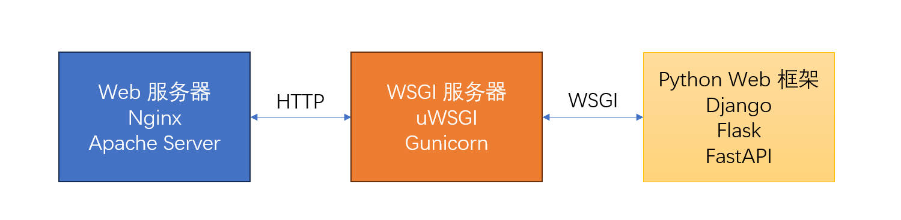

## 前言

最近有些项目使用 Flask 来作为后端应用，它相对于 Django 框架更加轻量，但也意味着很多东西稍显“简陋”，一切都需要自己动手，才能丰衣足食。

之前是写 Java + SpringBoot 的，感觉各个坑点的解决方案都相当成熟，自成体系，约定远远大于自定义，后来者维护代码，大部分的代码都是模板式的，所以很省心。

但是 Flask 如同 Python 一样，简洁，灵活，但如果没有任何的约束，后期的维护和交接工作会很糟心。

本文并非一个最佳实践的教程，因为我刚刚将 Flask 作为生产工具使用，有很多疑惑的点并没有找到唯一的最优解，仅仅作为一次记录，我相信这个记录中的方案，会随着之后的不断深入了解 Flask 和其生态环境后，有所改变和优化。

---

## Why WSGI

WSGI 的目的是为了解耦 Web 服务器和 Web 框架，正如同英国计算机科学家的那句名言：

> 在计算机科学中，没有什么问题是不能通过增加一个中间层来解决的，但这通常会产生新问题。
>
> —— 大卫·惠勒

并不像 SpringBoot 自嵌了一个 Tomcat，它直接可以在生产环境中使用，Flask 需要借助 uWsgi 或者 Gunicorn 来实现生产环境的部署。

这里就涉及到 Flask 和 Gunicorn 以及 Nginx 的三者关系。

Python 有个自己的 web 协议——WSGI，全称是：Python Web Server Gateway Interface。

Gateway 是网关，网关在网络中最大的作用就是实现不同的协议翻译和转换，所以这里的 Python Web 服务器网关接口也不例外，它最主要涉及的两个协议：HTTP 协议和 WSGI 协议。

WSGI 的目的是解决 Python 开发者在选择 web 应用程序框架和 Web 服务器时碰到的问题：选择某个 Web 框架会限制开发者对于 Web 服务器的选择。

在 Java 中，无论选择什么 Web 框架，只要都遵守 Servlet API 即可，因为大部分 Web 服务器都实现了 Servlet API。

同样的，只要 Python 的大部分 Web 服务器都实现 WSGI 接口，那么选择 Web 框架就更加自由了。

Web 服务器的代表：Nginx，Apache HTTP Server，它们处理 HTTP 协议，反向代理，负载均衡和提供静态资源文件服务。

WSGI 服务器的代表：uWSGI，Gunicorn，它们负责作为中间的网关服务，将 Web 服务器的 HTTP 协议转换成 WSGI 协议发给 Web 应用处理，然后把 Web 应用返回的结果再转换成 HTTP 协议交给 Web 服务器。

Web 应用框架的代表：Django，Flask，FastAPI，它们处理业务逻辑，和数据库打交道，支持模板引擎，处理路由和函数的绑定，处理用户的会话和身份验证等功能，它们支持 WSGI 协议，并和 WSGI 服务器通讯。



WSGI 的出现，解耦了 Web 框架和 Web 服务器，使得它们可以独立演化，而不需要相互适配特定的协议。开发者可以自由选择 WSGI 服务器和 Web 框架的组合，满足不同的性能需求。

关于三者的关系，已经讲述清楚了，那么是否一定三者必须要都有才能启动一个 web 应用呢？

当我们仅仅在开发一个本地测试的 Hello World 的时候，我们甚至可以仅仅使用以下命令就启动一个简单的 web 服务：

```sh
python -m http.server 18888
```

### Werkzeug

Flask 使用了 **Werkzeug** 提供的轻量级 WSGI 服务器，它支持直接解析 HTTP 请求并调用 Flask 应用程序，当运行 `app.run()` 时，实际上启动的是这个开发服务器。

Werkzeug 工作流程：

- Werkzeug 开发服务器会监听一个指定的端口（默认是 `127.0.0.1:5000`）。
- 它直接处理 HTTP 请求，将其转化为符合 WSGI 标准的调用，传递给 Flask 应用程序。
- Flask 处理业务逻辑后返回响应，Werkzeug 再将其封装成 HTTP 响应发送给客户端。

优点：

1. 适合开发使用，轻量，自嵌。
2. 支持自动重载功能（`debug=True` 时），每次修改代码后，服务器会自动重启。
3. 支持简单的日志记录，方便查看请求和错误信息。

缺点：

1. 不适合生产环境，开发服务器的性能较低，无法高效处理大量并发请求。
2. 它缺乏像 Gunicorn 或 uWSGI 那样的多线程、多进程支持。
3. 开发服务器在设计上是为了简单易用，而非处理复杂的生产环境需求，比如高并发、负载均衡和长连接。

### Gunicorn

在生产环境中，我们为了支持大量的并发连接，需要使用更加稳定、专业的 WSGI 服务器，比如 uWSGI 和 Gunicorn，它们不仅仅是 WSGI 服务器，它们还支持了基础的 HTTP 协议的解析和处理能力。

所以，这些 WSGI 服务器，可以在不使用 Web 服务器（Nginx）的时候，顺便充当 HTTP 服务器的功能。

### Nginx

虽然 Gunicorn 能直接支持 HTTP 请求，但它作为一个 WSGI 服务器，仍有一些局限性，特别是在复杂生产环境中：

1. **静态资源处理**：
   - Gunicorn 不擅长处理静态资源（如图片、CSS、JavaScript 文件），这些请求会占用 Gunicorn 的工作进程，降低处理动态请求的效率。
   - Nginx 专为高效处理静态资源优化，通常用来分担这部分流量。
2. **性能优化**：
   - Nginx 在处理高并发场景（如短连接、大量静态资源）方面比 Gunicorn 更高效。
   - Nginx 支持异步 I/O，可以更好地管理连接，而 Gunicorn 的工作进程模型会受到进程/线程数的限制。
3. **安全性**：
   - Nginx 提供了更多的安全功能，如限制请求速率、过滤恶意请求、保护后端应用。
   - Gunicorn 缺乏这些高级安全功能。
4. **负载均衡**：
   - 在复杂的架构中，Nginx 可以充当反向代理，将请求分发给多个后端的 Gunicorn 实例，实现负载均衡。
5. **HTTPS 支持**：
   - 虽然 Gunicorn 支持 HTTPS，但配置复杂且性能不如 Nginx，通常让 Nginx 来处理 TLS 终端。

所以，在简单的生产环境，使用 Gunicorn + Flask 即可，但如果需要静态资源处理，负载均衡，反向代理等等更加复杂的环境下，使用 Nginx + Gunicorn + Flask 是最终的解决方案。

---

## werkzeug 和 gunicorn 性能

Flask 自带的 Werkzeug 性能不好，但是本地测试很方便，本节以下面两个接口来验证当 I/O 密集型和 CPU 密集型的时候，使用 Werkzeug 和 Gunicorn 的性能差距。

```python
# CPU 密集型任务：计算一个大数的阶乘
@app.route('/cpu-bound')
def cpu_bound():
    app.logger.info(f'CPU bound Start...')
    start = int(time.time() * 1000)
    result = 1
    for i in range(1, 10 ** 5):
        result *= i
    end = int(time.time() * 1000)
    app.logger.info(f'CPU bound End...')
    return f"CPU Bound Task Completed cost {end - start} ms"

# IO 密集型任务：模拟延迟
@app.route('/io-bound')
def io_bound():
    app.logger.info(f'IO bound Start...')
    start = int(time.time() * 1000)
    time.sleep(5)
    end = int(time.time() * 1000)
    app.logger.info(f'IO bound End...')
    return f"IO Bound Task Completed cost {end - start} ms"
```

Werkzeug 的单线程模型，使得它无法处理 CPU 密集型的任务，但对于 I/O 密集型的任务，如果数量少的话，表现尚可。

以下是测试代码：

```python
import requests
from concurrent.futures import ThreadPoolExecutor, as_completed
import time

# 测试接口
URL_CPU = "http://127.0.0.1:8080/cpu-bound"
URL_IO = "http://127.0.0.1:8080/io-bound"

def make_request(url):
    try:
        response = requests.get(url, timeout=60)
        return response.text
    except Exception as e:
        return f"Error: {e}"

# 并发测试
def concurrent_test(url, num_requests):
    with ThreadPoolExecutor(max_workers=num_requests) as executor:
        futures = [executor.submit(make_request, url) for _ in range(num_requests)]
        results = []
        for future in as_completed(futures):
            results.append(future.result())
        return results

def test_cpu(num_requests):
    print("Testing CPU-bound interface...")
    start_time = time.time()
    cpu_results = concurrent_test(URL_CPU, num_requests)
    cpu_time = time.time() - start_time

    print(f"CPU-bound test completed in {cpu_time:.2f} seconds")
    for index, result in enumerate(cpu_results):
        print(f'index: {index}, result: {result}')

def test_io(num_requests):
    print("Testing IO-bound interface...")
    start_time = time.time()
    io_results = concurrent_test(URL_IO, num_requests)
    io_time = time.time() - start_time

    print(f"IO-bound test completed in {io_time:.2f} seconds")
    for index, result in enumerate(io_results):
        print(f'index: {index}, result: {result}')

def main():
    # test_cpu(5)
    test_io(10)

if __name__ == "__main__":
    main()
```

### 测试 werkzeug

当调用 `test_io(10)` 时，可以看到所有的请求同时开始，等待 5 秒后，同时返回，这是因为 sleep 操作主要依赖操作系统，所以看起来性能还可以。

但是调用 `test_cpu` 的时候，可以观察到随着数量的增多，耗时也在增加，当一个 CPU 密集型请求占用线程时，其他请求必须等待。每个请求的处理时间大致相同，因此响应时间会按并发数线性递增。

在我本地的机器上，耗时和请求数量成正比：

| CPU密集型任务数量 | 耗时    |
| ----------------- | ------- |
| test_cpu(1)       | 2046 ms |
| test_cpu(2)       | 4050 ms |
| test_cpu(3)       | 5942 ms |
| test_cpu(4)       | 8178 ms |

Werkzeug 没法利用多核 CPU 的优势，所以需要借助 Gunicorn。

### 测试 gunicorn

当指定一个 work 时（gunicorn -w 1），测试 CPU 密集型的结果和 werkzeug 是一样的，但是我们可以增大 -w 的参数值，来并发执行任务。

指定 -w 为 2，表示 2 个进程。

测试结果如下：

| CPU密集型任务数量 | 耗时    |
| ----------------- | ------- |
| test_cpu(1)       | 1918 ms |
| test_cpu(2)       | 1745 ms |
| test_cpu(3)       | 3684 ms |
| test_cpu(4)       | 3587 ms |
| test_cpu(5)       | 5525 ms |
| test_cpu(6)       | 5546 ms |
| test_cpu(7)       | 8290 ms |
| test_cpu(8)       | 8266 ms |
| test_cpu(9)       | 9355 ms |
| test_cpu(10)      | 9571 ms |

可以发现虽然随着任务量，耗时依然呈线性递增，但是接口能够同时处理两个任务了，所以处理 1 个任务和处理 2 个任务耗时相当，处理 9 个任务和处理 10 个任务耗时相当。

根据 [Design — Gunicorn 23.0.0 documentation](https://docs.gunicorn.org/en/latest/design.html#how-many-workers) 的介绍：

> 不要将工作进程的数量扩展到您预期的客户端数量。Gunicorn 只需要 4-12 个工作进程即可每秒处理数百或数千个请求。
>
> Gunicorn 依靠操作系统在处理请求时提供所有负载平衡。通常，我们建议以 (2 x $num_cores) + 1 作为起始工作进程的数量。虽然不是太科学，但该公式基于以下假设：对于给定的核心，一个工作进程将从套接字读取或写入，而另一个工作进程正在处理请求。
>
> 显然，您的特定硬件和应用程序将影响最佳工作进程数量。我们的建议是从上述猜测开始，并在应用程序处于负载状态时使用 TTIN 和 TTOU 信号进行调整。
>
> 永远记住，存在工作进程过多的情况。在某个点之后，您的工作进程将开始消耗系统资源，从而降低整个系统的吞吐量。

可以得知，并不是 worker 越多越好，推荐 worker 的数量是 CPU 核心数的 2 倍 + 1 个，再多就会降低系统吞吐量，增加系统额外的切换开销。

### I/O 密集型任务下二者的性能

测试 I/O 密集型的接口时，发现 Gunicorn 在只有一个 worker 下的表现并不如 Werkzeug：Werkzeug 接收到 10 个请求，sleep 5 秒后，同时返回，而 Gunicorn 则是一个个处理，最终耗时 50 秒。

我猜测因为 Werkzeug 的测试环境是在 Windows，Werkzeug 本质上并不是异步的，而是依赖 Windows 操作系统调度来高效处理 IO 阻塞。

而 Gunicorn 的测试环境在 Linux，Gunicorn 的一个 worker 默认是一个 同步 WSGI 工作线程。当 worker 处理一个请求时，其他请求必须排队等待。这种行为导致 IO 密集型任务变成串行处理：一个请求等待 5 秒完成，其他请求依次排队。

Werkzeug 的单线程调度机制在 Windows 上表现得更像“伪并发”，而 Gunicorn 强制一个 worker 同步执行 WSGI 请求，没有额外的调度优化。

Gunicorn 的 worker 是跨平台一致的设计，而 Windows 上的 Werkzeug 受益于底层特性，性能看似更好。

解决这个 I/O 串行的问题，有几种方法：

-w 指定更多的 worker，每个 worker 处理一个 IO 任务，假设 -w 为 2，同时有 10 个并发的请求进入，每个请求耗时 5 秒，那么原本的 50 秒（10 * 5）将缩短成 25 秒（10 / 2 * 5）。

--threads 指定更多的线程，Gunicorn 允许每个 worker 拥有多个线程，-w 1 --threads 2 可以 2 （1 * 2）个并发量，和上面 -w 2 一样，最终耗时 25 秒。

-k 指定 gevent，-w 1 -k gevent（需要额外 pip install gevent），也能实现并发处理 I/O 密集型的请求。

---

## 配置切换

在开发，测试，生产环境下，连接的数据库和一些配置都有所不同，如何切换不同环境下的配置，也是个实践上的重要问题。

以一个 redis 数据库的切换作为例子。

我们可以将所有的配置信息写在一个 web_config.py 文件中：

```python
class Config(object):
    # 存储公共配置
    PROJECT_NAME = "study-flask"


class DevelopmentConfig(Config):
    # 存储开发环境中的配置
    
    REDIS_HOST = '192.168.0.201'
    REDIS_PORT = 6379
    REDIS_DB = 0
    REDIS_PASSWORD = '123456'

class ProductionConfig(Config):
    # 存储生产环境中的配置
    
    REDIS_HOST = '192.168.0.202'
    REDIS_PORT = 6379
    REDIS_DB = 0
    REDIS_PASSWORD = '654321'


config = {
    'development': DevelopmentConfig,
    'production': ProductionConfig,
}
```

然后在 db.py 中集中管理数据库的初始化：

```python
def init_redis(app):
    app_logger.info('start init redis...')

    try:
        redis_client = redis.StrictRedis(
            host=app.config['REDIS_HOST'],
            port=app.config['REDIS_PORT'],
            db=app.config['REDIS_DB'],
            password=app.config['REDIS_PASSWORD'],
            socket_timeout=5,
            socket_connect_timeout=5,
        )

        # 测试 Redis 连接
        # 如果连接失败，会抛出异常
        redis_client.ping()
        app.logger.info('Redis connection successful.')
        # 把 redis client 保存进 app 中
        app.redis_client = redis_client
        app_logger.info('redis init done...')
        return redis_client

    except redis.ConnectionError as e:
        app_logger.exception(f"Failed to connect to Redis")
        sys.exit(1)

    except Exception as e:
        app_logger.exception(f"Unexpected error during Redis initialization: {e}")
        sys.exit(1)
```

在 app.py 进行初始化：

```python
app.config.from_object(web_config.config['development'])
```


---

## 日志


---

## 异常处理


---

## 代码部署


---

## 参考

1. [PEP 333 – Python Web 服务器网关接口 v1.0 |peps.python.org](https://peps.python.org/pep-0333/)
2. https://docs.gunicorn.org/
