## 前言

完成一段程序代码模块的编写或者是系统的搭建，难免碰到一个个出乎意料的 Bug，让人摸不到头脑，但又迫切的需要去解决它们。

或者是希望能够深入复杂框架的内部，通过了解程序运行时侯变量的状态和变化细节，见微知著，看到整个框架的运行规律。

依靠“跟断点”的方式，能很好地帮助我们解决这些需求。本文通过 IDEA 简述调试 Java 代码一些方法，其他的软件（例如：Pycharm）也都大同小异。

---

## 断点

断点是程序中一种特殊的标记，用来调试代码时，起到中断程序运行的作用。它可以帮助我们了解程序运行时候的状态和行为。

断点可以很简单，比如程序运行到某个指定的断点行，立刻暂停。

也可以用作很复杂的逻辑判断，比如使用条件断点。

---

## 断点的类型

在 IDEA 中，有以下类型的断点：

* 行断点（Line breakpoints）：在某行代码设置断点，程序运行到这一行代码的时候，暂停程序，此类断点可以被设置在可执行的代码行上。
* 方法断点（Method breakpoints）：当进入或退出某个指定的方法（或者是某个抽象方法的实现）的时候，程序会暂停，帮助我们确认进入/退出方法时的状态。
* 字段观察点（Field watchpoints）：如果在某个字段上设置了观察点，那么当程序对这个字段取值或者赋值的时候，程序会暂停。
* 异常断点（Exception breakpoints）：当 Throwable 或者它的子类被抛出时，异常断点会暂停程序运行。

---

## 设置断点

### 设置行断点

行断点是最常用，最简单的一种断点。

将鼠标移动到代码左侧行数字上，就可以在可执行代码行上设置断点（或者光标移动到该行，使用快捷键，Ctrl+F8）：

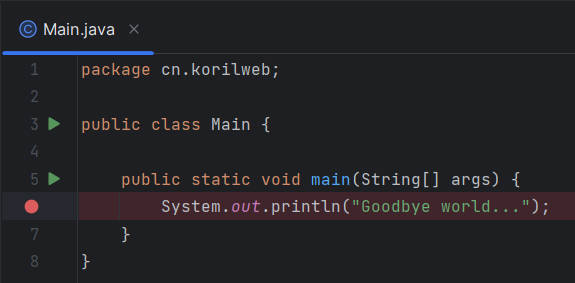

如果该行包含 lambda 表达式，您可以选择是否要设置常规行断点，或者程序只应在调用 lambda 时暂停。

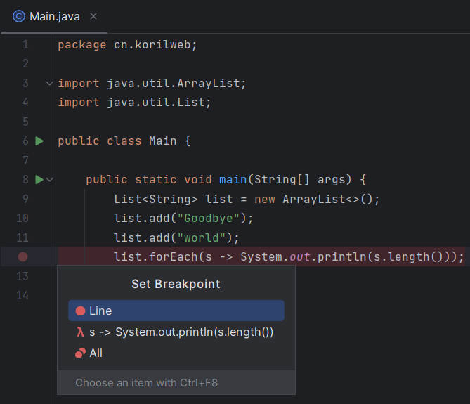

### 设置方法断点

我们希望程序暂停在进入某个方法的时候，则可以设置方法断点：

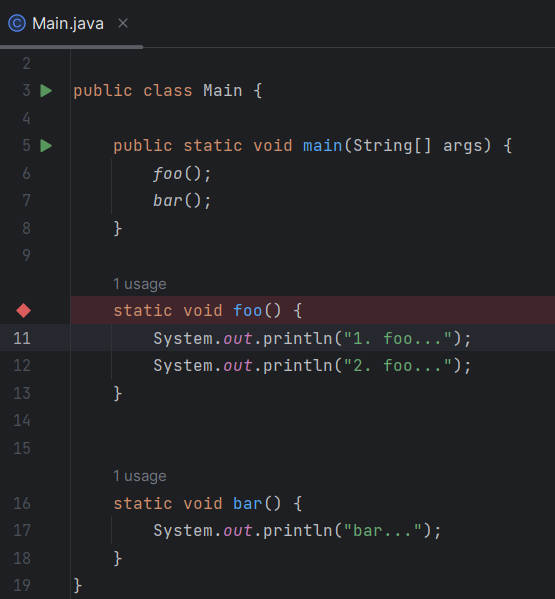

程序在运行到 foo 方法时，会自动暂停，进入方法的实现处代码行。

另外，我们都知道，在每一个没有手动实现构造器的类中，Java 会默认给一个无参的构造方法，将断点打在类名上，会自动暂停在调用到了该类的默认构造器的代码行上：

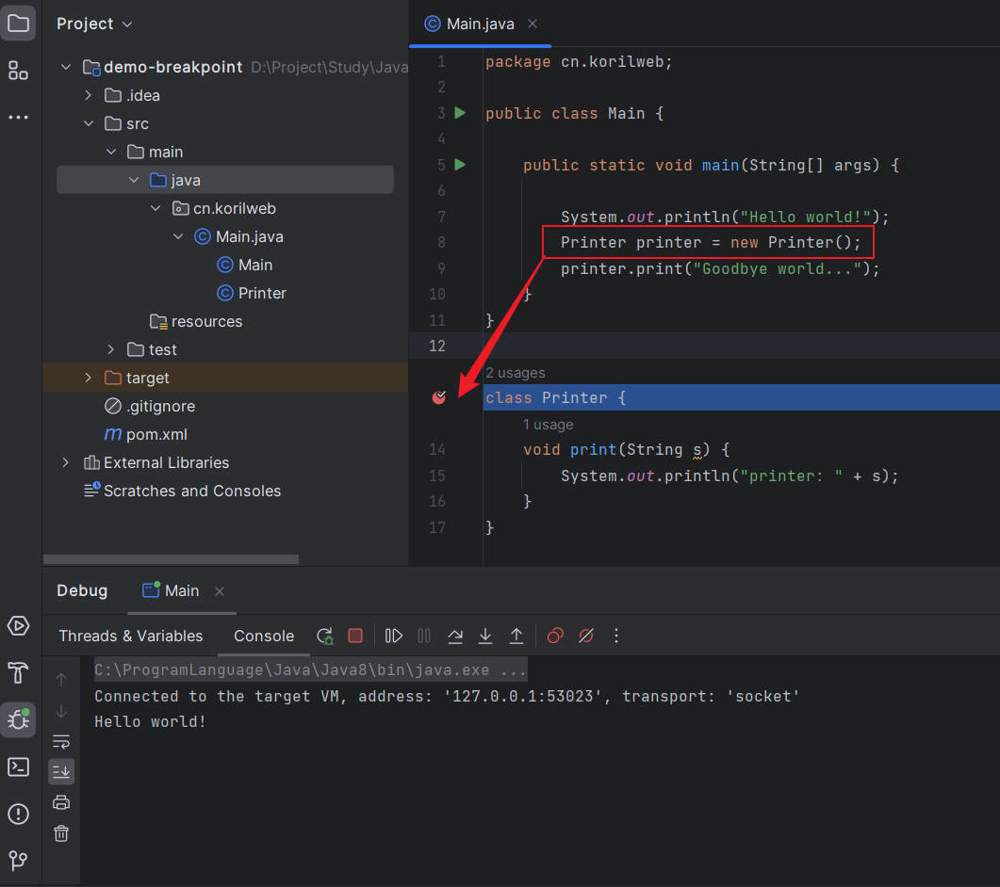

可以看到，程序先打印了 Hello world，然后因为调用了 Printer 类的默认构造器，就暂停到了断点上。

### 匹配多个类或方法

暂略...

### 设置字段观察点

如果希望观察某个字段的变化状态，可以在字段上添加字段观察点：

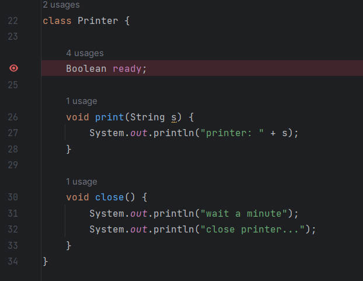

### 设置异常断点

当程序产生了某个异常的时候，可以通过设置异常断点，来让程序停留在异常发生的地方，如果想在任何 Throwable 的实例被抛出时暂停，可以在 AnyException 上打勾：

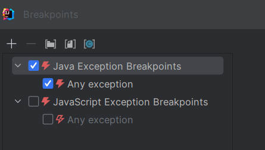

如果希望某一个特殊的异常出现时暂停，可以添加指定的异常类型：

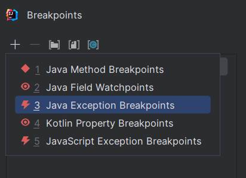

### 设置条件断点

在日常工作中，经常碰到需要调试从数据库中提取出来的数据量庞大的集合。

提取后，通常会遍历集合，然后根据对象的某些属性，判断一些条件，来做出相应的操作，如果集合数量只有几个，打上行断点，一个一个跟着遍历还可以接受，但是一旦这个集合的大小成百上千，跟着遍历上千次就几乎是不可能的了。

为了解决这个问题，我们可以设置条件断点，只有当设置的条件返回为 true 时，断点才生效，即暂停程序，否则断点就被忽略。

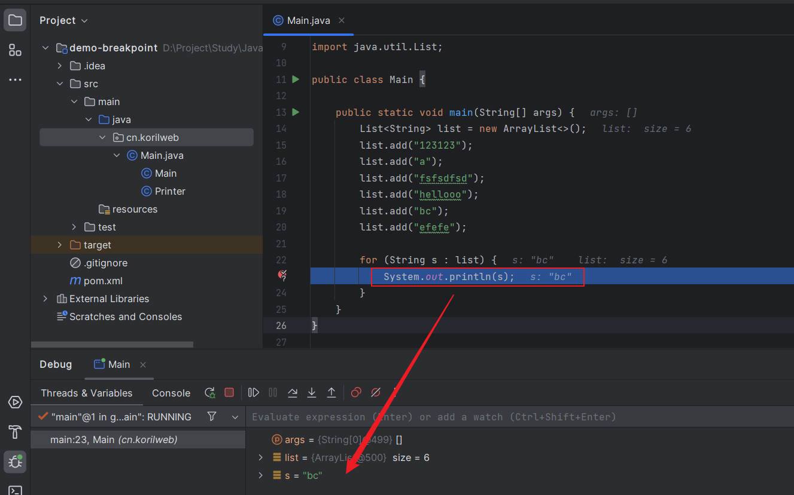

在上图中，我希望程序在循环里碰到字符串长度等于 2 的时候，才暂停程序，那么可以设置条件断点，单击鼠标右键，选择 Add Conditional Breakpoint，并在 Condition 中写上：s.length() == 2

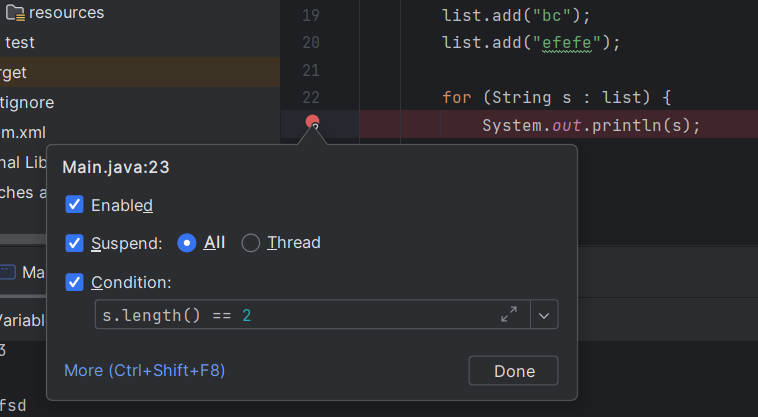

### 设置流断点

在使用了 Stream 的代码上，加上行断点，可以查看流的每一步骤的操作情况，IDEA 给流的每一步操作，导致的集合变化，做出了图形界面的展示，非常的直观。

考虑以下需求，从 List 集合中，筛选出不包含空格的字符串，然后全部转换成小写，再获取它们的长度并找到所有长度为偶数的元素，最后去重收集成一个 List 集合。

将断点加在使用了 Stream 代码行上，并单击 Trace Current Stream Chain：

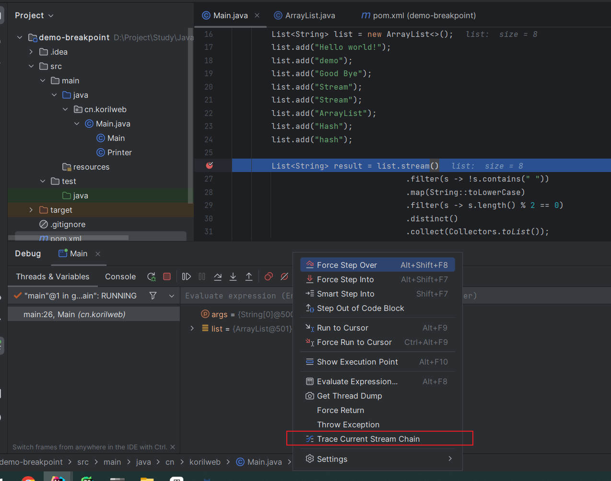

可以非常清晰的看到每一个流操作导致的集合的变化：

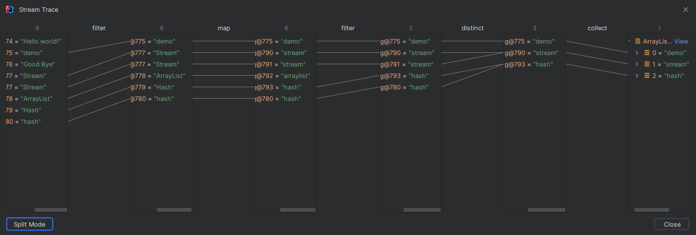

---

## 断点操作

下面将围绕下图的一些常用按钮操作，展开讲解：

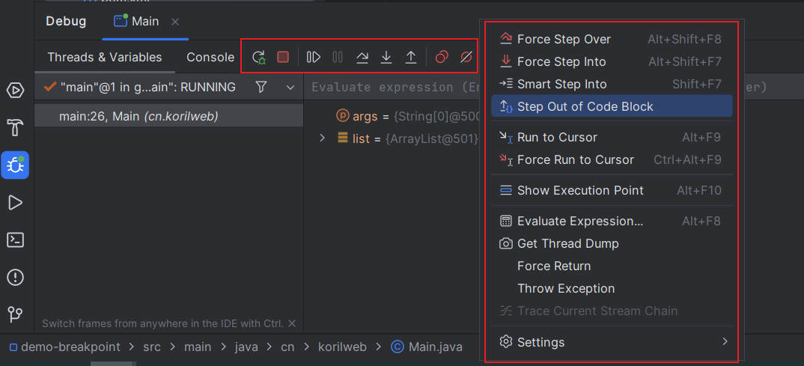

1. Rerun：重启
2. Stop：终止
3. Resume Program：恢复程序，跳到下一个断点
4. Pause Program：暂停程序
5. Step Over：步过，一行一行地往下走，如果这一行上有执行方法，不会进入方法内部。
6. Step Into：步入，和 Step Over 相对的，如果这一行有执行方法，将进入方法内部，一般用于进入自定义的方法内部，而不会进入官方类库里的方法。
7. Step Out：步出，有时候 Step Into 点快了，可能会进入过深层次的方法中，如果希望从当前位置的代码跳出去，回到调用处，可以使用此按钮。
8. Force Step Over：强制步过，如果当前断点行，存在一个可执行方法，该方法内部同样存在一些断点，如果不希望进入方法内部（普通的单步会跳到下一个断点处），可以使用此按钮。
9. Force Step Into：强制步入，能进入任何方法，查看底层源码的时候可以用这个进入官方类库的方法。
10. Show Execution Point：当我们运行到了某一个断点，但又需要跳到其他页面查看一些代码，想要从其他代码页面返回到当前断点时，可以按下该按钮。

---

## 参考

1. https://www.jetbrains.com/help/idea/using-breakpoints.html
2. https://www.jetbrains.com/help/idea/debugging-code.html
3. https://blog.csdn.net/weixin_44353507/article/details/124965399
