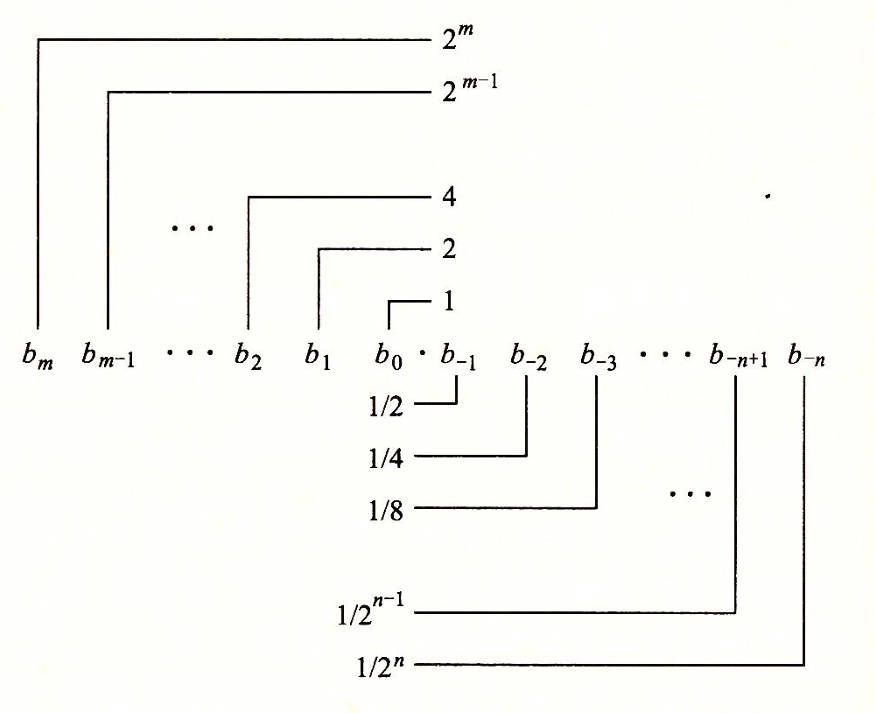
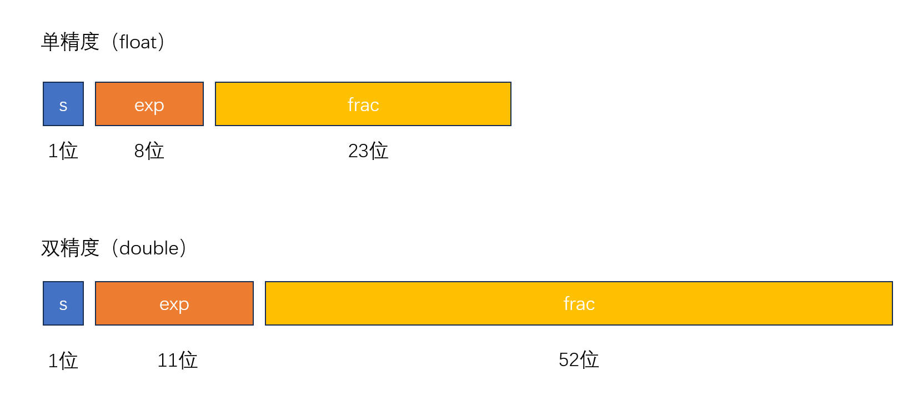

## 前言

编程语言中，浮点数的运算的结果不准确是个老生常谈的话题了，很多程序员都知道，也能说出个大概来。

但倘若真让其提笔计算，展现过程和思路，估计会面露难色（至少我是这样），所以趁着有空，写一篇完整的文章记录下大概的思路。

过不了多久，我这糟糕的记忆力估计还是会把这些过程忘在犄角旮旯里，但愿那时候，这篇文章能让我快速重新入门（苦笑）。

---

## 历史

在六、七十年代，各家计算机公司的各个型号的计算机，有着千差万别的浮点数表示，却没有一个业界通用的标准。这给数据交换、计算机协同工作造成了极大不便。IEEE的浮点数专业小组于七十年代末期开始酝酿浮点数的标准。

在1980年，英特尔公司就推出了单片的8087浮点数协处理器，其浮点数表示法及定义的运算具有足够的合理性、先进性，被IEEE采用作为浮点数的标准，于1985年发布。

研究和建立浮点数规范的科学家，名叫威廉·墨顿·卡韩（William Morton Kahan），生于加拿大安大略多伦多，数学家与计算机科学家，专长于数值分析。1989年图灵奖得主，1994年被提名为ACM院士。现为加州大学柏克莱分校计算机科学名誉教授。卡韩是 IEEE 754-1985 浮点数运算架构规格书的主要架构师，IEEE 754 系列的标准主要依据他的研究而制定，因此被称为浮点数之父。

---

## 矛盾

数学中的实数包含了有理数和无理数，有理数的整数，是很好理解的，在计算机中，用 int 和 long 之类的类型表示（补码的知识，不再赘述）。而有理数的另外一部分，分数，就没那么直观了。

回忆下十进制中的分数，0.1、0.2 之类的都可以直接写出来，但是诸如：1/3、2/7 之类的无限循环小数，在十进制里，没法完全把它写出来，因为小数部分是无限循环的。

那么在实际生活中，我们往往会四舍五入，1/3 可能就直接写成 0.33，但是我们都明白 1/3 != 0.33。

再切入到我们不太熟悉的二进制小数表示上，十进制下的 0.1 和 0.2 如果表示成二进制下的小数形式，就变成了无限循环小数。

那么，矛盾就显而易见了：

1. 计算机的存储是有限的，必定会涉及到无限循环小数的舍入问题，造成不精确。
2. 生活和工程里面，我们为了计算更加快速，经济和性能更好，往往会对精度做出妥协。

---

## 二进制小数

还是先从十进制入手，十进制表示法，如下所示，每一位的范围是 0-9：
$$
d_md_{m-1}...d_1d_0d_{-1}d_{-2}...d{-n}
$$
那么数值 d 就是每一位的数字乘以该位上的权重。小数点左边的权是 10 的正幂（整数值），右边的权是 10 的负幂（小数值）。
$$
d = \sum_{i=-n}^{m}10^i × d_i
$$
例如 10.75 = 1 * 10^1 + 0 * 10 ^ 0 + 7 * 10^-1 + 5 * 10 ^ -2。

再转到不太熟悉的二进制，原理是类似的，考虑一下二进制小数表达式，每一位要么是 0 要么是 1。
$$
b_mb_{m-1}...b_1b_0b_{-1}b_{-2}...b{-n}
$$
那么值就是：
$$
b = \sum_{i=-n}^{m}2^i × b_i
$$
小数点左边的权是 2 的正幂（整数值），右边的权是 2 的负幂（小数值）。

例如，一个以二进制表示的小数 10.11，转换成 10 进制表示就是 b = 1 * 2^1 + 0 * 2^0 + 1 * 2^-1 + 1 * 2^-2 = 2.75

小数的二进制表示转十进制，就是靠累加权重，这很好理解，反过来，小数十进制表示转成二进制，也有方法。

十进制转换为二进制，需要分成整数和小数两个部分分别转换。当转换整数时，用的除2取余法，而转换小数时候，用的是乘2取整法。

篇幅所限，这里可以参考网络的教程，方法很简单。

总之，当我们尝试将十进制的 0.1 和 0.2 转成二进制表示时，会发现在二进制下，这两个数是无限循环的。

十进制 0.1 转二进制：

|               | 整数部分 | 小数部分 |
| ------------- | -------- | -------- |
| 0.1 * 2 = 0.2 | 0        | 0.2      |
| 0.2 * 2 = 0.4 | 0        | 0.4      |
| 0.4 * 2 = 0.8 | 0        | 0.8      |
| 0.8 * 2 = 1.6 | 1        | 0.6      |
| 0.6 * 2 = 1.2 | 1        | 0.2      |

可以看到循环的部分是 0011，十进制的 0.1 转二进制就是 0.0001100110011...

十进制 0.2 转二进制也可以用上面方法，不过因为 0.2 是 0.1 的两倍，对于二进制而言，直接把小数点右移一位即可，所以十进制 0.2 转二进制就是 0.001100110011...

---

## 定点数和浮点数

### 定点数

在详细讲浮点数前，我们还需要了解另外一种表示法，也就是我们经常在用的方式——定点数表示法，即约定机器中所有数据的小数点位置固定不变。 

定点数表示法的优点是简单直观，硬件实现也方便，但是缺点也很明显，数值表示的范围太小，运算时容易产生溢出。

### 浮点数

当表示一个很大（比如 5 * 2^100）或者很小（接近于零，比如 3 * 2^-100），定点数都无能为力，因为后面要跟着一长串 0，这远远超过了 32 位或者 64 位，为了运算速度和存储空间，浮点数应运而生。

---

## IEEE 的浮点数

和科学计数法一样，IEEE 浮点数标准用 Value = (-1)^s * M * 2^E 的方式来表达一个数。

这样做的一个好处就是，节省了大数或者小数的存储空间。

这里总共就三个可变参数：s、M、E，下面依次解释：

* s：符号，只有一位，0 代表正数，1 代表负数。
* M（Mantissa）：二进制小数。
* E：阶码，作用是加权，表示 2 的 E 次幂。

公式确定了，剩下的就是如何将它们编码到 32 位或者 64 位当中。

编码字段：

* s：s 无需处理，直接编码。
* frac：fraction，n 位的二进制小数字段，通过编码得到 M。
* exp：exponent，k 位的阶码字段，通过编码得到 E。

s 不需要解释，IEEE 754 稍微有点麻烦的地方就是在 frac 和 exp 编码这里，以下图片，描述了 32 位和 64 位下， n 和 k 的取值：

这里的 M、E 和 exp、frac 不可混淆，M 和 E 会通过某种规则，转换成一串 0 和 1 分别存入 exp 和 frac 的字段中。

根据 exp 的取值，IEEE 浮点数的编码可以分成三类。

### 规格化

### 非规格化

### 无穷大和 NaN

---

## 舍入

---

## 转换

### 十进制小数转浮点数

### 浮点数转十进制

---

## 参考

1. [Floating Point Math (30000000000000004.com)](https://0.30000000000000004.com/)
2. [IEEE754标准中的4种舍入模式_round to nearest even-CSDN博客](https://blog.csdn.net/weixin_42454243/article/details/121922333)
3. [Why does 0.1 + 0.2 = 0.30000000000000004? (jvns.ca)](https://jvns.ca/blog/2023/02/08/why-does-0-1-plus-0-2-equal-0-30000000000000004/)
4. [为什么 0.1 + 0.2 = 0.300000004 - 面向信仰编程 (draveness.me)](https://draveness.me/whys-the-design-floating-point-arithmetic/)
5. [IEEE 754 - 维基百科，自由的百科全书 (wikipedia.org)](https://zh.wikipedia.org/wiki/IEEE_754)
6. [Floating Point Numbers: IEEE 754 Standard | Single Precision and Double Precision Format (youtube.com)](https://www.youtube.com/watch?v=e_J9lXnU_vs)