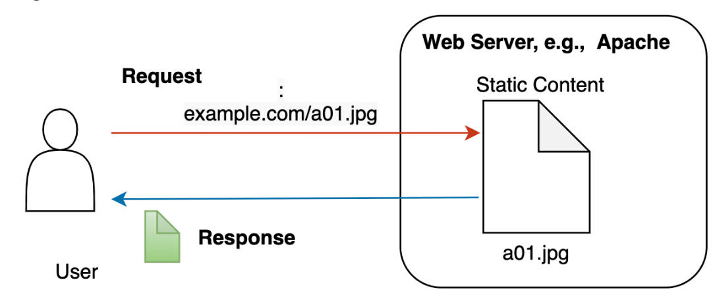
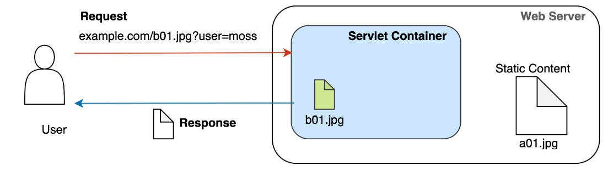
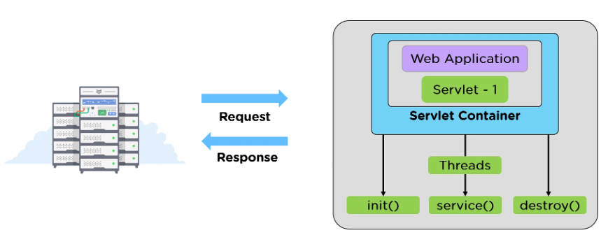
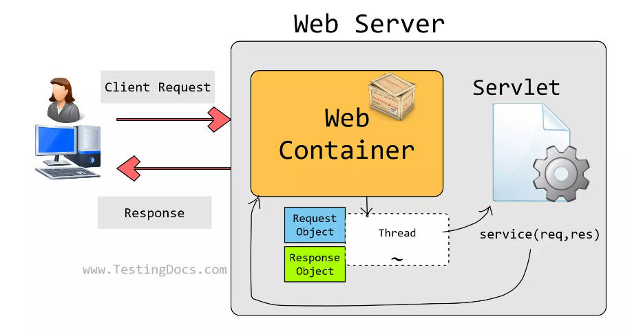

## 前言

Servlet 是一个常常在工作中被忽略但是却是整个 Java Web 基石的技术。

在聊 Servlet 之前，得先了解早期的静态页面技术和动态页面技术之间的差别。

---

## 静态页面

在静态的 Web 程序中，用户通过浏览器（Chrome，Firefox，Edge 之类的，也叫做用户代理，叫做代理是因为这些浏览器软件才是真正在和服务器通讯，收发信息）向 Web 服务器发送 HTTP 协议的的请求，通常请求的是 HTML 文件，另外还有一些 CSS，JS，JPEG，PNG 等静态资源文件。

浏览器收到了服务器发来的响应信息后，通过内核对响应信息做出构造，解析，渲染成可视化的页面。

所以在整个网页交互的过程中，核心就是放在服务器上的一堆 HTML 文件，这些文件对每一个来访的浏览器请求都是一样的，即每一个人都会看到相同的页面。

---

## 动态页面

随着 Web 的发展，静态页面已经无法满足像网络电商，在线银行等这种需要对不同的用户提供不同的页面的服务，动态页面随之诞生。

考虑一下的一个例子：

一个管理系统有一千个用户，管理系统需要有一个个人信息的展示页面。

一千个用户肯定有不同的名字，年龄等个人信息，我们希望能让不同的人看到不同的个人信息网页，最粗暴的方式就是建立一千个 HTML 文件，然后写上他们的信息，然后浏览器在请求的时候，带上用户的名字，服务器做个简单的查找即可。

但是这样的方式显然是不现实的，一旦用户的信息发生修改，修改 HTML 内容要交给人工来做，并且文件会随着用户的增多而随之暴增：

```
/web/data 下的文件
1. 小明.html
2. 小李.html
3. 小张.html
...
```

重复是程序员最大的敌人！我们希望这些页面是自动生成的，而非人工手动添加或者修改的。

并且，最好只有少数 HTML 文件（骨架文件），这些文件能够根据不同的用户请求，自动填充不同的内容。显然，计算机和程序就是做这些事情的。

```
/web/data 下面只有一个个人信息的骨架文件
1. info.html

HTML 内容：
<html>
	<head>
		<title>
			{{ 用户的名字 }} 的信息展示页面
		</title>
	</head>
	<h1>欢迎你！{{ 用户的名字 }} </h1>
	<p>...用户的个人信息</p>
</html>
```

上面的 {{ 用户的名字 }} 就像是程序中的变量一样：

```java
String name = "koril";
System.out.format("Welcome! %s", name);
```

不同的 HTTP 请求，产生了不同的变量，"Welcome! %s" 这一串字符串也就展现出了不同的效果。

这种动态性就是我们希望的，所以动态网站基本都是由编程语言编写而成，运行在服务器之上，并且数据持久化存储在诸如 MySQL，Oracle，MongoDB 等数据库中，根据不同的请求，Web 程序（用 C、C++、PHP、Java、Python 等编写）从数据库提取出不同的数据，做一些业务逻辑上的处理，最后将数据拼接成 HTML 页面返回给浏览器。

---

## Web Server、Servlet 以及 Servlet Container

上面提到的静态页面，同样需要有服务器的某个软件提供支持，因为本质上，HTML，CSS，JS 还有图片这些资源，都是通过 HTTP 协议来传输和接收的，必然会有一个解析 HTTP 协议的程序，Apache 和 Nginx 都是最有名的 Web Server 软件，它们支持 HTTP 协议和传输静态资源文件，但是它们不能生成动态的页面，只是单纯的数据搬运工。



动态页面技术可以使用多种语言来实现，本文将以 Java Servlet 技术为中心讲述。

Java 中的动态页面技术主要围绕 Servlet，它的全称是：Server Applet，意为服务端的小程序，这个服务端的小程序承包了上面我们提到的所有有关于生成动态页面的内容：接收到一个请求对象，根据请求的一些参数去数据库拿数据，构造合适的数据结构，转换成响应对象，最后交由 Web Server 返回给客户端。

Servlet 不能直接运行，它只是包含了业务逻辑处理的代码（大部分业务程序员做的事情，理解业务需求，然后转换成代码，写在 Servlet 中），接受请求，处理请求，返回响应。但底层的网络协议的解析和生成 Servlet 的过程，它自己并不负责，而是让 Web Server 和 Servlet Container（像 Tomcat 这样的 Servlet 容器）来完成。

例如，Tomcat 接收到 Web Server 的请求后，解析出请求路径，找到具体访问的接口，然后创建与路径相对应的 Servlet 实现类对象，最后调用 Servlet 中的 service 方法。



Tomcat 既是 Servlet Container 又是 Web Server，但是 Tomcat 更多侧重在 Servlet 容器上面，它像是 Servlet 的包工头，负责管理 Servlet 的生命周期。

---

## Servlet 接口和生命周期

Servlet 是一个接口，其中包含了初始化，提供服务，提供配置信息，销毁等生命周期有关的方法，Servlet 接口的注释写的非常详尽，我也对每一段做了中文翻译：

```java
package javax.servlet;

import java.io.IOException;


/**
 * Defines methods that all servlets must implement.
 * 该接口定义了所有 Servlet 都需要实现的方法
 *
 * <p>A servlet is a small Java program that runs within a Web server.
 * Servlets receive and respond to requests from Web clients,
 * usually across HTTP, the HyperText Transfer Protocol.
 * 一个 Servlet 是一个小型的 Java 程序运行在 Web Server 上。
 * Servlet 接收以及响应来自 Web 客户端的请求，
 * 请求和响应通常遵循 HTTP 协议，即超文本传输协议。
 *
 * <p>To implement this interface, you can write a generic servlet
 * that extends
 * <code>javax.servlet.GenericServlet</code> or an HTTP servlet that
 * extends <code>javax.servlet.http.HttpServlet</code>.
 * 为了实现这个接口，你可以通过继承 javax.servlet.GenericServlet 来
 * 编写一个通用的 Servlet 或者继承 javax.servlet.http.HttpServlet 来
 * 编写一个 HTTP Servlet。
 *
 * <p>This interface defines methods to initialize a servlet,
 * to service requests, and to remove a servlet from the server.
 * These are known as life-cycle methods and are called in the
 * following sequence:
 * 该接口定义了初始化一个 Servlet 的方法，提供对请求的服务方法，以及从 server 中移除一个 Servlet 的方法。
 * 这些方法被称为生命周期的方法，并且按照一下顺序被调用：
 * <ol>
 * <li>The servlet is constructed, then initialized with the <code>init</code> method.
 * Servlet 被构造成功，通过 init 方法进行初始化。
 * <li>Any calls from clients to the <code>service</code> method are handled.
 * 任何从客户端的请求，都交由 service 方法处理。
 * <li>The servlet is taken out of service, then destroyed with the 
 * <code>destroy</code> method, then garbage collected and finalized.
 * Service 处理完请求后，通过 destroy 方法进行销毁，然后垃圾回收器进行回收。
 * </ol>
 *
 * <p>In addition to the life-cycle methods, this interface
 * provides the <code>getServletConfig</code> method, which the servlet 
 * can use to get any startup information, and the <code>getServletInfo</code>
 * method, which allows the servlet to return basic information about itself,
 * such as author, version, and copyright.
 * 除了生命周期的方法之外，该接口还提供了 getServletConfig 方法，可以通过这个方法获得
 * 启动时的信息，以及 getServletInfo 方法，可以返回一些 Servlet 自身的信息，例如作者，
 * 版本号，版权等。
 *
 * @author 	Various
 *
 * @see 	GenericServlet
 * @see 	javax.servlet.http.HttpServlet
 *
 */


public interface Servlet {

    /**
     * Called by the servlet container to indicate to a servlet that the 
     * servlet is being placed into service.
     * 由 Servlet 容器调用，以指示该 Servlet 正准备投入使用。
     *
     * <p>The servlet container calls the <code>init</code>
     * method exactly once after instantiating the servlet.
     * The <code>init</code> method must complete successfully
     * before the servlet can receive any requests.
     * Servlet 容器必须在实例化 Servlet 类后调用 init 方法。
     * init 方法必须在其能够接收任何请求之前成功完成。
     *
     * <p>The servlet container cannot place the servlet into service
     * if the <code>init</code> method
     * <ol>
     * <li>Throws a <code>ServletException</code>
     * <li>Does not return within a time period defined by the Web server
     * </ol>
     * Servlet 容器在以下情况发生时，不能将 Servlet 放入服务中。
     * 1. 抛出 ServletException 异常
     * 2. 在 Web Server 定义的时间周期内没有返回结果。
     *
     *
     * @param config			a <code>ServletConfig</code> object 
     *					containing the servlet's
     * 					configuration and initialization parameters
     *
     * 参数 config：一个 ServletConfig 对象，包含了 Servlet 的配置和初始化信息。
     *
     * @exception ServletException 	if an exception has occurred that
     *					interferes with the servlet's normal
     *					operation
     *
     * 异常 ServletException：在 Servlet 的方法调用过程中抛出的异常。
     *
     * @see 				UnavailableException
     * @see 				#getServletConfig
     *
     */

    public void init(ServletConfig config) throws ServletException;
    
    

    /**
     *
     * Returns a {@link ServletConfig} object, which contains
     * initialization and startup parameters for this servlet.
     * The <code>ServletConfig</code> object returned is the one 
     * passed to the <code>init</code> method. 
     * 
     * 返回一个对象，该对象包含 Servlet 启动和初始化的一些信息
     * 返回的 ServletConfig 对象就是传递给 init 方法的对象。
     *
     *
     * <p>Implementations of this interface are responsible for storing the 
     * <code>ServletConfig</code> object so that this 
     * method can return it. The {@link GenericServlet}
     * class, which implements this interface, already does this.
     *
     * 此接口的实现负责存储 ServletConfig 对象，以便此方法可以返回它。
     * 实现此接口的链接 GenericServlet 类已经这样做了。
     *
     * @return		the <code>ServletConfig</code> object
     *			that initializes this servlet
     *
     * @see 		#init
     *
     */

    public ServletConfig getServletConfig();
    
    

    /**
     * Called by the servlet container to allow the servlet to respond to 
     * a request.
     * Servlet 容器调用该方法，让 Servlet 去响应一个请求。
     *
     * <p>This method is only called after the servlet's <code>init()</code>
     * method has completed successfully.
     * 此方法仅能在 init 方法成功完成之后再被调用
     * 
     * <p>  The status code of the response always should be set for a servlet 
     * that throws or sends an error.
     * 应始终为抛出或发送错误的 Servlet 设置响应的状态代码。
     * 
     * <p>Servlets typically run inside multithreaded servlet containers
     * that can handle multiple requests concurrently. Developers must 
     * be aware to synchronize access to any shared resources such as files,
     * network connections, and as well as the servlet's class and instance 
     * variables. 
     * Servlet 通常在可以同时处理多个请求的多线程 Servlet 容器中运行。 
     * 开发人员必须有意识的去同步访问任何共享资源，如文件、网络连接，以及 Servlet 的类和实例变量。
     *
     * More information on multithreaded programming in Java is available in 
     * <a href="http://java.sun.com/Series/Tutorial/java/threads/multithreaded.html">
     * the Java tutorial on multi-threaded programming</a>.
     *
     *
     * @param req 	the <code>ServletRequest</code> object that contains
     *			the client's request
     * 参数 req：ServletRequest 对象，包含了客户端的请求信息
     *
     * @param res 	the <code>ServletResponse</code> object that contains
     *			the servlet's response
     * 参数 res：ServletResponse 对象，包含了 Servlet 的响应信息
     * 
     * @exception ServletException 	if an exception occurs that interferes
     *					with the servlet's normal operation 
     * 异常 ServletException：在 Servlet 的方法调用过程中抛出的异常。
     *
     * @exception IOException 		if an input or output exception occurs
     * 异常 IOException：如果输入或者输出发生异常。
     *
     */

    public void service(ServletRequest req, ServletResponse res)
	throws ServletException, IOException;
	
	

    /**
     * Returns information about the servlet, such
     * as author, version, and copyright.
     * 返回 Servlet 的信息，例如作者，版本号，版权。
     * 
     * <p>The string that this method returns should
     * be plain text and not markup of any kind (such as HTML, XML,
     * etc.).
     * 返回的字符串必须是纯文本，不能是标记语言文本（例如 HTML，XML 等）。
     *
     * @return 		a <code>String</code> containing servlet information
     *
     */

    public String getServletInfo();
    
    

    /**
     *
     * Called by the servlet container to indicate to a servlet that the
     * servlet is being taken out of service.  This method is
     * only called once all threads within the servlet's
     * <code>service</code> method have exited or after a timeout
     * period has passed. After the servlet container calls this 
     * method, it will not call the <code>service</code> method again
     * on this servlet.
     * 由 Servlet 容器调用以指示该 Servlet 正在停止服务。 
     * 只有在 Servlet 的服务方法中的所有线程都退出或超时时间过后，才会调用此方法。 
     * servlet 容器调用该方法后，不会再对该 Servlet 调用 service 方法。
     *
     * <p>This method gives the servlet an opportunity 
     * to clean up any resources that are being held (for example, memory,
     * file handles, threads) and make sure that any persistent state is
     * synchronized with the servlet's current state in memory.
     * 此方法使 Servlet 有机会清理任何正在持有的资源（例如，内存、文件句柄、线程）
     * 并确保任何持久状态与 Servlet 在内存中的当前状态同步。
     */

    public void destroy();
}

```

Servlet 接口定义了五个方法，从生活中的角度来做个比方：Servlet 的实现类就像是 Web Server 中不知疲倦的工具人。

而 Servlet 接口就是定义了这些工具人实现类的所有必须实现的生命周期的方法：

1. init：通过一个配置信息类，初始化一个工具人。
2. service：让这个工具人提供服务（给它一个 request，它生产一个 response 然后返回），此方法要在 init 成功后才可以调用。
3. destroy：工具人没有价值的时候，直接 destroy 清理掉它，让它被 GC 给回收走。

另外还有两个方法用来获取工具人的信息：

1. getServletConfig：获取一个 ServletConfig 对象，包含启动和初始化的一些信息。
2. getServletInfo：获取一个 String，包含作者，版本，版权等信息。

下面是我在网上找到的两张图片，都很好的描述了请求（request），响应（response），Tomcat（Web Server & Web Servlet Container），Servlet 之间的关系：





---

## ServletConfig

在 init 方法的形参中，出现了 ServletConfig 类。

要构造一个 Servlet 实现类，必须给给初始化方法一个 ServletConfig 对象。

```java
package javax.servlet;

import java.util.Enumeration;

/**
 * A servlet configuration object used by a servlet container
 * to pass information to a servlet during initialization. 
 * Servlet 容器用于在初始化期间将信息传递给 Servlet 的配置对象。
 */
 public interface ServletConfig {
    
    /**
     * Returns the name of this servlet instance.
     * The name may be provided via server administration, assigned in the 
     * web application deployment descriptor, or for an unregistered (and thus
     * unnamed) servlet instance it will be the servlet's class name.
     *
     * 返回此 servlet 实例的名称。
     * 名称可以通过服务器管理提供，在 Web 应用程序部署描述符中分配，
     * 或者对于未注册（因此未命名）的 servlet 实例，它将是 servlet 的类名。
     *
     * @return	the name of the servlet instance
     */
    public String getServletName();


    /**
     * Returns a reference to the {@link ServletContext} in which the caller
     * is executing.
     * 返回一个 ServletContext 的引用。
     *
     * @return	a {@link ServletContext} object, used
     * by the caller to interact with its servlet container
     * 
     * @see ServletContext
     */
    public ServletContext getServletContext();

    
    /**
     * Gets the value of the initialization parameter with the given name.
     * 根据给定的 name 返回初始化时对应的参数
     *
     * @param name the name of the initialization parameter whose value to
     * get
     *
     * @return a <code>String</code> containing the value 
     * of the initialization parameter, or <code>null</code> if 
     * the initialization parameter does not exist
     */
    public String getInitParameter(String name);


    /**
     * Returns the names of the servlet's initialization parameters
     * as an <code>Enumeration</code> of <code>String</code> objects, 
     * or an empty <code>Enumeration</code> if the servlet has
     * no initialization parameters.
     * 返回 Servlet 初始化参数的名称作为 String 对象的枚举，
     * 如果 servlet 没有初始化参数，则返回空枚举。
     *
     * @return an <code>Enumeration</code> of <code>String</code> 
     * objects containing the names of the servlet's 
     * initialization parameters
     */
    public Enumeration<String> getInitParameterNames();

}

```

ServletConfig 对象通常由 Tomcat 来自动配置，我们能够通过 ServletConfig 来获取到 ServletContext，即 Servlet 的上下文。

---

## 小结

本文从静态页面和动态页面技术为切入点，就 Java 的动态页面技术的核心接口 Servlet 和 ServletConfig，做了一些简单的介绍，关于如何开发一个 Servlet 应用，并部署到 Tomcat 中，以及上面提到的 ServletContext 究竟是什么，将在之后的文章做讨论。

---

## 参考

1. https://www3.ntu.edu.sg/home/ehchua/programming/java/JavaServlets.html
2. https://mossgreen.github.io/Servlet-Containers-and-Spring-Framework/
