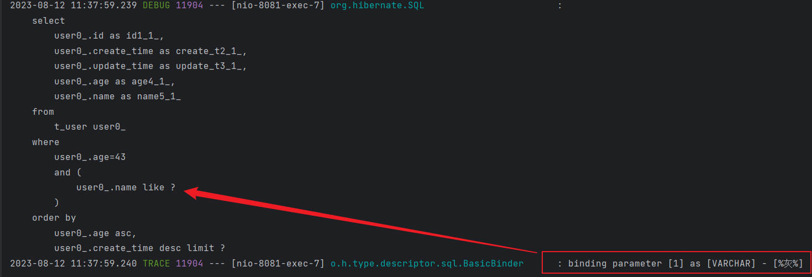

## 前言

在使用 SpringBoot + JPA 作为项目框架的时候，时常会碰到 SQL 错误（使用 @Query 编写 native sql）时常发生，这时候 SQL 的日志对于问题的解决就显得非常重要了。

---

## 测试框架和表

本文的测试仅包含两张表：t_user 和 t_order：

```sql
CREATE TABLE IF NOT EXISTS `t_order` (
  `id` int NOT NULL AUTO_INCREMENT,
  `name` varchar(50) COLLATE utf8mb4_general_ci NOT NULL DEFAULT '0',
  `user_id` int NOT NULL DEFAULT '0',
  `create_time` timestamp NULL DEFAULT NULL,
  `update_time` timestamp NULL DEFAULT NULL,
  PRIMARY KEY (`id`)
)

CREATE TABLE IF NOT EXISTS `t_user` (
  `id` int NOT NULL AUTO_INCREMENT,
  `name` varchar(50) COLLATE utf8mb4_general_ci NOT NULL DEFAULT '0',
  `age` int DEFAULT NULL,
  `create_time` timestamp NULL DEFAULT NULL,
  `update_time` timestamp NULL DEFAULT NULL,
  PRIMARY KEY (`id`)
)
```

---

## 最简单的方式

这里演示方便，调用 UserRepository 的 findAll() 方法，如果不进行任何配置的话，日志文件不会有任何输出，如果仅仅是为了测试方便的话，可以使用如下配置：

```properties
spring.jpa.show-sql=true
```

日志打印如下：

```
Hibernate: select user0_.id as id1_1_, user0_.create_time as create_t2_1_, user0_.update_time as update_t3_1_, user0_.age as age4_1_, user0_.name as name5_1_ from t_user user0_
```

如果需要结构化打印，需要额外增加一个配置项：

```properties
spring.jpa.properties.hibernate.format_sql=true
```

日志打印结果如下：

```
Hibernate: 
    select
        user0_.id as id1_1_,
        user0_.create_time as create_t2_1_,
        user0_.update_time as update_t3_1_,
        user0_.age as age4_1_,
        user0_.name as name5_1_ 
    from
        t_user user0_
```

这个配置虽然简单直观，但不适合放在生产环境中使用，因为它是输出到控制台上的，而且没有参数，比如下面这个语句：

```
Hibernate: 
    select
        user0_.id as id1_1_,
        user0_.create_time as create_t2_1_,
        user0_.update_time as update_t3_1_,
        user0_.age as age4_1_,
        user0_.name as name5_1_ 
    from
        t_user user0_ 
    where
        user0_.age=43 
        and (
            user0_.name like ?
        ) 
    order by
        user0_.age asc,
        user0_.create_time desc limit ?
```

只能看到查询参数都是 ?，无法知道具体传入了什么值，对调试很不方便。

---

## 更好的选择

将配置项改成下面这样：

```properties
spring.jpa.properties.hibernate.format_sql=true
logging.level.org.hibernate.SQL=DEBUG
logging.level.org.hibernate.type.descriptor.sql.BasicBinder=TRACE
```


