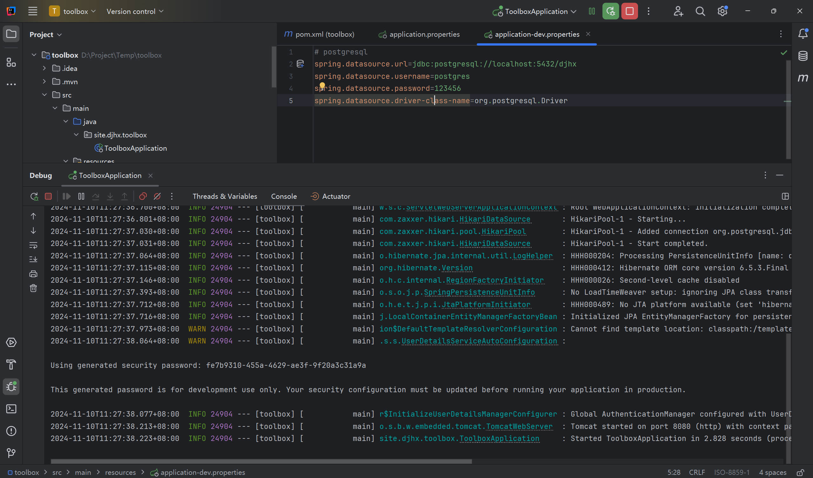

## 前言

现在流行的都是复杂的架构，前后端分离，微服务，容器化，这些在工作中固然“美好”，听起来高大上，既可以骗经费，又可以解决“实际”问题，在无聊的面试中又可以充当主要角色。

但是在很多个人的简易项目中，单体应用是不可或缺的，没有那么多时间搞运维，并发量不大和业务也不复杂的情况下，我们可以放心的选择单体应用，一切都是简单而透明的。

本文以 SpringBoot3 + SpringSecurity + Thymeleaf 的组合，来编写一个简单的分页查询页面作为示例。

项目编写完后，部署到服务器的过程也会讲解，包括配置 Nginx 和 Systemd。

本文的示例风格，参考了 Flask 官方文档的博客应用示例：[教程 — Flask中文文档(3.0.x)](https://dormousehole.readthedocs.io/en/latest/tutorial/index.html)

---

## 语言、框架和数据库

语言：

JDK21

框架：

Spring Boot3

Spring Security

Thymeleaf

Spring Data JPA

数据库：

PostgreSQL

---

## 需求

围绕数据库中的一张表，draft（草稿），来编写一个简单的应用，包括以下功能：

1. 为了安全性，有个登陆和注册页面。
2. 围绕 draft 表的增删改查。
3. 查询包含了一些字段，分页展示查询得到的数据。

---

## 项目初始化

pom 选择的依赖如下：
```xml
<dependencies>
    <dependency>
        <groupId>org.postgresql</groupId>
        <artifactId>postgresql</artifactId>
        <scope>runtime</scope>
    </dependency>
    <dependency>
        <groupId>org.springframework.boot</groupId>
        <artifactId>spring-boot-starter-data-jpa</artifactId>
    </dependency>
    <dependency>
        <groupId>org.springframework.boot</groupId>
        <artifactId>spring-boot-starter-security</artifactId>
    </dependency>
    <dependency>
        <groupId>org.springframework.boot</groupId>
        <artifactId>spring-boot-starter-thymeleaf</artifactId>
    </dependency>
    <dependency>
        <groupId>org.springframework.boot</groupId>
        <artifactId>spring-boot-starter-web</artifactId>
    </dependency>
    <dependency>
        <groupId>org.thymeleaf.extras</groupId>
        <artifactId>thymeleaf-extras-springsecurity6</artifactId>
    </dependency>

    <dependency>
        <groupId>org.projectlombok</groupId>
        <artifactId>lombok</artifactId>
        <optional>true</optional>
    </dependency>
    <dependency>
        <groupId>org.springframework.boot</groupId>
        <artifactId>spring-boot-starter-test</artifactId>
        <scope>test</scope>
    </dependency>
    <dependency>
        <groupId>org.springframework.security</groupId>
        <artifactId>spring-security-test</artifactId>
        <scope>test</scope>
    </dependency>
</dependencies>
```

---

## draft 表和数据库连接

本地 postgre 新建一个数据库，然后新建 draft 表：

```sql
-- ----------------------------
-- Table structure for draft
-- ----------------------------
DROP TABLE IF EXISTS "public"."draft";
CREATE TABLE "public"."draft" (
  "id" uuid NOT NULL,
  "title" varchar(255) COLLATE "pg_catalog"."default",
  "content" text COLLATE "pg_catalog"."default",
  "create_datetime" timestamp(6),
  "update_datetime" timestamp(6)
)
;

-- ----------------------------
-- Primary Key structure for table draft
-- ----------------------------
ALTER TABLE "public"."draft" ADD CONSTRAINT "draft_pkey" PRIMARY KEY ("id");
```

字段很简单，title 表示草稿的标题，content 表示草稿的内容，两个时间戳，一个是创建时间，一个是更新时间。

Spring Boot 的配置文件采用 profile 形式，application.properties 内容如下：
```properties
# 服务名称
spring.application.name=toolbox
# 关闭 open-in-view
spring.jpa.open-in-view=false
# 使用的 profile
spring.profiles.active=dev
```

application-dev.properties 内容如下：

```properties
# postgresql
spring.datasource.url=jdbc:postgresql://localhost:5432/djhx
spring.datasource.username=postgres
spring.datasource.password=123456
spring.datasource.driver-class-name=org.postgresql.Driver
```

配置好后，启动程序，没有报错，说明数据库连接成功，并且 Spring Security 会默认输出一个 UUID 的密码：



到这一步，主要是确认本地的数据库能够正常连接。

---

## 日志配置

logback 的日志记录也很重要，贴上我常用的配置文件，logback-spring.xml：

```xml
<?xml version="1.0" encoding="utf-8" ?>
<configuration scan="true" scanPeriod="30 seconds">

    <!-- 开发环境-日志级别 -->
    <!-- TRACE < DEBUG < INFO < WARN < ERROR -->
    <property
            name="DEV_LOG_LEVEL"
            value="INFO"
    />

    <!-- 测试环境-日志级别 -->
    <property
            name="TEST_LOG_LEVEL"
            value="INFO"
    />

    <!-- 生产环境-日志级别 -->
    <property
            name="PROD_LOG_LEVEL"
            value="INFO"
    />

    <!-- 日志存储目录路径 -->
    <property
            name="LOGS_DIR"
            value="./logs"
    />
    <!-- 日志文件名称格式 -->
    <property
            name="LOG_FILE_NAME_PATTERN"
            value="log_%d{yyyy-MM-dd}.log"
    />
    <!-- 日志保留最大数量 -->
    <property
            name="SAVE_LOG_MAX_NUM"
            value="3"
    />

    <!-- 控制台日志输出格式 -->
    <property
            name="CONSOLE_LOG_PATTERN"
            value="[%d{yyyy-MM-dd HH:mm:ss.SSS}] - [%highlight(%-5level)] - [%-15.30thread] - [%clr(%-20.30logger{30}){cyan}] : %msg%n"
    />

    <!-- 日志文件存储输出格式 -->
    <property
            name="FILE_LOG_PATTERN"
            value="[%d{yyyy-MM-dd HH:mm:ss.SSS}] - [%-5level] - [%-15thread] - [%-20logger] : %msg%n"
    />
    <!-- 日志色彩 -->
    <conversionRule
            conversionWord="clr"
            class="org.springframework.boot.logging.logback.ColorConverter"
    />

    <!-- appender console -->
    <appender name="CONSOLE" class="ch.qos.logback.core.ConsoleAppender">
        <encoder>
            <pattern>${CONSOLE_LOG_PATTERN}</pattern>
        </encoder>
    </appender>

    <!-- appender debug -->
    <appender name="DEBUG_FILE" class="ch.qos.logback.core.rolling.RollingFileAppender">

        <prudent>true</prudent>
        <encoder><pattern>${FILE_LOG_PATTERN}</pattern></encoder>
        <rollingPolicy class="ch.qos.logback.core.rolling.TimeBasedRollingPolicy">
            <fileNamePattern>${LOGS_DIR}/debug/${LOG_FILE_NAME_PATTERN}</fileNamePattern>
            <maxHistory>${SAVE_LOG_MAX_NUM}</maxHistory>
        </rollingPolicy>
        <filter class="ch.qos.logback.classic.filter.LevelFilter">
            <level>DEBUG</level>
            <onMatch>ACCEPT</onMatch>
            <onMismatch>DENY</onMismatch>
        </filter>
    </appender>

    <!-- appender info -->
    <appender name="INFO_FILE" class="ch.qos.logback.core.rolling.RollingFileAppender">

        <prudent>true</prudent>
        <encoder><pattern>${FILE_LOG_PATTERN}</pattern></encoder>
        <rollingPolicy class="ch.qos.logback.core.rolling.TimeBasedRollingPolicy">
            <fileNamePattern>${LOGS_DIR}/info/${LOG_FILE_NAME_PATTERN}</fileNamePattern>
            <maxHistory>${SAVE_LOG_MAX_NUM}</maxHistory>
        </rollingPolicy>
        <filter class="ch.qos.logback.classic.filter.LevelFilter">
            <level>INFO</level>
            <onMatch>ACCEPT</onMatch>
            <onMismatch>DENY</onMismatch>
        </filter>
    </appender>

    <!-- appender warn -->
    <appender name="WARN_FILE" class="ch.qos.logback.core.rolling.RollingFileAppender">

        <prudent>true</prudent>
        <encoder><pattern>${FILE_LOG_PATTERN}</pattern></encoder>
        <rollingPolicy class="ch.qos.logback.core.rolling.TimeBasedRollingPolicy">
            <fileNamePattern>${LOGS_DIR}/warn/${LOG_FILE_NAME_PATTERN}</fileNamePattern>
            <maxHistory>${SAVE_LOG_MAX_NUM}</maxHistory>
        </rollingPolicy>
        <filter class="ch.qos.logback.classic.filter.LevelFilter">
            <level>WARN</level>
            <onMatch>ACCEPT</onMatch>
            <onMismatch>DENY</onMismatch>
        </filter>
    </appender>

    <!-- appender error -->
    <appender name="ERROR_FILE" class="ch.qos.logback.core.rolling.RollingFileAppender">

        <prudent>true</prudent>
        <encoder><pattern>${FILE_LOG_PATTERN}</pattern></encoder>
        <rollingPolicy class="ch.qos.logback.core.rolling.TimeBasedRollingPolicy">
            <fileNamePattern>${LOGS_DIR}/error/${LOG_FILE_NAME_PATTERN}</fileNamePattern>
            <maxHistory>${SAVE_LOG_MAX_NUM}</maxHistory>
        </rollingPolicy>
        <filter class="ch.qos.logback.classic.filter.LevelFilter">
            <level>ERROR</level>
            <onMatch>ACCEPT</onMatch>
            <onMismatch>DENY</onMismatch>
        </filter>
    </appender>

    <!-- appender all -->
    <!-- 记录 level 为 info 及以上的所有日志到一个文件中 -->
    <appender name="ALL_FILE" class="ch.qos.logback.core.rolling.RollingFileAppender">

        <prudent>true</prudent>
        <encoder><pattern>${FILE_LOG_PATTERN}</pattern></encoder>
        <rollingPolicy class="ch.qos.logback.core.rolling.TimeBasedRollingPolicy">
            <fileNamePattern>${LOGS_DIR}/all/${LOG_FILE_NAME_PATTERN}</fileNamePattern>
            <maxHistory>${SAVE_LOG_MAX_NUM}</maxHistory>
        </rollingPolicy>
        <filter class="ch.qos.logback.classic.filter.LevelFilter">
            <level>DEBUG</level>
            <onMatch>DENY</onMatch>
            <onMismatch>ACCEPT</onMismatch>
        </filter>
    </appender>

    <!-- 根记录器-根据 spring profile 的配置来选择 -->
    <!-- 没有配置 profile 则默认是 default -->
    <springProfile name="default">
        <root level="${DEV_LOG_LEVEL}">
            <appender-ref ref="CONSOLE" />
            <appender-ref ref="DEBUG_FILE" />
            <appender-ref ref="INFO_FILE" />
            <appender-ref ref="WARN_FILE" />
            <appender-ref ref="ERROR_FILE" />
            <appender-ref ref="ALL_FILE" />
        </root>
    </springProfile>

    <!-- profile=dev -->
    <springProfile name="dev">
        <root level="${DEV_LOG_LEVEL}">
            <appender-ref ref="CONSOLE" />
            <appender-ref ref="DEBUG_FILE" />
            <appender-ref ref="INFO_FILE" />
            <appender-ref ref="WARN_FILE" />
            <appender-ref ref="ERROR_FILE" />
            <appender-ref ref="ALL_FILE" />
        </root>
    </springProfile>

    <!-- profile=test -->
    <springProfile name="test">
        <root level="${TEST_LOG_LEVEL}">
            <appender-ref ref="CONSOLE" />
            <appender-ref ref="DEBUG_FILE" />
            <appender-ref ref="INFO_FILE" />
            <appender-ref ref="WARN_FILE" />
            <appender-ref ref="ERROR_FILE" />
            <appender-ref ref="ALL_FILE" />
        </root>
    </springProfile>

    <!-- profile=prod -->
    <springProfile name="prod">
        <root level="${PROD_LOG_LEVEL}">
            <appender-ref ref="CONSOLE" />
            <appender-ref ref="DEBUG_FILE" />
            <appender-ref ref="INFO_FILE" />
            <appender-ref ref="WARN_FILE" />
            <appender-ref ref="ERROR_FILE" />
            <appender-ref ref="ALL_FILE" />
        </root>
    </springProfile>

</configuration>
```

该文件放在 `resources` 目录下即可。

---

## 业务代码

### entity 的基类

BaseEntity 包含了 id 和 create_datetime，update_datetime 三个字段，其他 entity 继承该类，避免重复性的编写这三个字段：

```java
@Data
@MappedSuperclass
public abstract class BaseEntity {


    @Id
    @GeneratedValue(strategy = GenerationType.AUTO)
    @Column(columnDefinition = "UUID", updatable = false, nullable = false)
    private UUID id;


    @Column(name = "create_datetime", updatable = false, nullable = false)
    @CreationTimestamp
    private LocalDateTime createDatetime;


    @Column(name = "update_datetime")
    @UpdateTimestamp
    private LocalDateTime updateDatetime;
}
```

Draft 类：
```java

@EqualsAndHashCode(callSuper = true)
@Data
@Entity
@Table(name = "draft")
public class Draft extends BaseEntity {


    @Column(name = "title")
    private String title;


    @Column(name = "content")
    private String content;
}
```

DraftRepository 类：

```java
@Repository
public interface DraftRepository extends JpaRepository<Draft, UUID>, JpaSpecificationExecutor<Draft> {
}
```

