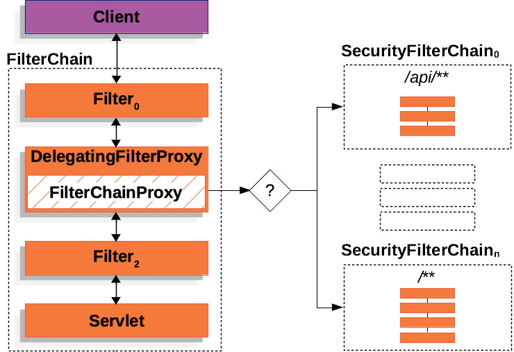

## 前言

最近在论坛上浏览 Spring Security 相关的一些帖子，发现国内吐槽这个框架难用笨重的人，在数量上似乎远远大于讨论这个框架技术和设计的人。

最开始接触 Spring Security 的时候，也被它的复杂性所困扰，和 Spring 家族的其他框架一样，极其繁多的抽象和设计，导致在一些简单项目的使用上没有那么简洁轻便，但后来稍微深入了解了才明白其中设计的一些精妙之处，认证，授权以及安全，在现实工程中，本就属于复杂度极高的领域，只是国内大部分的项目不需要那么安全，也没有审计，很多是生命周期很短的项目，所以在用 Spring Security 的时候就显得很笨拙，没有自己随意写一个过滤器或者拦截器来的方便。

根本原因还是对大型复杂项目的安全功能缺乏实践经验，以及对于框架本身缺少深入的理解，随意的几句话，便可抹消掉为开源框架贡献力量的无数工程师的努力。

深入理解一个框架的第一步，首先是看看它默认提供了什么，之后才能更加透明的进行自定义配置。

本文使用的版本是 Spring Security 7.1.0，本文讨论的是 Servlet Web 应用。

---

## 流程

Spring Security 的大致流程可以参考官方介绍 Servlet Applications Security 架构的这篇[文档](https://docs.spring.io/spring-security/reference/servlet/architecture.html)。

Spring Security 是基于 Servlet Filter 体系的，里面 Spring 自己写了个 DelegatingFilterProxy 用来桥接 Spring Security Filter 和 Servlet,真正的入口是 FilterChainProxy,它决定了一个 HTTP 请求如何按照匹配的规则，进入到特定的 SecurityFilterChain, 每个 SecurityFilterChain 都有一长串（也可以没有）Filter,请求就在这 Filter 链中一步步传递下去。



这引入了最重要的两个入口类，一个是 FilterChainProxy，一个是 SecurityFilterChain，前者是根据规则来调用不同的 SecurityFilterChain,也就是 Web Security 的入口，如果想 debug,可以在 FilterChainProxy 的 doFilterInternal 方法里打上断点，并且配置 logging level：

```
logging.level.org.springframework.security=TRACE
```

可以看到很多有用的 trace 日志信息。

FilterChainProxy 基本是不需要自己配置的，但 SecurityFilterChain 是我们最常使用的配置项，它包含了一系列的 Filter.

有一个构造器类，是专门用来配置出一个 SecurityFilterChain 的，那就是 HttpSecurity.

它俩的关系大概是：HttpSecurity 是 Builder（构建器），SecurityFilterChain 是最终构建出来的产品，这是建造者模式，不断的通过链式调用配置各个选项，最后调用 build 方法生成 SecurityFilterChain（实现类是 DefaultSecurityFilterChain）。

---

## SecurityFilterChain

我们在引入 Spring Security 依赖以后，并没有编写任何配置，日志就打印了一个 uuid 密码，并且访问所有接口，如果不传递用户名密码，就会 401,这是因为自动配置的机制，我们没有提供配置，Spring Boot 就默认给了我们一个最基本的配置：

```java

@AutoConfiguration(after = UserDetailsServiceAutoConfiguration.class,
		afterName = { "org.springframework.boot.webmvc.autoconfigure.WebMvcAutoConfiguration",
				"org.springframework.boot.webmvc.test.autoconfigure.MockMvcAutoConfiguration" })
@ConditionalOnClass(EnableWebSecurity.class)
@ConditionalOnWebApplication(type = Type.SERVLET)
public final class ServletWebSecurityAutoConfiguration {

	@Configuration(proxyBeanMethods = false)
	@ConditionalOnBean(DispatcherServletPath.class)
	@ConditionalOnClass(DispatcherServletPath.class)
	static class PathPatternRequestMatcherBuilderConfiguration {

		@Bean
		@ConditionalOnMissingBean
		PathPatternRequestMatcher.Builder pathPatternRequestMatcherBuilder(
				DispatcherServletPath dispatcherServletPath) {
			PathPatternRequestMatcher.Builder builder = PathPatternRequestMatcher.withDefaults();
			String path = dispatcherServletPath.getPath();
			return (!path.equals("/")) ? builder.basePath(path) : builder;
		}

	}

	/**
	 * The default configuration for web security. It relies on Spring Security's
	 * content-negotiation strategy to determine what sort of authentication to use. If
	 * the user specifies their own {@link SecurityFilterChain} bean, this will back-off
	 * completely and the users should specify all the bits that they want to configure as
	 * part of the custom security configuration.
	 */
	@Configuration(proxyBeanMethods = false)
	@ConditionalOnDefaultWebSecurity
	static class SecurityFilterChainConfiguration {

		@Bean
		@Order(SecurityFilterProperties.BASIC_AUTH_ORDER)
		SecurityFilterChain defaultSecurityFilterChain(HttpSecurity http) {
			http.authorizeHttpRequests((requests) -> requests.anyRequest().authenticated());
			http.formLogin(withDefaults());
			http.httpBasic(withDefaults());
			return http.build();
		}

	}

	/**
	 * Adds the {@link EnableWebSecurity @EnableWebSecurity} annotation if Spring Security
	 * is on the classpath. This will make sure that the annotation is present with
	 * default security auto-configuration and also if the user adds custom security and
	 * forgets to add the annotation. If {@link EnableWebSecurity @EnableWebSecurity} has
	 * already been added or if a bean with name
	 * {@value BeanIds#SPRING_SECURITY_FILTER_CHAIN} has been configured by the user, this
	 * will back-off.
	 */
	@Configuration(proxyBeanMethods = false)
	@ConditionalOnMissingBean(name = BeanIds.SPRING_SECURITY_FILTER_CHAIN)
	@ConditionalOnClass(EnableWebSecurity.class)
	@EnableWebSecurity
	static class EnableWebSecurityConfiguration {

	}

}

```

ServletWebSecurityAutoConfiguration 属于 Spring Boot 自动配置，它的职责非常简单，就是自动开启 Spring Security。

在 defaultSecurityFilterChain 中，默认的配置是：

1. 对所有接口进行保护：http.authorizeHttpRequests((requests) -> requests.anyRequest().authenticated());
2. 支持 form 表单登陆：http.formLogin(withDefaults());
3. 支持 Basic 认证：http.httpBasic(withDefaults());

这就是为什么一开始什么配置都没有，访问接口会跳转到登陆页面的原因。

---

## WebSecurityConfiguration

真正负责创建 FilterChainProxy 的是 WebSecurityConfiguration，它属于 Spring Security, 上面提到的 ServletWebSecurityAutoConfiguration 自动启用了 @EnableWebSecurity 注解，这个注解会引入 WebSecurityConfiguration。

创建顺序：

```

Spring Boot
    │
    ▼
ServletWebSecurityAutoConfiguration
    │
    ▼
@EnableWebSecurity
    │
    ▼
导入 WebSecurityConfiguration
    │
    ▼
创建 FilterChainProxy

```

---

## HttpSecurity

ServletWebSecurityAutoConfiguration 中的 defaultSecurityFilterChain 参数表明了该函数依赖 HttpSecurity，这个 Bean 的配置类是 HttpSecurityConfiguration, 相关代码如下：

```java

    @Bean(HTTPSECURITY_BEAN_NAME)
	@Scope("prototype")
	HttpSecurity httpSecurity() {
		LazyPasswordEncoder passwordEncoder = new LazyPasswordEncoder(this.context);
		AuthenticationManagerBuilder authenticationBuilder = new DefaultPasswordEncoderAuthenticationManagerBuilder(
				this.objectPostProcessor, passwordEncoder);
		authenticationBuilder.parentAuthenticationManager(authenticationManager());
		authenticationBuilder.authenticationEventPublisher(getAuthenticationEventPublisher());
		HttpSecurity http = new HttpSecurity(this.objectPostProcessor, authenticationBuilder, createSharedObjects());
		WebAsyncManagerIntegrationFilter webAsyncManagerIntegrationFilter = new WebAsyncManagerIntegrationFilter();
		webAsyncManagerIntegrationFilter.setSecurityContextHolderStrategy(this.securityContextHolderStrategy);
		// @formatter:off
		http
			.csrf(withDefaults())
			.addFilter(webAsyncManagerIntegrationFilter)
			.exceptionHandling(withDefaults())
			.headers(withDefaults())
			.sessionManagement(withDefaults())
			.securityContext(withDefaults())
			.requestCache(withDefaults())
			.anonymous(withDefaults())
			.servletApi(withDefaults())
			.with(new DefaultLoginPageConfigurer<>());
		http.logout(withDefaults());
		// @formatter:on
		applyCorsIfAvailable(http);
		applyDefaultConfigurers(http);
		applyHttpSecurityCustomizers(this.context, http);
		applyTopLevelCustomizers(this.context, http);
		return http;
	}

```

可以看到 HttpSecurity 注入到 Spring 容器前，就配置了很多 filter,比如 csrf。

---

## 查看 SecurityFilterChain 包含什么 Filter

对于 Spring Security 的调试而言，最重要的就是知道一个 HTTP 请求经过了多少个 Filter, 那么如何知道一个 SecurityFilterChain 包含了多少个 Filter？

除了被动的通过设置 security log level 为 TRACE,查看日志打印之外，断点也是不错的选择，按照启动时触发断点和启动后请求触发断点可以把断点打在以下两处地方。

### HttpSecurity 的构造函数

HttpSecurity 有个函数：

```java

	@Override
	protected DefaultSecurityFilterChain performBuild() {
		this.filters.sort(OrderComparator.INSTANCE);
		List<Filter> sortedFilters = new ArrayList<>(this.filters.size());
		for (Filter filter : this.filters) {
			sortedFilters.add(((OrderedFilter) filter).filter);
		}
		return new DefaultSecurityFilterChain(this.requestMatcher, sortedFilters);
	}

```

会调用 DefaultSecurityFilterChain 的构造函数：

```java

	public DefaultSecurityFilterChain(RequestMatcher requestMatcher, List<Filter> filters) {
		if (filters.isEmpty()) {
			logger.debug(LogMessage.format("Will not secure %s", requestMatcher));
		}
		else {
			List<String> filterNames = new ArrayList<>();
			for (Filter filter : filters) {
				filterNames.add(filter.getClass().getSimpleName());
			}
			String names = StringUtils.collectionToDelimitedString(filterNames, ", ");
			logger.debug(LogMessage.format("Will secure %s with filters: %s", requestMatcher, names));
		}
		this.requestMatcher = requestMatcher;
		this.filters = new ArrayList<>(filters);
	}

```

断点打在这里，可以在应用启动时触发断点，查看有哪些 filters 加入。

### FilterChainProxy

如果是想要 SpringBoot 启动完毕，发送一个请求来看会走入什么过滤器链，可以把断点打在 FilterChainProxy.doFilterInternal():

```java

private void doFilterInternal(ServletRequest request, ServletResponse response, FilterChain chain)
			throws IOException, ServletException {
		FirewalledRequest firewallRequest = this.firewall.getFirewalledRequest((HttpServletRequest) request);
		HttpServletResponse firewallResponse = this.firewall.getFirewalledResponse((HttpServletResponse) response);
		List<Filter> filters = getFilters(firewallRequest);
		if (filters == null || filters.isEmpty()) {
			if (logger.isTraceEnabled()) {
				logger.trace(LogMessage.of(() -> "No security for " + requestLine(firewallRequest)));
			}
			firewallRequest.reset();
			this.filterChainDecorator.decorate(chain).doFilter(firewallRequest, firewallResponse);
			return;
		}
		if (logger.isDebugEnabled()) {
			logger.debug(LogMessage.of(() -> "Securing " + requestLine(firewallRequest)));
		}
		FilterChain reset = (req, res) -> {
			if (logger.isDebugEnabled()) {
				logger.debug(LogMessage.of(() -> "Secured " + requestLine(firewallRequest)));
			}
			// Deactivate path stripping as we exit the security filter chain
			firewallRequest.reset();
			chain.doFilter(req, res);
		};
		this.filterChainDecorator.decorate(reset, filters).doFilter(firewallRequest, firewallResponse);
	}

```

断点可以放在：

```java

List<Filter> filters = getFilters(request);

```

## SecurityConfigurer

看到以下代码时：

```java

		@Bean
		@Order(SecurityFilterProperties.BASIC_AUTH_ORDER)
		SecurityFilterChain defaultSecurityFilterChain(HttpSecurity http) {
			http.authorizeHttpRequests((requests) -> requests.anyRequest().authenticated());
			http.formLogin(withDefaults());
			http.httpBasic(withDefaults());
			return http.build();
		}

```

第一反应是 HttpSecurity 在一步一步配置选项，每配置完一个，就会往 DefaultSecurityFilterChain.filters 中添加一个 filter,但实际上添加filter发生在所有配置项配置完成，调用 http.build() 这一步。

在配置的每一步，往里塞的并不是 filter,而是 configurer,点进 formLogin 的函数可以看到：

```java

    public HttpSecurity formLogin(Customizer<FormLoginConfigurer<HttpSecurity>> formLoginCustomizer) {
		formLoginCustomizer.customize(getOrApply(new FormLoginConfigurer<>()));
		return HttpSecurity.this;
	}
	
```

HttpSecurity 在配置阶段保存的是 SecurityConfigurer，不是 Filter；直到 build() 时，所有 Configurer 才共同协作，把需要的 Filter 创建出来并加入过滤器链。

当配置完成，调用 build 时，会进入 AbstractConfiguredSecurityBuilder.doBuild()：

```java

    @Override
	protected final O doBuild() {
		synchronized (this.configurers) {
			this.buildState = BuildState.INITIALIZING;
			beforeInit();
			init();
			this.buildState = BuildState.CONFIGURING;
			beforeConfigure();
			configure();
			this.buildState = BuildState.BUILDING;
			O result = performBuild();
			this.buildState = BuildState.BUILT;
			return result;
		}
	}

```

configure() 会遍历所有的 configurers,依次调用每个 configurer 的 configure 方法：

```java

	private void configure() {
		Collection<SecurityConfigurer<O, B>> configurers = getConfigurers();
		for (SecurityConfigurer<O, B> configurer : configurers) {
			configurer.configure((B) this);
		}
	}

```

HttpSecurity 在配置过程中添加的所有 configurer, 都有 configure 方法，最后一步都会调用 http.addFilter。

当 configure 执行完毕，所有的 filter 都被添加进来，接下来就会执行 performBuild：

```java

	@Override
	protected DefaultSecurityFilterChain performBuild() {
		this.filters.sort(OrderComparator.INSTANCE);
		List<Filter> sortedFilters = new ArrayList<>(this.filters.size());
		for (Filter filter : this.filters) {
			sortedFilters.add(((OrderedFilter) filter).filter);
		}
		return new DefaultSecurityFilterChain(this.requestMatcher, sortedFilters);
	}

```

这一步最重要的是 sort,也就是按照 Spring Security 内置顺序对所有 filter 进行排序。

所以生命周期可以按照以下顺序理解：

```

HttpSecurity
      │
      ├── 保存各种 SecurityConfigurer
      │
      └── build()
              │
              ▼
      每个 Configurer.configure()
              │
              ▼
      创建 Filter
              │
              ▼
      HttpSecurity 收集所有 Filter
              │
              ▼
      排序
              │
              ▼
      DefaultSecurityFilterChain

```

这么设计的好处是，因为 filter 链的顺序是很关键的，但是在链式调用的配置阶段，我们可以随心所欲打乱顺序配置，把所有的 configurer 不考虑顺序，全部加进来，只有最终在 build 的时候，对 filter 进行排序。

---

## 总结

下面粗略的大白话总结下所涉及的概念：

- 入口是 FilterChainProxy,根据规则来让不同的请求进入到不同的 SecurityFilterChain,通过 WebSecurity 构造，非特殊情况无需自己配置。
- SecurityFilterChain 包含0个或者多个filters,通过 HttpSecurity 配置和构造，大部分自定义配置，都使用 HttpSecurity。
- SpringBoot 通过 ServletWebSecurityAutoConfiguration 提供了默认的自动配置，@EnableWebSecurity 注解会引入 WebSecurityConfiguration。
- HttpSecurityConfiguration 提供了 HttpSecurity 的 Bean 配置，默认就配置了很多 Filter,比如：csrf。
- ServletWebSecurityAutoConfiguration 默认给 SecurityFilterChain 配置了3点：第一，所有端口受保护；第二，启用 formLogin；第三，启动 httpBasic。
- HttpSecurity 配置阶段保存的是一系列的 configurer,最后 build 的时候会调用所有 configurer 的 configure,才会把真正的 filter 加进来。
- HttpSecurity 会在所有 filter 加入进来后，对它们进行排序。
