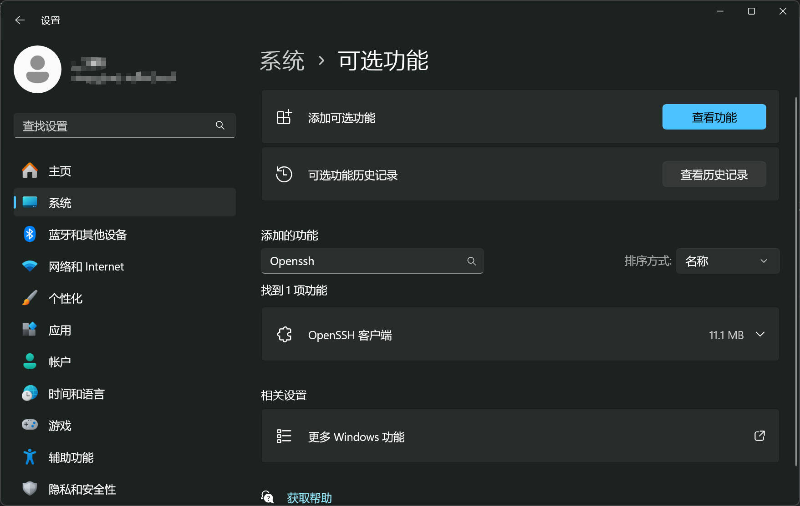

## 前言

最近在尝试把 Windows 下的磁盘挂载到公网服务器上，其中的一个方案是 sshfs，它是基于 ssh 的，所以要先能够通过 SSH 连接到 Windows 才行。

本文介绍如何在 Windows 中开启 OpenSSH Server。

---

## 步骤

### 安装

打开“系统”的“可选功能”，这里可以看到我的电脑仅仅装了 OpenSSH 客户端，但是没有装 OpenSSH 服务端。



点开“查看功能”，然后添加 “OpenSSH 服务端”：


在服务中，启动：


这里的 SSH Server 服务，如果只是临时使用或者不希望系统自启动的话，选择手动即可，如果希望系统开机自启，则选择自动（延迟启动）或者自动选项。


### 账户

折腾了好久没有成功登陆本机账号，索性就新建一个测试账号吧。

```cmd
net user koril 123456 /add
net user koril 123456 /active
```

### 登陆

```cmd
ssh koril@LAPTOP-DJH
```

这里 @ 后面可以是 IP 地址，也可以是主机名。