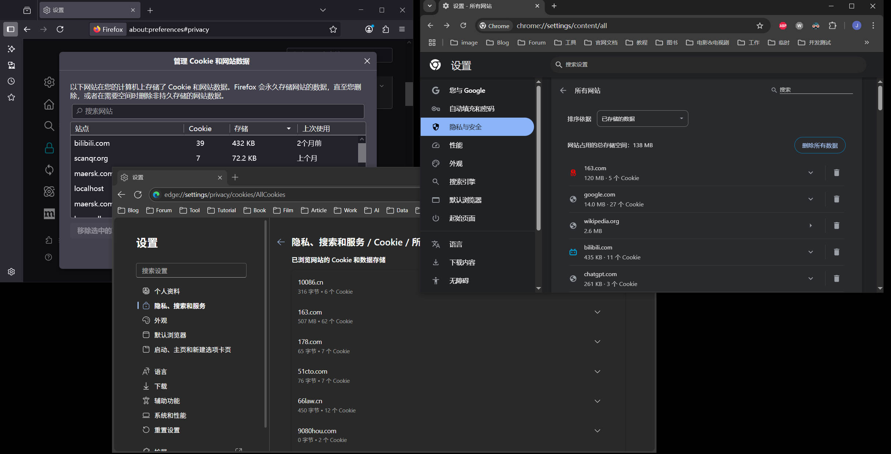
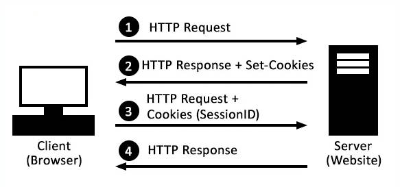

## 目录

[TOC]

---

## 前言

HTTP 协议是无状态的，所谓无状态，指的是服务器无法确认多个 HTTP 请求之间是否存在关联，或者多个请求是否由同一个用户发出。这种简单的设计在静态类型页面（没有太多交互）的网站上工作良好，但是对于动态网站（根据不同的用户生成不同的页面）来说，无状态就很棘手了。

一些动态网站（比如：电商网站，博客平台等）需要标志出一个用户在访问一项业务（也许是添加多个商品到购物车，也许是浏览了几个页面需要记录历史浏览状态）的时候，需要借助 HTTP 的 cookie 和 session 技术来完成。

---

## cookie

cookie 是一种在 web 服务器和 web 浏览器之间传递信息的技术，最早由美国的李维·蒙塔利（Lou Montulli）于 1994 年发明，通过在 HTTP response headers 中添加一个 set-cookie 字段来完成 web 服务器在 web 浏览器上保存一些信息，等下一次 web 浏览器发送请求时，就会携带 set-cookie 里的内容（放在 request header 的 cookie 字段）交给 web 服务器。

可以先把 cookie 简单的想象一个浏览器的存储功能，存储了针对于不同的网站的键值对，在 chrome/firefox/edge 等浏览器的 settings-隐私与安全中，可以找到所有网站的 cookies：

首先 web 浏览器可以通过这个字段，保存一些关于当前使用该浏览器的用户的个人信息，比如：用户设置偏好，用户名，购物车列表等等，这样用户打开特定网站时，web 浏览器就可以通过这些 cookie 内容，展示特定于当前用户的页面。

另外一方面，web 服务器为了从成千上万的 HTTP 请求中，辨认出哪几个 HTTP 请求属于某一个特定的用户或者浏览器，就可以在 cookie 里面塞一个 id（比如一个 UUID），这种模式就引申出了 cookie 的另外一个用法——维护 session。

---

## session

cookie 本身并不是为了解决“在浏览器上存东西”而被发明，它的出现是为了解决 HTTP 协议无状态特性的问题。在网络的早期，当没有其他选择时，cookie 被用于数据存储目的（也就是上一小节提到的用法），现在建议使用新式存储 API，例如 Web Storage API (localStorage，sessionStorage) 或者 IndexedDB。

如果说 cookie 是 HTTP 中一个实际的 header 字段，那么 session 更像是一个过程，它基于 cookie 实现：

1. 用户使用账号名密码登录
2. 登陆成功后，服务器为该用户生成一个 SessionId，并且在服务器内存中存储了这个 SessionId 对应的用户信息。
3. 服务器通过 set-cookie 把 SessionId 告诉浏览器，浏览器存储到 cookie 中。
4. 浏览器之后每一次访问该站点，会在 cookie 中携带这个 SessionId 向服务器表明自己的身份。

流程大致如下：

---

## Session 存储策略

首先考虑一种最简单的场景和方式：用户使用用户名+密码的方式，登陆成功后，服务器通过数据库的 user 表确定了请求对应的用户信息（用户 id，购物车记录，登陆有效时间等等信息）。

服务器可以一股脑的把这些信息以明文的方式，set-cookie 交给浏览器，浏览器在后面每一个请求，都会带上这些信息。

但是生产环境一般不会这么做，因为这会把用户数据透明的交给浏览器，用户信息的安全性无法保证。

为了适应不同的应用场景，目前主流的做法有三种。

### 第一种

应用服务器在内存中维护一个键值对结构（Map），Key 是一个随即生成的 SessionId，Value 则是用户信息对象，服务器仅需要把 SessionId 交给服务器，这样用户信息存储在服务器端，安全性有了保障。

优点：

1. 实现简单。
2. 内存访问速度快。

缺点：

1. 可扩展性差，一旦部署到分布式的环境下，服务器和服务器各自的内存无法共享。
2. 服务器重启或者进程崩溃，导致用户 session 信息全部丢失。
3. 用户数量极大时，会导致内存占用很高。

适用场景：适用于单服务器，场景简单，用户数量可控，session 丢失不敏感的应用。

### 第二种

和第一种类似，同样是把 SessionId 交给浏览器，不过用户信息是存储在数据库层面的（比如：Redis 或者 MySQL）

优点：

1. 可扩展，所有应用服务器共享一个 session 存储。
2. 持久性可以通过数据库来保证。
3. 容量大，可以持久化磁盘，减轻内存压力。

缺点：

1. 存在应用和数据库之间的网络开销。
2. 复杂性更高。
3. 要考虑在用户量极大时，数据库读写性能和网络性能。

适用场景：需要水平扩展到多个应用服务器，需要保障 session 高可用的应用。

### 第三种

第三种是一种自包含、无状态的 session，服务器不存储 session 信息，而是将用户信息序列化（如：JSON），再使用仅有服务器端保存的密钥，进行签名（防止客户端篡改），把最终生成的签名后的数据交给浏览器。

优点：

1. 实现简单，有现成的方案——JWT，不需要在服务器端保存 session 数据。
2. 可扩展，服务端不存储 session 数据，天然支持分布式。

缺点：

1. 相比于 SessionId，这一种签名数据的占用空间更大，网络传输开销较大。
2. CPU 压力高，每次请求响应涉及到 session 数据的解密和签名校验。
3. 一旦签发，无法在短时间内撤销，因为服务器没有保存 session 数据，除非等到签发信息过期或者在服务器维护黑名单 session。
4. 用户信息编码在签发的信息中，存在泄露信息的风险。

适用场景：无状态 API、微服务间认证、单点登录、客户端需要知道部分用户信息的场景（如显示用户名）。

---

## Cookie 的生存时间

cookie 有两种控制生存时间的方式：

1. 会话 Cookie
2. 持久性 Cookie

会话 Cookie 仅在当前浏览器会话中有效，关闭浏览器就自动删除，这种 session cookie 常见于临时登陆，或者安全性较高的网站（比如：银行软件）。

持久性 Cookie 会持久化到本地磁盘，可以通过两种方式设置持久性 Cookie 的生存时间：

1. Expires=$date
2. Max-Age=$seconds

Expires 用于设置一个具体的过期时间，而 Max-Age 则可以设置从现在开始的存活秒数。

---

## 安全性

cookie 为了增强安全性，提供了以下字段：

- Path
- HttpOnly
- Secure
- SameSite

这一部分的内容可以参考：https://juejin.cn/post/6959830432519520292

---

## 参考

1. https://developer.mozilla.org/en-US/docs/Web/HTTP/Guides/Cookies
2. https://http.dev/cookies
3. https://developer.mozilla.org/en-US/docs/Web/HTTP/Guides/Overview#http_is_stateless_but_not_sessionless
4. https://developer.mozilla.org/zh-CN/docs/Web/HTTP/Reference/Headers/Set-Cookie
5. https://zhuanlan.zhihu.com/p/688144675
