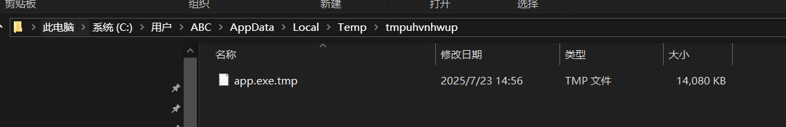

## 前言

之前开发过一些客户端小工具（CLI 或者 GUI），不可避免地会碰到软件更新的问题，如果是自己使用的软件，那用新的版本替换掉旧的版本即可，一切都在本地完成。

但如果开发的工具分发到互联网或者公司部门同事之间使用，软件的更新就成了一个头疼的问题，每次更新软件版本，都得通过聊天软件或者U盘之类的手段传来传去。

本文提供一个简单通用的方式（不一定是最好的），来实现软件的全量更新，本文使用 PySide6 作为 GUI 软件编写框架，使用 Nuitka 打包成 exe 文件。

---

## 思路

用户启动软件后，一般可以通过以下几种方式来提供更新入口：

1. 启动软件时，立即检测是否有新的版本，用户被动接收更新通知
2. 软件启动后，定时检测是否有新的版本，用户被动接收更新通知
3. 菜单栏的帮助里，一般会提供检测是否有新版本的选项，用户主动检查更新

无论哪一种更新方式，首先需要实现的函数是检测是否存在新的版本。

可以在公网服务器上，放置一个文本文件（格式随意，txt，yaml，json，xml 都行），该文本文件存储了当前最新版本的软件信息:

- 新版本的版本号
- 新版本的发布时间
- 更新内容
- 新版本的下载地址

例如，公网上放一个 version.json，内容如下：

```json
{
  "version": "v1.0.1",
  "update_date": "2025-07-21",
  "description": "测试更新",
  "exe_url": "http://your-server/app.exe"
}
```

检测是否存在新的版本，就可以通过该文件的最新版本号和当前客户端软件内部的版本号进行比对。如果存在更新的版本，则根据该文件提供的新版本的下载地址，下载到本地的临时目录。

新版本的软件下载到临时目录成功后，再进行替换，把旧版本替换成新版本，然后重新启动软件，并且退出更新程序。

需要注意的是，网上的一些方案，是把更新程序和主程序捆绑，最后打包成一个 exe 文件，但是这样会导致“关闭主程序-更新-重启主程序”这个主要环节出现问题，Windows 是不能关闭当前正在运行的程序的，所以一些博客的方法是把“软件替换+重启软件”这个步骤通过 bat 文件来完成。

本文的方式是把 app.exe（主程序）和 update.exe（更新程序）分开，这样“关闭-下载-替换-重启”的整个步骤会更加方便。

---

## 主程序

主程序不包含其他业务逻辑，仅仅把当前软件的版本号显示在窗口中央：

```python
import os
import subprocess
import sys

from PySide6.QtCore import Qt
from PySide6.QtWidgets import (
    QMainWindow, QApplication, QLabel,
    QMessageBox
)

__version__ = 'v1.0.0'


class MainWindow(QMainWindow):
    def __init__(self):
        super().__init__()
        self.label = None
        self.init_ui()

    def init_ui(self):
        self.setWindowTitle("Hello World")
        self.setFixedSize(300, 150)

        self.label = QLabel(f"version: {__version__}", self)
        self.label.setAlignment(Qt.AlignmentFlag.AlignCenter)
        self.setCentralWidget(self.label)


def main():
    app = QApplication(sys.argv)
    window = MainWindow()
    window.show()
    sys.exit(app.exec())


if __name__ == '__main__':
    main()
```

这里采用的更新方式是，在菜单栏放一个 help，提供更新的选项：

!()[./images/1.jpg]

菜单栏代码如下：

```python
def init_ui(self):

    # 添加菜单
    menubar = self.menuBar()
    update_menu = menubar.addMenu("Help")
    check_action = update_menu.addAction("Check App Update")
    check_action.triggered.connect(self.check_update)
```

用户点击 check action 后，回调 check_update 函数：

```python
    def check_update(self):
        try:
            version_info = update.check_version(__version__)
            if version_info:
                reply = QMessageBox.question(
                    self,
                    "发现新版本",
                    f"检测到新版本 {version_info['version']}，是否更新？",
                    QMessageBox.StandardButton.Yes | QMessageBox.StandardButton.No
                )
                if reply == QMessageBox.StandardButton.Yes:
                    self.run_update(version_info)
            else:
                QMessageBox.information(self, "已是最新版", f"当前已是最新版本：{__version__}")
        except Exception as e:
            QMessageBox.critical(self, "更新错误", f"检查更新时出错: {str(e)}")
```

update.check_version 会去检测是否存在新的版本，如果存在的话，就把服务器上的版本信息返回。

用户点击确认更新后，调用 run_update 函数，该函数主要作用是启动更新程序（update.exe）并且退出当前主程序（app.exe）：

```python
    def run_update(self, version_info):
        try:

            app_path = Path(sys.argv[0])
            app_dir = app_path.parent

            # 构建 update.exe 路径并检查存在性
            update_path = app_dir / "update.exe"
            if not update_path.exists():
                raise FileNotFoundError(f"找不到更新程序: {update_path}")

            # 启动更新程序
            subprocess.Popen([
                update_path,
                app_path,
                __version__,
                version_info['exe_url'],
                version_info['version'],
                version_info['description'],
                version_info['update_date']
            ])

            # 退出当前应用
            QApplication.quit()
        except Exception as e:
            QMessageBox.critical(self, "更新错误", f"启动更新程序时出错: {str(e)}")
```

---

## 更新程序

### 比较版本号

假设当前的程序内部有一个变量存储了当前版本号 local_version，而服务器端存储了最新的程序版本号 remote_version，二者约定好都是类似于 v1.2.3 这样的格式，那么可以使用以下方式进行版本比较：

```python
def check_version(current_version):
    try:
        with urllib.request.urlopen(app_update_repo_url, timeout=10) as response:
            data = response.read()
            text = data.decode('utf-8')
            new_version_info = json.loads(text)
            new_version = new_version_info['version']
            if is_newer_version(current_version, new_version):
                return new_version_info
        return None
    except Exception as e:
        print(f"检查版本时出错: {str(e)}")
        return None


def version_tuple(v):
    # 处理版本号格式: "v1.2.3" -> (1, 2, 3)
    return tuple(map(int, v.strip("v").split(".")))


def is_newer_version(current, latest):
    return version_tuple(latest) > version_tuple(current)
```

python tuple 的大小比较是从左往右依次比较，碰到第一个不相等的元素，进行判断大小，所以适用于这里的版本号比较。

接下来就是编写一个 GUI 界面，提供下载的信息和进度条展示：

```python
class DownloadProgressSignal(QObject):
    # 进度条信号 percent, downloaded, total
    progress_updated = Signal(int, int, int)
    # 状态栏信号 message
    status_updated = Signal(str)
    # 下载是否完成信号 success, message
    finished = Signal(bool, str)


class UpdateDialog(QDialog):
    def __init__(self, parent=None, version_info=None, save_path=None, app_path=None):
        super().__init__(parent)
        self.abort_flag = None
        self.cancel_btn = None
        self.status_lbl = None
        self.progress_bar = None
        self.description_info_lbl = None
        self.version_info_lbl = None
        self.version_info = version_info
        self.save_path = save_path
        self.app_path = app_path
        self.download_thread = None
        self.download_signals = DownloadProgressSignal()
        self.init_ui()
        self.setWindowTitle("应用更新")
        self.setFixedSize(400, 250)

        # 连接信号
        self.download_signals.progress_updated.connect(self.update_progress)
        self.download_signals.status_updated.connect(self.update_status)
        self.download_signals.finished.connect(self.on_download_finished)

        # 开始更新
        self.start_update()

    def init_ui(self):
        layout = QVBoxLayout(self)
        layout.setSpacing(10)
        layout.setContentsMargins(20, 20, 20, 20)

        # 版本信息
        version_info_msg = f"旧版本: {self.version_info['old_version']} -> 新版本: {self.version_info['new_version']} 发布时间: {self.version_info.get('update_date', '未知')}"
        description_msg = f"更新内容: {self.version_info['description']}"
        self.version_info_lbl = QLabel(version_info_msg)
        self.version_info_lbl.setAlignment(Qt.AlignmentFlag.AlignCenter)
        layout.addWidget(self.version_info_lbl)

        # 描述信息
        self.description_info_lbl = QLabel(description_msg)
        self.description_info_lbl.setWordWrap(True)
        layout.addWidget(self.description_info_lbl)

        # 进度条
        self.progress_bar = QProgressBar()
        self.progress_bar.setAlignment(Qt.AlignmentFlag.AlignCenter)
        self.progress_bar.setRange(0, 100)
        self.progress_bar.setValue(0)
        layout.addWidget(self.progress_bar)

        # 状态信息
        self.status_lbl = QLabel("准备下载更新...")
        self.status_lbl.setAlignment(Qt.AlignmentFlag.AlignCenter)
        layout.addWidget(self.status_lbl)

        # 控制按钮
        self.cancel_btn = QPushButton("取消更新")
        self.cancel_btn.clicked.connect(self.cancel_update)
        layout.addWidget(self.cancel_btn)

    def start_update(self):
        """启动下载线程"""
        self.cancel_btn.setEnabled(True)
        self.status_lbl.setText("正在下载更新...")

        # 创建下载线程
        self.download_thread = threading.Thread(
            target=self.download_latest_exe,
            args=(self.version_info['exe_url'], self.save_path),
            daemon=True
        )
        self.download_thread.start()

    def download_latest_exe(self, download_url, save_path):
        """下载新版本的可执行文件（在后台线程中运行）"""
        try:
            self.download_signals.status_updated.emit("正在连接服务器...")

            with urllib.request.urlopen(download_url, timeout=30) as response:
                total_size = int(response.headers.get('Content-Length', 0))
                downloaded = 0
                chunk_size = 8192

                self.download_signals.status_updated.emit(f"开始下载 ({total_size // 1024} KB)...")
                self.download_signals.progress_updated.emit(0, 0, total_size)

                with open(save_path, 'wb') as f:
                    while True:
                        if hasattr(self, 'abort_flag') and self.abort_flag:
                            self.download_signals.status_updated.emit("下载已取消")
                            self.download_signals.finished.emit(False, "下载被取消")
                            return

                        chunk = response.read(chunk_size)
                        if not chunk:
                            break
                        f.write(chunk)
                        downloaded += len(chunk)

                        # 更新进度
                        if total_size > 0:
                            percent = int((downloaded / total_size) * 100)
                            self.download_signals.progress_updated.emit(percent, downloaded, total_size)

                # 下载完成
                self.download_signals.status_updated.emit("下载完成，正在应用更新...")
                self.download_signals.finished.emit(True, "")

        except Exception as e:
            error_msg = f"下载失败: {str(e)}"
            self.download_signals.status_updated.emit(error_msg)
            self.download_signals.finished.emit(False, error_msg)

    def update_progress(self, percent, downloaded, total):
        """更新进度条显示"""
        self.progress_bar.setValue(percent)
        if total > 0:
            self.status_lbl.setText(
                f"下载中: {percent}% ({downloaded // 1024} KB / {total // 1024} KB)"
            )

    def update_status(self, message):
        """更新状态文本"""
        self.status_lbl.setText(message)

    def on_download_finished(self, success, message):
        """下载完成后的处理"""
        if success:
            # 执行文件替换
            if self.replace_file():
                # 启动新版本应用
                self.status_lbl.setText("更新完成，正在启动新版本...")
                QApplication.processEvents()  # 确保UI更新
                time.sleep(1)  # 让用户看到完成消息

                try:
                    subprocess.Popen([self.app_path])
                except Exception as e:
                    QMessageBox.critical(
                        self,
                        "启动失败",
                        f"无法启动新版本: {str(e)}\n请手动启动程序。"
                    )

                # 关闭更新对话框
                self.accept()
            else:
                QMessageBox.critical(self, "更新失败", "文件替换失败，请手动更新。")
                self.reject()
        else:
            QMessageBox.critical(self, "更新失败", message)
            self.reject()

    def replace_file(self):
        """替换应用程序文件"""
        try:
            # 删除旧文件
            if os.path.exists(self.app_path):
                # 尝试最多5次删除操作，每次间隔1秒
                for i in range(5):
                    try:
                        os.remove(self.app_path)
                        break
                    except PermissionError:
                        self.status_lbl.setText(f"无法删除旧文件 (尝试 {i + 1}/5), 等待重试...")
                        time.sleep(1)
                else:
                    self.status_lbl.setText("删除旧文件失败，请手动删除")
                    return False

            # 移动新文件到目标位置
            shutil.move(self.save_path, self.app_path)
            return True
        except Exception as e:
            self.status_lbl.setText(f"替换文件失败: {str(e)}")
            return False

    def cancel_update(self):
        """取消更新操作"""
        reply = QMessageBox.question(
            self,
            "确认取消",
            "确定要取消更新吗？",
            QMessageBox.StandardButton.Yes | QMessageBox.StandardButton.No
        )

        if reply == QMessageBox.StandardButton.Yes:
            # 设置取消标志
            self.abort_flag = True
            self.status_lbl.setText("正在取消更新...")
            self.cancel_btn.setEnabled(False)
```

下载时启动一个线程 download_thread 进行下载，保存到临时目录，临时目录由 tempfile.mkdtemp() 生成，一般在 C:/Users/xxx/AppData/Local/Temp 下：



下载成功后，replace_file 函数把临时目录中的新版本替换掉旧版本程序。

最后编写一个 update.exe 的入口函数——run_update_gui：

```python
def run_updater_gui():
    """带GUI的更新程序入口"""
    if len(sys.argv) < 5:
        print("用法: updater.exe <app_path> <current_version> <exe_url> <new_version>")
        return

    # app = QApplication(sys.argv)

    _, app_path, current_version, exe_url, new_version, description, update_date = sys.argv

    # 创建临时目录存放下载的新exe
    temp_dir = tempfile.mkdtemp()
    temp_exe_path = os.path.join(temp_dir, os.path.basename(app_path) + ".tmp")

    version_info = {
        'old_version': current_version,
        'new_version': new_version,
        'description': description,
        'update_date': update_date,
        'exe_url': exe_url,
    }

    # 显示更新对话框
    dialog = UpdateDialog(version_info=version_info, save_path=temp_exe_path, app_path=app_path)
    dialog.exec()

    # 清理临时目录
    try:
        shutil.rmtree(temp_dir)
    except Exception as e:
        pass

    # 退出更新程序
    sys.exit(0)
```

入口函数负责创建一个临时目录（windows 的 %TEMP%），然后创建并运行 dialog 窗口，最后更新完退出当前的更新程序。

---

## 代码

完整的 app.py 代码如下：

```python
import subprocess
import sys
from pathlib import Path

from PySide6.QtCore import Qt
from PySide6.QtWidgets import (
    QMainWindow, QApplication, QLabel,
    QMessageBox
)

import update

__version__ = 'v1.0.0'


class MainWindow(QMainWindow):
    def __init__(self):
        super().__init__()
        self.label = None
        self.init_ui()

    def init_ui(self):
        self.setWindowTitle("Hello World")
        self.setFixedSize(300, 150)

        self.label = QLabel(f"version: {__version__}", self)
        self.label.setAlignment(Qt.AlignmentFlag.AlignCenter)
        self.setCentralWidget(self.label)

        # 添加菜单
        menubar = self.menuBar()
        update_menu = menubar.addMenu("Help")
        check_action = update_menu.addAction("Check App Update")
        check_action.triggered.connect(self.check_update)

    def check_update(self):
        try:
            version_info = update.check_version(__version__)
            if version_info:
                reply = QMessageBox.question(
                    self,
                    "发现新版本",
                    f"检测到新版本 {version_info['version']}，是否更新？",
                    QMessageBox.StandardButton.Yes | QMessageBox.StandardButton.No
                )
                if reply == QMessageBox.StandardButton.Yes:
                    self.run_update(version_info)
            else:
                QMessageBox.information(self, "已是最新版", f"当前已是最新版本：{__version__}")
        except Exception as e:
            QMessageBox.critical(self, "更新错误", f"检查更新时出错: {str(e)}")

    def run_update(self, version_info):
        try:

            app_path = Path(sys.argv[0])
            app_dir = app_path.parent

            # 构建 update.exe 路径并检查存在性
            update_path = app_dir / "update.exe"
            if not update_path.exists():
                raise FileNotFoundError(f"找不到更新程序: {update_path}")

            # 启动更新程序
            subprocess.Popen([
                update_path,
                app_path,
                __version__,
                version_info['exe_url'],
                version_info['version'],
                version_info['description'],
                version_info['update_date']
            ])

            # 退出当前应用
            QApplication.quit()
        except Exception as e:
            QMessageBox.critical(self, "更新错误", f"启动更新程序时出错: {str(e)}")


def main():
    app = QApplication(sys.argv)
    window = MainWindow()
    window.show()
    sys.exit(app.exec())


if __name__ == '__main__':
    main()

```

完整的 update.py 代码如下：

```python
import json
import os
import shutil
import subprocess
import sys
import tempfile
import threading
import time
import urllib.request

from PySide6.QtCore import Qt, Signal, QObject
from PySide6.QtWidgets import (
    QApplication, QDialog, QVBoxLayout, QLabel,
    QProgressBar, QPushButton, QMessageBox
)

app_update_repo_url = 'https://your-server/version.json'


def check_version(current_version):
    try:
        with urllib.request.urlopen(app_update_repo_url, timeout=10) as response:
            data = response.read()
            text = data.decode('utf-8')
            new_version_info = json.loads(text)
            new_version = new_version_info['version']
            if is_newer_version(current_version, new_version):
                return new_version_info
        return None
    except Exception as e:
        print(f"检查版本时出错: {str(e)}")
        return None


def version_tuple(v):
    # 处理版本号格式: "v1.2.3" -> (1, 2, 3)
    return tuple(map(int, v.strip("v").split(".")))


def is_newer_version(current, latest):
    return version_tuple(latest) > version_tuple(current)


class DownloadProgressSignal(QObject):
    # 进度条信号 percent, downloaded, total
    progress_updated = Signal(int, int, int)
    # 状态栏信号 message
    status_updated = Signal(str)
    # 下载是否完成信号 success, message
    finished = Signal(bool, str)


class UpdateDialog(QDialog):
    def __init__(self, parent=None, version_info=None, save_path=None, app_path=None):
        super().__init__(parent)
        self.abort_flag = None
        self.cancel_btn = None
        self.status_lbl = None
        self.progress_bar = None
        self.description_info_lbl = None
        self.version_info_lbl = None
        self.version_info = version_info
        self.save_path = save_path
        self.app_path = app_path
        self.download_thread = None
        self.download_signals = DownloadProgressSignal()
        self.init_ui()

        # 连接信号
        self.download_signals.progress_updated.connect(self.update_progress)
        self.download_signals.status_updated.connect(self.update_status)
        self.download_signals.finished.connect(self.on_download_finished)

        # 开始更新
        self.start_update()

    def init_ui(self):
        self.setWindowTitle("应用更新")
        self.setFixedSize(400, 250)
        # 去掉右上角的关闭按钮
        self.setWindowFlags(self.windowFlags() & ~Qt.WindowType.WindowCloseButtonHint)

        layout = QVBoxLayout(self)
        layout.setSpacing(10)
        layout.setContentsMargins(20, 20, 20, 20)

        # 版本信息
        version_info_msg = f"旧版本: {self.version_info['old_version']} -> 新版本: {self.version_info['new_version']} 发布时间: {self.version_info.get('update_date', '未知')}"
        description_msg = f"更新内容: {self.version_info['description']}"
        self.version_info_lbl = QLabel(version_info_msg)
        self.version_info_lbl.setAlignment(Qt.AlignmentFlag.AlignCenter)
        layout.addWidget(self.version_info_lbl)

        # 描述信息
        self.description_info_lbl = QLabel(description_msg)
        self.description_info_lbl.setWordWrap(True)
        layout.addWidget(self.description_info_lbl)

        # 进度条
        self.progress_bar = QProgressBar()
        self.progress_bar.setAlignment(Qt.AlignmentFlag.AlignCenter)
        self.progress_bar.setRange(0, 100)
        self.progress_bar.setValue(0)
        layout.addWidget(self.progress_bar)

        # 状态信息
        self.status_lbl = QLabel("准备下载更新...")
        self.status_lbl.setAlignment(Qt.AlignmentFlag.AlignCenter)
        layout.addWidget(self.status_lbl)

        # 控制按钮
        self.cancel_btn = QPushButton("取消更新")
        self.cancel_btn.clicked.connect(self.cancel_update)
        layout.addWidget(self.cancel_btn)

    def start_update(self):
        """启动下载线程"""
        self.cancel_btn.setEnabled(True)
        self.status_lbl.setText("正在下载更新...")

        # 创建下载线程
        self.download_thread = threading.Thread(
            target=self.download_latest_exe,
            args=(self.version_info['exe_url'], self.save_path),
            daemon=True
        )
        self.download_thread.start()

    def download_latest_exe(self, download_url, save_path):
        """下载新版本的可执行文件（在后台线程中运行）"""
        try:
            self.download_signals.status_updated.emit("正在连接服务器...")

            with urllib.request.urlopen(download_url, timeout=30) as response:
                total_size = int(response.headers.get('Content-Length', 0))
                downloaded = 0
                chunk_size = 8192

                self.download_signals.status_updated.emit(f"开始下载 ({total_size // 1024} KB)...")
                self.download_signals.progress_updated.emit(0, 0, total_size)

                with open(save_path, 'wb') as f:
                    while True:
                        if hasattr(self, 'abort_flag') and self.abort_flag:
                            self.download_signals.status_updated.emit("下载已取消")
                            self.download_signals.finished.emit(False, "下载被取消")
                            return

                        chunk = response.read(chunk_size)
                        if not chunk:
                            break
                        f.write(chunk)
                        downloaded += len(chunk)

                        # 更新进度
                        if total_size > 0:
                            percent = int((downloaded / total_size) * 100)
                            self.download_signals.progress_updated.emit(percent, downloaded, total_size)

                # 下载完成
                self.download_signals.status_updated.emit("下载完成，正在应用更新...")
                self.download_signals.finished.emit(True, "")

        except Exception as e:
            error_msg = f"下载失败: {str(e)}"
            self.download_signals.status_updated.emit(error_msg)
            self.download_signals.finished.emit(False, error_msg)

    def update_progress(self, percent, downloaded, total):
        """更新进度条显示"""
        self.progress_bar.setValue(percent)
        if total > 0:
            self.status_lbl.setText(
                f"下载中: {percent}% ({downloaded // 1024} KB / {total // 1024} KB)"
            )

    def update_status(self, message):
        """更新状态文本"""
        self.status_lbl.setText(message)

    def on_download_finished(self, success, message):
        """下载完成后的处理"""
        if success:
            # 执行文件替换
            if self.replace_file():
                # 启动新版本应用
                self.status_lbl.setText("更新完成，正在启动新版本...")
                QApplication.processEvents()  # 确保UI更新
                time.sleep(1)  # 让用户看到完成消息

                try:
                    subprocess.Popen([self.app_path])
                except Exception as e:
                    QMessageBox.critical(
                        self,
                        "启动失败",
                        f"无法启动新版本: {str(e)}\n请手动启动程序。"
                    )

                # 关闭更新对话框
                self.accept()
            else:
                QMessageBox.critical(self, "更新失败", "文件替换失败，请手动更新。")
                self.reject()
        else:
            QMessageBox.critical(self, "更新失败", message)
            self.reject()

    def replace_file(self):
        """替换应用程序文件"""
        try:
            # 删除旧文件
            if os.path.exists(self.app_path):
                # 尝试最多5次删除操作，每次间隔1秒
                for i in range(5):
                    try:
                        os.remove(self.app_path)
                        break
                    except PermissionError:
                        self.status_lbl.setText(f"无法删除旧文件 (尝试 {i + 1}/5), 等待重试...")
                        time.sleep(1)
                else:
                    self.status_lbl.setText("删除旧文件失败，请手动删除")
                    return False

            # 移动新文件到目标位置
            shutil.move(self.save_path, self.app_path)
            return True
        except Exception as e:
            self.status_lbl.setText(f"替换文件失败: {str(e)}")
            return False

    def cancel_update(self):
        """取消更新操作"""
        reply = QMessageBox.question(
            self,
            "确认取消",
            "确定要取消更新吗？",
            QMessageBox.StandardButton.Yes | QMessageBox.StandardButton.No
        )

        if reply == QMessageBox.StandardButton.Yes:
            # 设置取消标志
            self.abort_flag = True
            self.status_lbl.setText("正在取消更新...")
            self.cancel_btn.setEnabled(False)


def run_updater_gui():
    """带GUI的更新程序入口"""
    if len(sys.argv) < 5:
        print("用法: updater.exe <app_path> <current_version> <exe_url> <new_version>")
        return

    app = QApplication(sys.argv)

    _, app_path, current_version, exe_url, new_version, description, update_date = sys.argv

    # 创建临时目录存放下载的新exe
    temp_dir = tempfile.mkdtemp()
    temp_exe_path = os.path.join(temp_dir, os.path.basename(app_path) + ".tmp")

    version_info = {
        'old_version': current_version,
        'new_version': new_version,
        'description': description,
        'update_date': update_date,
        'exe_url': exe_url,
    }

    # 显示更新对话框
    dialog = UpdateDialog(version_info=version_info, save_path=temp_exe_path, app_path=app_path)
    dialog.exec()

    # 清理临时目录
    try:
        shutil.rmtree(temp_dir)
    except Exception as e:
        pass

    # 退出更新程序
    sys.exit(0)


if __name__ == '__main__':
    run_updater_gui()

```

---

## 打包

可以使用 nuitka 做最后的打包工作：

```sh
python -m nuitka --onefile --windows-console-mode=disable --plugin-enable=pyside6 --output-dir=out --output-filename=app.exe .\app.py
python -m nuitka --onefile --windows-console-mode=disable --plugin-enable=pyside6 --output-dir=out --output-filename=update.exe .\update.py
```
