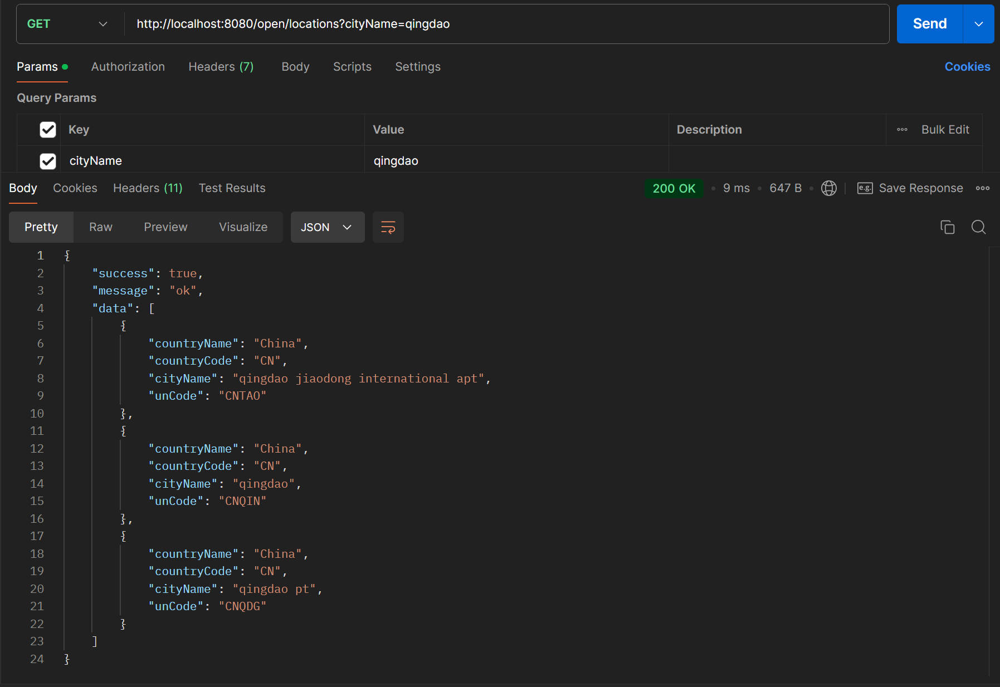
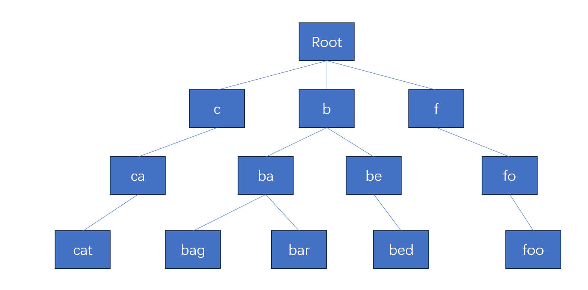

## 前言

搜索框的提示词功能是个很常见的功能，第一反应是用字典树（Trie Tree）来实现，这里不赘述 Trie Tree 的原理，这个经典的数据结构有很多书本和网络的资料可以参考。

本文以 Redis 的 zset 为基本工具，来实现一个直白简单，但可能并非最有效（空间复杂度高）的前缀匹配功能。

---

## 语言/框架/数据库

Spring Boot 3.x

Redis 7.x

Java 21

Python 3.8

---

## 实现功能

实现一个接口，get 请求，query 参数是一个字符串（例如：城市名称），返回该字符串作为前缀，匹配到的在数据库中的所有相关城市信息。

例如，数据库有以下省市名称：

1. shanghai
2. shanxi
3. beijing
4. tianjin
5. fujian
6. zhejiang

query = fu 时，返回 ['fujian']，query = shan，返回 ['shanghai', 'shanxi']。

本项目的接口实现结果如下：



---

## 数据集

我爬取了以下网站的数据：

[UN/LOCODE Code List by Country and Territory | UNECE](https://unece.org/trade/cefact/unlocode-code-list-country-and-territory)

这里的数据是**联合国口岸及相关地点代码**，用于运输，贸易行业，里面包含了各个国家的口岸地址信息。

比如，query = shanghai 匹配到的，可以是如下口岸信息列表：

```json
{
    "success": true,
    "message": "ok",
    "data": [
        {
            "countryName": "China",
            "countryCode": "CN",
            "cityName": "shanghai railway station",
            "unCode": "CNSHZ"
        },
        {
            "countryName": "China",
            "countryCode": "CN",
            "cityName": "shanghai hongqiao international apt",
            "unCode": "CNSHA"
        },
        {
            "countryName": "China",
            "countryCode": "CN",
            "cityName": "shanghai pudong international apt",
            "unCode": "CNPVG"
        },
        {
            "countryName": "China",
            "countryCode": "CN",
            "cityName": "shanghai",
            "unCode": "CNSGH"
        },
        {
            "countryName": "China",
            "countryCode": "CN",
            "cityName": "shanghai pt",
            "unCode": "CNSHG"
        }
    ]
}
```

---

## 实现

### zset、zrank、zrange

set 是集合，包含不重复的元素，而 zset 则是 set 的扩展，它存储了有序的，不重复的元素。

zset 的顺序是依靠评分（score）来排的，比如，插入几个学生的分数：

```
zadd stu 67 bob 88 alice 54 tom 72 jack 91 mike
```

然后查询：

```
zrange stu 0 -1
```

结果：

```
1	tom
2	bob
3	jack
4	alice
5	mike
```

集合是通过哈希表实现的，所以添加，删除，查找的复杂度都是 O(1)。

排序是根据 score 从小到大排，有序集合的成员是唯一的，但分数值可以重复。

当分数相同时，按照字典排序，例如，所有学生都以 score = 0 插入 zset：

```
zadd stu 0 bob 0 alice 0 tom 0 jack 0 mike
```

结果：

```
1	alice
2	bob
3	jack
4	mike
5	tom
```

我们可以利用这一特性，来存储城市名称（中文也可以，因为是基于 Unicode 码值的字典序进行排序的）。

Redis 的 Zrank 返回有序集中指定成员的排名，下标从 0 开始，比如：

```
zadd stu 0 bob 0 alice 0 tom 0 jack 0 mike

zrank stu alice # 0
zrank stu tom   # 4
```

Redis Zrange 返回有序集中，指定区间内的成员，比如，返回第零至第二个成员：

```
zrange stu 0 2
# 返回
alice
bob
jack
```

zadd，zrank，zrange 就是本文实现前缀匹配所需要的所有命令了。

### 插入单个名称

我们以 cat，bed，bag，foo，bar 这几个单词为例子，描述一下插入一个新的名称进 zset 的方法。

按照前缀树的逻辑，我们需要构造以下的树：



从数据库存储的角度来说，我们需要把单词的所有前缀都存储进去，这是一种空间换时间的方法，以存储 cat 为例：

```
zadd word 0 c 0 ca 0 cat 0 cat*

zrange word 0 -1
```

我把 cat（包括 cat 本身）的前缀都存储进 zset，并且用 * 结尾来标识一个有效单词，没有 * 结尾的都是作为前缀存储。

zrange 需要一个范围，除了开始区间值（也就是用户输入的查询前缀），我们还需要一个结尾区间值。

c 的结尾值是 d，ca 的结尾值是 cb，cat 的结尾值是 cau，这样有了结尾值，我们就可以用 zrange 来查询区间的有效单词了。

以下是插入 cat 这一个单词的所有内容：

```
zadd word 0 c 0 ca 0 cat 0 d 0 cb 0 cau 0 cat*
```

插入一个单词，所需要的所有成员数是 s = 2 * (len(word)) + 1。

用 python 代码来表示这个过程：

```python
def save_word_in_sorted_set(set_name, word):
    """
    将单个 word 存储 redis sorted set
    :param set_name: 有序集合的名称
    :param word: 单词
    """
    # 有效单词以 * 结尾
    # 分数值都为 0
    r.zadd(name=set_name, mapping={word + "*": 0})
    for i in range(len(word)):
        tmp = word[:i + 1]
        # 前缀
        r.zadd(name=set_name, mapping={tmp: 0})
        # 前缀最后一个字符码值 + 1, 用于 zrange 的结束区间值
        r.zadd(name=set_name, mapping={tmp[:len(tmp) - 1] + chr(ord(tmp[-1]) + 1): 0})
```

### 插入所有的城市口岸名称

我把所有名称，写到了一个 json 文件中，格式如下：

```json
["Ali Shirzayi", "Bagram", "Bamian", "Bazar-E-Panjwai", "Bost", "Camp Bastion", "Camp Dwyer", "Camp Leatherneck", "Camp Salerno", "Camp Wolverine", ... ]
```

总数是 106843 个。

然后循环插入到 redis 中：

```python
def save_cities_in_sorted_set(set_name):
    """
    存储城市名称列表到 redis sorted set
    :return:
    """
    key = set_name
    # 城市数量: 106843
    with open('./cities.json', mode='r', encoding='utf-8') as f:
        cities = json.load(f)
        total = len(cities)
        for index, city_name in enumerate(cities, start=1):
            city_name = city_name.lower()
            print(f'开始处理第 {index} 个, 总数: {total}')
            save_word_in_sorted_set(key, city_name)
```

### 数量以及占用空间

总共有 10 万个城市口岸名称，用 zcard 和 memory usage 来查看下最终的总数和占用空间大小：

```
zcard "quote:location" # 1171525
memory usage "quote:location" # 110500016
```

前缀占用的成员数量就有 100万+，空间占用了约 110 M，所以这种方法的缺点就是空间复杂度高。

### 搜索

当用户输入 ca 的时候，只需要四步就可以查出结果：

1. 在 zset 中找到 ca 的 rank 值
2. 在 zset 中找到 cb 的 rank 值
3. zrange zset_name ca_rank cb_rank，就可以找到具体的区间（包含了前缀和有效单词）
4. 通过后缀 *，过滤出有效单词

转换成 Python 代码：

```python
def auto_complete(set_name, query):
    """
    根据 query 查出相关的自动补全的选项
    :param set_name: 有序集合名称
    :param query: 查询前缀
    """

    # query 作为 start
    start_query = query
    # 最后一个字符 unicode + 1 作为 end
    end_query = query[:len(query) - 1] + chr(ord(query[-1]) + 1)

    start_index = r.zrank(name=set_name, value=start_query)
    end_index = r.zrank(name=set_name, value=end_query)
    tmp_res = r.zrange(set_name, start=start_index, end=end_index)
    res = []
    for item in tmp_res:
        if item[-1] == ord('*'):
            word = item.decode('utf-8')
            word = word[:len(word) - 1]
            res.append(word)
    return res
```

---

## Spring Boot 接口

下面用 Spring Boot 来编写一个后端 http 接口，来实现自动补全提示的功能。

模型类，也就是最终返回结果：

```java
@Data
public class QuoteLocation {

    private String countryName;

    private String countryCode;

    private String cityName;

    private String unCode;
}
```

controller 类：

```java
@RestController
@RequestMapping("/open")
public class LocationController {


    private final LocationService locationService;


    public LocationController(LocationService locationService) {
        this.locationService = locationService;
    }


    @GetMapping("/locations")
    public JsonResult<List<QuoteLocation>> locations(@Validated LocationQuery query) {
        return JsonResult.success(locationService.getLocations(query));
    }
}
```

service 类：

```Java
public interface LocationService {

    List<QuoteLocation> getLocations(LocationQuery query);
}
```

service impl 类：

```java
@Slf4j
@Service
public class LocationServiceImpl implements LocationService {

    private final static String LOCATION_SET = "location";
    private final static String LOCATION_DETAIL_SET = "location_detail";


    private final RedisTemplate<String, Object> redisTemplate;
    private final ObjectMapper objectMapper;

    public LocationServiceImpl(RedisTemplate<String, Object> redisTemplate, ObjectMapper objectMapper) {
        this.redisTemplate = redisTemplate;
        this.objectMapper = objectMapper;
    }


    @Override
    public List<QuoteLocation> getLocations(LocationQuery query) {

        ZSetOperations<String, Object> zSetOps = redisTemplate.opsForZSet();
        HashOperations<String, Object, Object> hashOps = redisTemplate.opsForHash();

        // 前缀树索引信息 sorted set
        String setKey = RedisUtil.generateKey(LOCATION_SET);
        // 城市国家代码详细信息 hash map
        String hashKey = RedisUtil.generateKey(LOCATION_DETAIL_SET);

        String queryName = query.getCityName().toLowerCase();

        String endQuery = queryName.substring(0, queryName.length() - 1) +
                (char) (queryName.charAt(queryName.length() - 1) + 1);

        // 获取 start 和 end 索引
        Long startIndex = zSetOps.rank(setKey, queryName);
        Long endIndex = zSetOps.rank(setKey, endQuery);

        if (startIndex == null || endIndex == null) {
            return new ArrayList<>();
        }

        // 获取前缀匹配结果（包含有效单词和前缀）
        Set<Object> tmpRes = zSetOps.range(setKey, startIndex, endIndex);
        List<String> res = new ArrayList<>();

        // 有效单词以 * 结尾
        // 过滤掉前缀，保留有效单词，并去掉结尾的 *
        if (!CollectionUtils.isEmpty(tmpRes)) {
            for (Object item : tmpRes) {
                String cityName = (String) item;
                if (cityName.endsWith("*")) {
                    res.add(cityName.substring(0, cityName.length() - 1));
                }
            }
        }

        List<QuoteLocation> locations = new ArrayList<>();
        // 根据城市名获取所有相关的城市国家代码信息
        List<Object> details = hashOps.multiGet(hashKey, new HashSet<>(res));

        for (Object detail : details) {
            String cityDetail = (String) detail;
            QuoteLocation location;
            try {
                location = objectMapper.readValue(cityDetail, QuoteLocation.class);
            }
            catch (JsonProcessingException e) {
                throw new AppException("解析城市详情异常");
            }
            locations.add(location);
        }

        return locations;
    }
}
```

我用一个 zset 存储所有城市口岸名称，再用一个 hash 来存储每个城市口岸对应的具体信息（所属国家，代码等）。

先在 zset 找到可能的匹配项，然后再去 hash 里检索具体信息。

RedisTemplate 配置以及其他工具类，这些细节就不在本文赘述了。

---

## 总结

这并不是一个很好的方案，因为占用空间大，但是搜索的效果还不错（本地测试，3-5毫秒），也很稳定，是一个简单直白的思路。

如果接口访问量极大，不想用关系型数据库的 Like 语句做匹配，也不想引入 ES 等其他较重的工具，可以考虑这个 Redis 的解决方案。

---

## 参考

1. [Can Redis do prefix matching? - Stack Overflow](https://stackoverflow.com/questions/9348191/can-redis-do-prefix-matching)
2. http://antirez.com/post/autocomplete-with-redis.html
3. [Two ways of using Redis to build a NoSQL autocomplete search index - Pat Shaughnessy](https://patshaughnessy.net/2011/11/29/two-ways-of-using-redis-to-build-a-nosql-autocomplete-search-index)