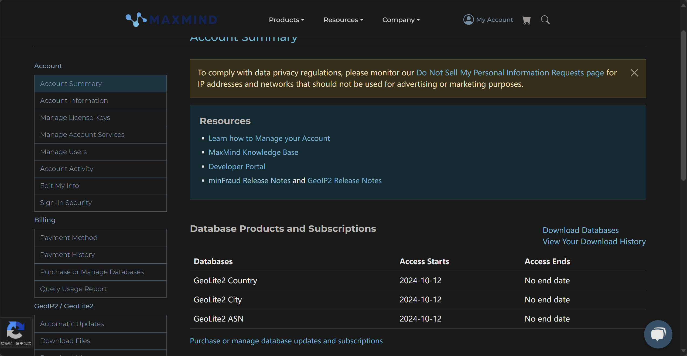
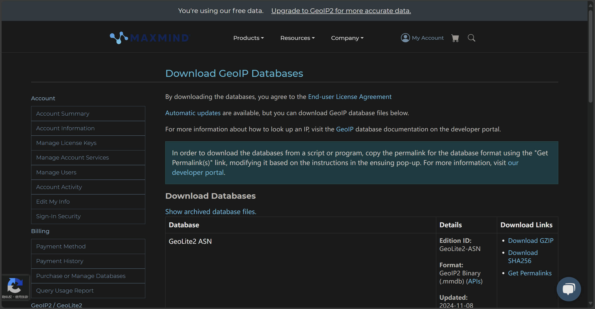
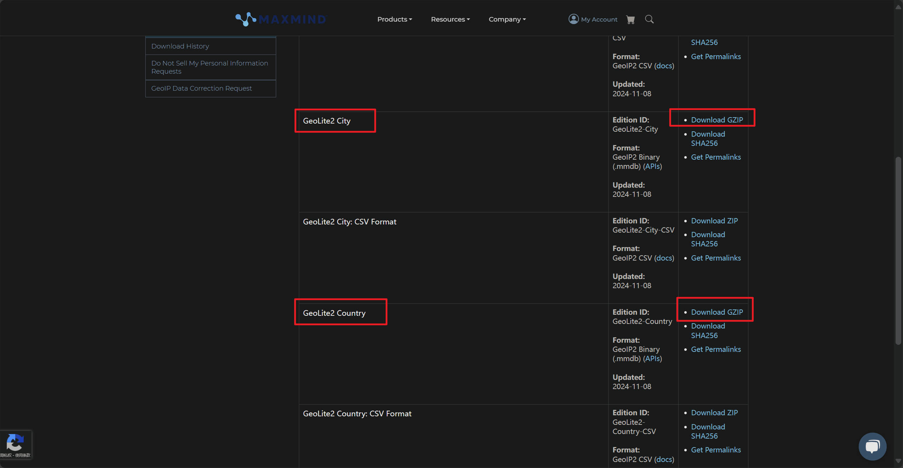
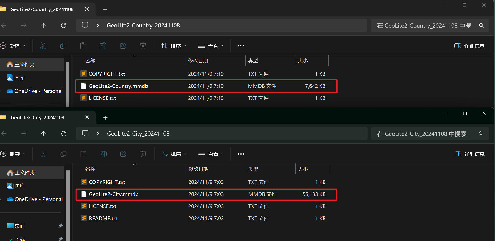

## 前言

诸如一些 IP 工具站，可以返回当前请求的客户端位置信息，这在一些应用中是很有用的（比如投广告 XD），本文简单介绍下 MaxMind 的数据库，以及编写一个小 Demo 来实现返回客户端 IP 信息的后端接口。

---

## MaxMind

MaxMind 由 Thomas Mather 于 2002 年创立，总部位于美国马萨诸塞州马尔登。

该公司以 GeoIP 品牌销售 IP 地理位置和其他 IP 地址相关数据。GeoIP 就是 IP 和地理位置信息的映射，通过区域注册机构（不同的 IP 段由互联网注册机构分配给不同的大洲和国家）提供的信息，以及数据挖掘和用户反馈，MaxMind 提供了GeoIP 数据库来查询 IP 地址所对应的地理位置，这种位置通常是不精确的（最多到市区）。

如果定位不准还会闹出官司：

在一次不寻常的技术故障中，堪萨斯州波特温东北约 4 英里（6.4 公里）的一个农场成为 6 亿个 IP 地址的默认站点，当时这家数字地图公司将美国本土的假定地理中心从 39°50′N 98°35′W 更改为 38°N 97°W。

这些 IP 地址经常被犯罪嫌疑人和其他邪恶分子使用，随后会根据 MaxMind 的数据将其映射到堪萨斯州的农场。执法部门和其他个人经常就与 IP 地址相关的行为联系或拜访业主。该坐标处的房产所有者对 MaxMind 提起了诉讼。MaxMind 将默认 IP 地址的地理位置移至堪萨斯州湖中部，并于 2017 年 9 月通过替代争议解决方式解决了此案。

美国的确切中心位于堪萨斯州北部，靠近内布拉斯加州边境。从技术上讲，中心点的纬度和经度坐标是 39°50′N 98°35′W。在数字地图中，这个数字很丑陋：39.8333333，-98.585522。因此，早在 2002 年，当 MaxMind 首次在其数字地图上为美国中心选择默认点时，它决定清理测量结果，并使用更简单的附近纬度和经度：38°N 97°W 或 38.0000，-97.0000。

因此，在过去的 14 年里，每当 MaxMind 的数据库被查询到它无法识别的美国 IP 地址的位置时，它都会吐出一个距离该国地理中心两小时车程的地点的默认位置。这种情况经常发生：5,000 家公司依赖 MaxMind 的 IP 映射信息，现在总共有超过 6 亿个 IP 地址与该默认坐标相关联。如果这些 IP 地址中的任何一个被骗子、计算机窃贼或联系帮助热线的自杀者使用，MaxMind 的数据库会将它们放在同一个位置：38.0000，-97.0000。

自从 James 和 Theresa Arnold 于 2011 年 3 月搬进他们在堪萨斯州巴特勒县租来的 623 英亩农场以来，他们看到“无数”执法官员和个人日夜出现在他们的农场，寻找与涉嫌盗窃和其他涉嫌犯罪的联系。所有这些人都是因为 GPS 位置的四舍五入错误而到达的，这会错误地将人们指向他们的农场。

最后，MaxMind 通过将默认 IP 地址的位置移动到堪萨斯湖中央来修复其 IP 数据库中的错误，但客户并不经常更新他们的数据，因此这个问题可能需要很多年才能完全解决。

---

## 原理

本文不介绍 MaxMind 提供的 GeoIP 数据库的原理，涉及到的是文件规范和二叉搜索树。

本质是加载 mmdb 文件到内存，然后通过搜索树高效的检索数据，可以翻阅文末“参考”中的博客。

---

## 下载

在下载数据库前，需要注册 MaxMind 账号：https://www.maxmind.com/

登陆后，会跳转到以下下载页面：


点击 Download Databases：



MaxMind 支持自动更新 GeoIP 库，但为了简便，本文用自己下载的数据库来演示。

MaxMind 提供多种产品：

1. GeoIP2-City：提供更为详细的城市级别数据，包括国家、省/州、市和邮政编码等信息，适合需要精准地理信息的场景。
2. GeoIP2-Country：专注于国家级别的数据，可以返回IP所属的国家信息，是应用最为广泛的基础数据库。
3. GeoIP2-ASN：ASN（自治系统号码）数据库，包含IP地址归属的自治系统（ISP或大型网络服务提供商）信息，适合网络分析和监控。
4. GeoLite2 系列：免费版本，包括GeoLite2-City、GeoLite2-Country、GeoLite2-ASN，数据精度和更新频率比收费版低，适合预算较少的项目。

GeoIP2 是收费版本，精度高，GeoLite2 是免费版本，精度低，对于大部分项目来说，使用 GeoLite2 即可。

同时 MaxMind 提供了两种格式：mmdb 和 csv，本文使用前者。

下载 GeoLite2-City 和 GeoLite2-Country：



下载到本地，解压，获取到 mmdb 文件：



---

## Web API demo

MaxMind 的 mmdb 文件支持不同的编程语言来读取，以 Python 为例，它的读取库是：

[maxmind/MaxMind-DB-Reader-python: Python MaxMind DB reader extension](https://github.com/maxmind/MaxMind-DB-Reader-python)

创建一个目录，虚拟环境，下载依赖包：

```bash
# 创建项目目录
cd ~/project
mkdir mmdb-api
cd mmdb-api

# 虚拟环境
python3 -m venv venv
source ./venv/bin/activate

# 下载依赖包
python -m pip install -U pip setuptools flask maxminddb geoip2
```

涉及的两个库的 pypi 地址：

https://pypi.org/project/maxminddb/

https://pypi.org/project/geoip2/

把刚刚下载的两个 mmdb 文件，拷到项目目录下。

示例代码，main.py：

```python
from pprint import pprint
import maxminddb

def main():
    ip = '152.216.7.110'
    with maxminddb.open_database('GeoLite2-City.mmdb') as reader:
        res = reader.get(ip)
        pprint(res)

    print('-' * 30)
    with maxminddb.open_database('GeoLite2-Country.mmdb') as reader:
        res = reader.get(ip)
        pprint(res)


if __name__ == '__main__':
    main()
```

打印结果：

```python
{'continent': {'code': 'NA',
               'geoname_id': 6255149,
               'names': {'de': 'Nordamerika',
                         'en': 'North America',
                         'es': 'Norteamérica',
                         'fr': 'Amérique du Nord',
                         'ja': '北アメリカ',
                         'pt-BR': 'América do Norte',
                         'ru': 'Северная Америка',
                         'zh-CN': '北美洲'}},
 'country': {'geoname_id': 6252001,
             'iso_code': 'US',
             'names': {'de': 'USA',
                       'en': 'United States',
                       'es': 'Estados Unidos',
                       'fr': 'États Unis',
                       'ja': 'アメリカ',
                       'pt-BR': 'EUA',
                       'ru': 'США',
                       'zh-CN': '美国'}},
 'location': {'accuracy_radius': 1000,
              'latitude': 37.751,
              'longitude': -97.822,
              'time_zone': 'America/Chicago'},
 'registered_country': {'geoname_id': 6252001,
                        'iso_code': 'US',
                        'names': {'de': 'USA',
                                  'en': 'United States',
                                  'es': 'Estados Unidos',
                                  'fr': 'États Unis',
                                  'ja': 'アメリカ',
                                  'pt-BR': 'EUA',
                                  'ru': 'США',
                                  'zh-CN': '美国'}}}
------------------------------
{'continent': {'code': 'NA',
               'geoname_id': 6255149,
               'names': {'de': 'Nordamerika',
                         'en': 'North America',
                         'es': 'Norteamérica',
                         'fr': 'Amérique du Nord',
                         'ja': '北アメリカ',
                         'pt-BR': 'América do Norte',
                         'ru': 'Северная Америка',
                         'zh-CN': '北美洲'}},
 'country': {'geoname_id': 6252001,
             'iso_code': 'US',
             'names': {'de': 'USA',
                       'en': 'United States',
                       'es': 'Estados Unidos',
                       'fr': 'États Unis',
                       'ja': 'アメリカ',
                       'pt-BR': 'EUA',
                       'ru': 'США',
                       'zh-CN': '美国'}},
 'registered_country': {'geoname_id': 6252001,
                        'iso_code': 'US',
                        'names': {'de': 'USA',
                                  'en': 'United States',
                                  'es': 'Estados Unidos',
                                  'fr': 'États Unis',
                                  'ja': 'アメリカ',
                                  'pt-BR': 'EUA',
                                  'ru': 'США',
                                  'zh-CN': '美国'}}}
```

除了 maxminddb 库，在 web api 中，我们也可以用 geoip2 这个库，二者的区别如下：

maxminddb

* 定位：一个较底层的库，用于直接读取和解析MaxMind DB格式的二进制文件。
* 功能：提供对.mmdb文件的低级别访问，返回的数据为字典形式，需要手动解析各个字段。
* 使用方式：返回的数据结构不如geoip2库那样方便，需要用户自己根据字段获取所需信息。
* 适合场景：适合希望直接访问MMDB文件原始数据的用户，或不需要高级封装、希望灵活处理数据的情况。

geoip2

* 定位：是MaxMind官方提供的高层次API库。
* 功能：提供方便的查询接口，可以直接从GeoIP2数据库（如City、Country、ASN数据库）中获取详细的地理位置数据。
* 使用方式：库中的查询方法返回结构化的数据对象，例如国家、城市、经纬度等信息，不需要手动解析数据结构。
* 适合场景：适合希望通过简洁的API访问GeoIP2数据库内容的用户。geoip2封装了底层的数据库解析细节，使用户可以直接获取所需的地理位置数据。

下面是一个 geoip2 和 flask 的例子，app.py：

```python
from flask import Flask, request, jsonify
import geoip2.database

app = Flask(__name__)

city_reader = geoip2.database.Reader('GeoLite2-City.mmdb')
country_reader = geoip2.database.Reader('GeoLite2-Country.mmdb')

def get_geo_info(ip):
    try:
        city_info = city_reader.city(ip)
        country_info = country_reader.country(ip)

        return {
            'ip': ip,
            'country iso code': country_info.country.iso_code,
            'country name': country_info.country.name,
            'city name': city_info.city.name,
            'latitude': city_info.location.latitude,
            'longitude': city_info.location.longitude
        }
    except Exception as e:
        return {'error': str(e)}

@app.route('/', methods=['GET'])
def geo_info():
    ip = request.headers.get('X-Forwarded-For', request.remote_addr)
    data = get_geo_info(ip)
    return jsonify(data)

if __name__ == '__main__':
    app.run(host='0.0.0.0', port=5001)
```

如果做 nginx 反向代理，需要注意 nginx 的 X- 相关的 header，如果 nginx 反向代理后，代码使用 `ip = request.remote_addr` 获取 ip 的话，只能获取到 127.0.0.1 的本地地址。

经过反向代理后，由于在客户端和web服务器之间增加了中间层，因此web服务器无法直接拿到客户端的ip，通过$remote_addr变量拿到的将是反向代理服务器的ip地址。

所以需要 nginx 在代理的时候，把真实 IP 传递过来，注意加上这两行：

```nginx
proxy_set_header        X-Real-IP       $remote_addr;
proxy_set_header        X-Forwarded-For $proxy_add_x_forwarded_for;
```

在后端取的时候，取 X-Forwarded-For 中的 ip 地址。

---

## 参考

1. [MaxMind DB 文件格式规范](https://maxmind.github.io/MaxMind-DB/)
2. [基于二叉树的高效IP检索格式MMDB - leavygood - 博客园](https://www.cnblogs.com/leavygood/p/17109967.html)
3. [Hackl0us/GeoIP2-CN: 小巧精悍、准确、实用 GeoIP2 数据库](https://github.com/Hackl0us/GeoIP2-CN)
4. https://en.wikipedia.org/wiki/MaxMind
5. [GeoIP 简介-CSDN博客](https://blog.csdn.net/zzhongcy/article/details/121247674)