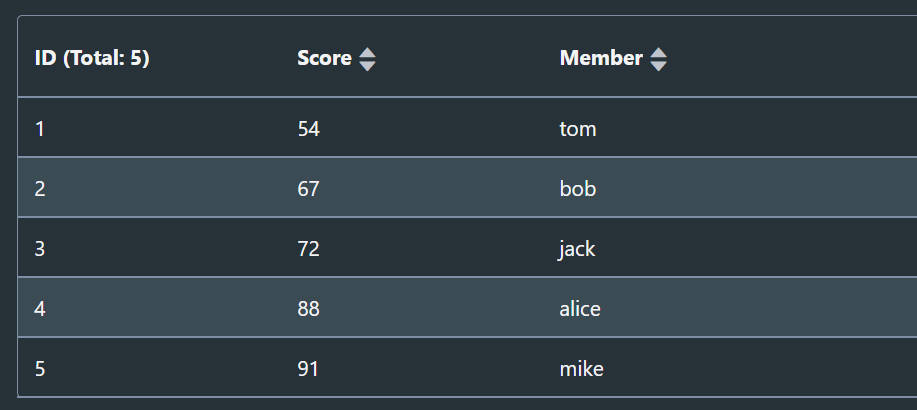
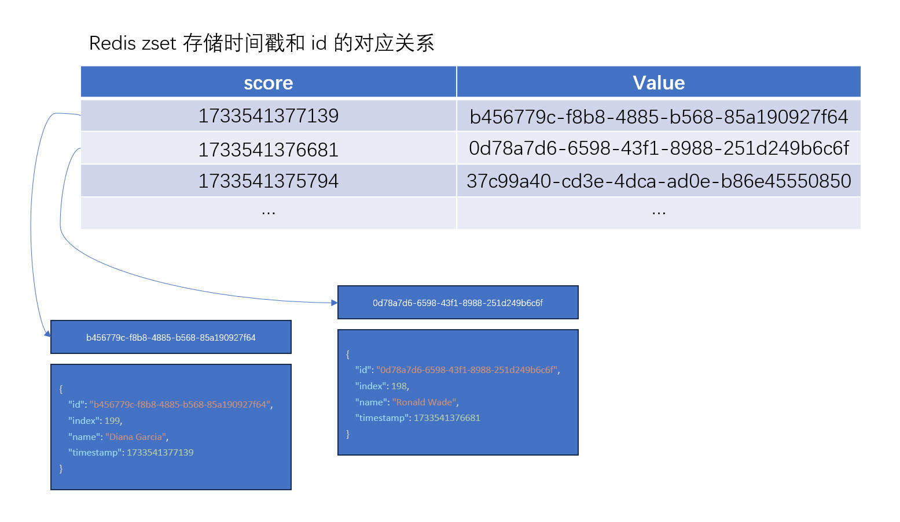

## 前言

之前大部分项目都是面向政府办公的，很多页面都需要使用分页的功能。由于数据库都基于关系型数据库（比如 MySQL），分页的实现自然是使用 limit + offset 的方式偏多，也可以基于游标分页。

上层 ORM 如果是 MyBatis，则有 PageHelper，如果是 Spring Data JPA，则有 `org.springframework.data.domain.Pageable` 的分页接口类。

关系型数据库的分页，需要关注的大概就是 offset 的性能问题（索引优化，全表扫描等），需要达到的目标就是不管跳到那一页，接口的耗时都是稳定而非递增的。

本文不使用关系型数据库，而是用 Redis 这种非关系型的内存数据库，来实现分页和搜索的功能。

由于 Redis 的存储结构以及查询语法与关系型数据库存在较大差异，分页和搜索的实现，也存在很大的不同。

---

## 语言和框架

语言：Python 3.8.0

框架：Flask

数据库：Redis server 7.0.15

---

## 目标功能

1. 提供分页接口
2. 部分字段的搜索

---

## zset

本文实现分页的核心结构就是 redis 的 zset，所以简单讲述下相关的概念和命令。

在这一篇博客：[一种直白有效的前缀匹配方案 | DJHX - 阿辉的博客](https://djhx.site/blog/backend/一种直白有效的前缀匹配方案/) 当中，介绍过了 zset 这个 redis 存储结构，但是那时候并没有使用分数（score）排序的功能，但考虑以下场景：

每隔 n 毫秒，会有数据存储到数据库中，数据量非常庞大，在前端页面需要准确展示最近的数据，支持分页，并且可以丢弃过早的老数据。

该需要可以考虑时序数据库（支持更加复杂专业的功能），但是简单场景下， redis 的 zset 也很合适。

假设每个数据对象是一个 json，例如：

```json
{
    "id": "571fe31d-ae94-4dde-b4e0-c5011067ea3c",
    "state": "ON",
    "temperature": "22",
    "humidity": "61",
    ...
}
```

我们可以以数据对象的 id 字段作为 value，然后以时间毫秒戳作为 score 来排序，然后将 id 对应的完整 json 存储在其他的键值对或者 hash 中即可。

在 zset 有序集合中 , 默认会根据 score 由低到高进行排序，每个元素在这个排序下都有一个排序值。

以该命令为例：

```sh
zadd grade 67 bob 88 alice 54 tom 72 jack 91 mike
```

存储结构如下：



最左侧是，在给定的 score 下排序的顺序值，中间是 score，最右侧是 value。

### 基于排序值-zrange

升序，从低往高排序（asc）使用该命令可以根据排序值找到元素：

```sh
# 从低到高，找到所有元素
> zrange grade 0 -1
tom
bob
jack
alice
mike

# 前 3 个元素
> zrange grade 0 2
tom
bob
jack

# 第 4 个至最后一个
> zrange grade 3 -1
alice
mike
```

使用方式和 python 的切片相似。

### 基于排序值-zrevrange

排序和 zrange 相反，降序，从高到低排序（desc）：

```sh
> zrevrange grade 0 -1
mike
alice
jack
bob
tom
```

### 基于分数值-zrangebyscore

zrangebyscore 是以分数作为筛选条件：

```sh
# 获取 50 - 70 分之间的学生
> zrangebyscore grade 50 70
tom
bob

# 获取比 80 分低的学生
> zrangebyscore grade -inf 80
tom
bob
jack

# 获取比 70 分高的学生
> zrangebyscore grade 70 inf
jack
alice
mike
```

### 基于分数值-zrevrangebyscore

和 zrange 类似，zrangebyscore 也有个倒序的操作——zrevrangebyscore：

```sh
# 获取 80 - 60 分之间的学生
> ZREVRANGEBYSCORE grade 80 60
jack
bob
```

zrangebyscore 是从小到大排，所以第一个 score 是 min，第二个 score 是 max。

而 zrevrangebyscore 是从大到小排，所以第一个 score 是 max，第二个 score 是 min，这点需要注意。

### 定位-zrank

zrank 可以获取元素在小到大排序下的顺序值：

```sh
# 一个不存在的学生
> zrank grade foo
null

# tom 的顺序，在从低到高排序下，tom 的 54 分排在第一位
> zrank grade tom
0
```

### 定位-zrevrank

zrevrank 的排序和 zrank 相反：

```sh
# tom 的顺序，在从高到低排序下，tom 的 54 分排在第四位
> zrevrank grade tom
4
```

---

## 分页

### 假数据

假设元素的 json 结构如下：

```json
{
    "id": "fcc973b9-d154-4557-b311-83ae5a178b2e",
    "index": 0,
    "name": "demo page",
    "timestamp": "1733535140000"
}
```

- id：主键
- index：为了后续测试分页用的，方便看是否正确，顺序递增
- name：表示业务字段
- timestamp：毫秒时间戳，表示创建该数据的时刻

插入 n 条测试数据到 redis 中：

```python
def insert_fake_data(num):
    for i in range(num):
        data_id = str(uuid.uuid4())
        timestamp = int(round(time.time() * 1000))
        data = {
            'id': data_id,
            'index': i,
            'name': fake.name(),
            'timestamp': timestamp,
        }
        # zset 存储 score = timestamp, value = data_id
        redis_client.zadd(name="demo:zset", mapping={data_id: timestamp})
        # data 存储在 demo:data:{id} 的 key 中
        redis_client.set(name=f"demo:data:{data_id}", value=pickle.dumps(data))
        # 随机睡眠 0 - 1000 毫秒
        time.sleep(random.randrange(0, 1000) / 1000)
```

### 分页接口

前端只需要传递两个参数，pageIndex（第几页），pageSize（一页有几个元素）即可。

后端可以通过 pageIndex 和 pageSize 相乘，算出 offset（偏移量），然后获取分页元素。

```python
@app.route('/page')
def page():
    # 前端传参
    page_index = int(request.args.get('pageIndex', '0'))
    page_size = int(request.args.get('pageSize', '10'))

    # 偏移量
    offset = page_index * page_size

    # 从 zset 中获取对应分页元素的 id
    # withscores=True 表示连同 score 一块返回
    # 返回结果例如: 
    # [
    #   (b'be0f126a-1006-44a4-b83b-1ed27be79cde', 1733541362587.0), 
    #   (b'60699d10-fd23-472e-abb1-86adbd80c0db', 1733541361678.0), 
    #   (b'0753b19c-2895-4767-8909-2a97e1c9e6a1', 1733541361518.0)
    # ]
    res = redis_client.zrevrangebyscore(
        name="demo:zset",
        max="inf",
        min="-inf",
        start=offset,
        num=page_size,
        withscores=True
    )
    # 获取总共的元素数量
    total = redis_client.zcount(name="demo:zset", max="inf", min="-inf")
    
    # 构造返回分页元素详细信息
    content = []
    for index, item in enumerate(res):
        data_id = item[0].decode('utf-8')
        # 根据 id 获取元素详细内容
        data = pickle.loads(redis_client.get(f"demo:data:{data_id}"))
        content.append(data)

    return {
        'total': total,
        'content': content
    }
```

最重要的只有四个参数：

- pageIndex：第几页
- pageSize：一页几个元素
- total：所有元素的总数量
- content：这一页元素内容的列表

其他的参数，诸如：totalPage（总共几页），hasNext（是否有下一页），hasPrevious（是否有上一页），curPageSize（当前页的元素数量），可以通过以上四个参数算出（前端或者后端都可以做）。

总体的思路如下：

1. 根据分页参数，到 zset 中检索到对应的 id 列表。
2. 根据 id 列表，获取每个 id 对应的详细信息。



### mget

如果一页十个元素，每个都请求拿详情，会造成大量的网络开销，所以上面的代码的这一部分：

```python
content = []
for index, item in enumerate(res):
    data_id = item[0].decode('utf-8')
    # 根据 id 获取元素详细内容
    data = pickle.loads(redis_client.get(f"demo:data:{data_id}"))
    content.append(data)
```

可以使用 mget 命令，优化如下：

```python
data_id_list = [f'demo:data:{item[0].decode("utf-8")}' for item in res]
data_bin = redis_client.mget(data_id_list)
content = [pickle.loads(item) for item in data_bin]
```

这样只需要一次请求，就可以拿到当前页面的的详细信息。

---

## 搜索

zrangebyscore 支持 min 和 max 参数，所以对于时间范围的搜索是很方便的。

但是如果要对某个字段进行检索，比如，业务字段：性别=男，如果是 SQL，则加个 where 条件即可，这里使用的 redis 的 zset 就没这么简单了。

比较直接的方法是构造对应的搜索字段的 zset key 值，上面的分页案例仅仅存在一个 demo:zset 这一个 zset 集合。

那么假设需要搜索一个字段——gender，其值只有 male 和 female 两种。

那么需要在 zadd 时，分别将男性记录插入到名为 demo:zset:male 中，然后把女性记录插入到 demo:zset:female 中。 

在分页检索时，根据前端传递的参数来构造对应的 zset 键名。

---

## 时间复杂度

分页在使用 zrangebyscore 的 offset 时，需要注意它和关系型数据库一样，会遍历到指定的 offset 的位置，然后返回 n 个元素。

这就导致一旦数据量很庞大，/page?pageIndex=0&pageSize=10 的耗时与 /page?pageIndex=10000000&pageSize=10 的耗时相差很大。

官方的文档给出了 zrangebyscore 的时间复杂度：O(log(N)+M)，其中 N 为有序集合中的元素数，M 为返回的元素数。如果 M 为常数（例如，始终使用 LIMIT 请求前 10 个元素），则可以将其视为 O(log(N))。

如果 offset 比较大，其时间复杂度趋向于 O(N)。

在我本地机器上测试，1000万的数据量，第一页耗时 2 毫秒，最后一页耗时 500 毫秒。

---

## 参考

1. [redis系列-要命的zrangebyscore - 三石君 - 博客园](https://www.cnblogs.com/zhroot/p/12371655.html)
2. [ZRANGEBYSCORE | Docs](https://redis.io/docs/latest/commands/zrangebyscore/)
3. [Redis sorted sets | Docs](https://redis.io/docs/latest/develop/data-types/sorted-sets/)
4. [Redis实现分页+多条件模糊查询组合方案！-CSDN博客](https://blog.csdn.net/xiyang_1990/article/details/141701723)
