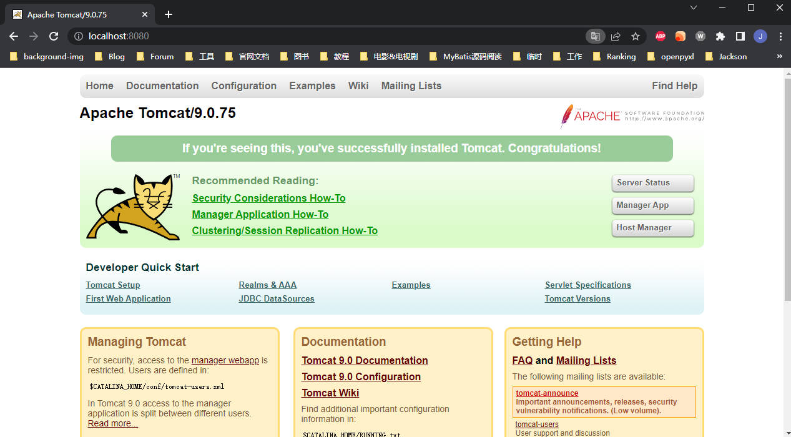
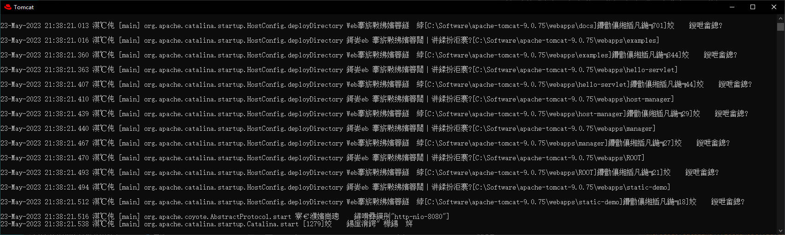
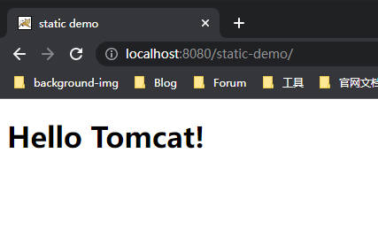
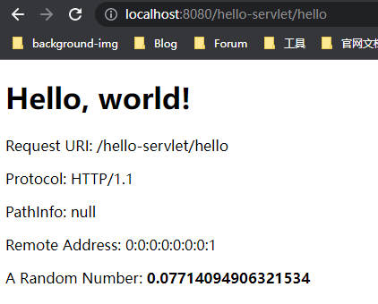

## 前言

在《Servlet 初探》中，我们简单看了下关于 Servlet 接口的一些约定以及概念，而本文将从实践的角度来讲讲如何部署一个可以使用的 Servlet 服务。

除了使用现代化的大型 IDE（如：IntelliJ IDEA）来快速创建 Tomcat + Servlet 项目之外，我将先从手动创建 Java 文件，手动编译，手动创建约定结构的目录开始，通过最原始的方式，展现一个 Servlet 的编写与应用。

---

## Tomcat

Servlet 更像是一种记录业务逻辑的东西，它不能单独运行，必须存在于 Servlet Container 中，Tomcat 就是一种最流行的 Servlet 容器。

在创建 Servlet 应用前，必须下载并且成功运行 Tomcat 应用。

Tomcat 官网：https://tomcat.apache.org/

Tomcat 9 Windows 版本下载地址：https://dlcdn.apache.org/tomcat/tomcat-9/v9.0.75/bin/apache-tomcat-9.0.75-windows-x64.zip

下载后，可以双击 bin/startup.bat 启动 Tomcat，打开 http://localhost:8080/ 可以下面的页面：



说明 Tomcat 安装并启动成功。

这里有个小问题，就是仔细看日志文件：



这里的乱码是 UTF-8 编码和 GBK 编码的转换问题，可以写个程序验证一下：

```java
package cn.korilweb;

import java.io.UnsupportedEncodingException;
import java.nio.charset.StandardCharsets;

public class Main {
    public static void main(String[] args) {
        String str = "淇℃伅";
        try {
            byte[] bytes = str.getBytes("GBK");
            String res = new String(bytes, StandardCharsets.UTF_8);
            System.out.println(res);
        } catch (UnsupportedEncodingException e) {
            throw new RuntimeException(e);
        }
    }
}
```

打印的结果是“信息”两个字，因为 Tomcat 是 UTF-8 的编码输出到日志文件，但是微软的 cmd 默认是 GBK 编码，所以出现了乱码的问题，修改的方式也很简单，在 conf/logging.properties 文件中：

```properties
# java.util.logging.ConsoleHandler.encoding = UTF-8
# 改成
java.util.logging.ConsoleHandler.encoding = GBK
```

改完配置，保存，重启 Tomcat 即可。

---

## 一个静态页面

之前提到过 Tomcat 也是 Web Server，所以它支持直接响应静态页面，所有 Tomcat 下的 Web App 都部署在 webapps 目录下，之所以上面能够展示 Tomcat 的欢迎页面，也是因为 webapps 目录下有了一些默认的示例项目。

展示静态资源很简单，在 webapps 下新建一个目录（webapps 下的每一个目录都将被视为一个单独的 web application），然后新建 index.html

```html
<!DOCTYPE html>
<html>
<head>
	<meta charset="utf-8">
	<meta name="viewport" content="width=device-width, initial-scale=1">
	<title>static demo</title>
</head>
<body>
	<h1>Hello Tomcat!</h1>
</body>
</html>
```

然后打开 http://localhost:8080/static-demo/，可以看到以下页面：



输入这串 URL 实际上访问的资源文件是 index.html，即完整路径为：http://localhost:8080/static-demo/index.html。

也就是说如果目录下有 index.html，Tomcat 会默认返回这个文件，但是如果是其他文件名称，就不能省略了。

---

## Hello Servlet

了解了如何展示静态资源文件，接下来将正式编写 Java Servlet 的代码，第一个示例项目将取名为：hello-servlet，另外约定<TOMCAT_HOME>表示 Tomcat 软件的安装目录。

和 Maven 约定俗成的一些目录结构和命名习惯一样，Tomcat 下的 web app 也有约定的格式和结构：

* <TOMCAT_HOME>/webapps/hello-servlet/：表示一个 web app 目录，下面放着一些资源文件，如 HTML，CSS，JS文件，以及 Java 的 Class 文件和第三方库，这个目录也表示该 app 的整个上下文（root context）。
* <TOMCAT_HOME>/webapps/hello-servlet/WEB-INF：这个目录是不能被客户端所直接访问的，里面存放着该应用的配置，比如 web.xml，在此目录下还放这个程序的源代码文件目录，编译后的 classes 目录以及第三方库目录。
* <TOMCAT_HOME>/webapps/hello-servlet/WEB-INF/src：存放 Java 程序的源代码文件，为了方便部署，最佳实践是将源代码文件和编译后的 classes 分开放。
* <TOMCAT_HOME>/webapps/hello-servlet/WEB-INF/classes：存放 Java 程序编译后的 class 文件，如果 class 定义了包的结构（package），该目录也要遵循同样的包结构，比如，package cn.korilweb; 那么这个目录下应该是 cn/korilweb/xxx.class 的结构。
* <TOMCAT_HOME>/webapps/hello-servlet/WEB-INF/lib：存放着这个 app 所需要使用的第三方库的 jar 包。
* <TOMCAT_HOME>/webapps/hello-servlet/META-INF：此目录和 WEB-INF 一样不能被客户端直接访问，它存放了一些和服务器相关的资源和配置文件，比如 context.xml。

Servlet 就是一个运行在 Tomcat 容器中的程序，客户通过 URL 调用相对应的 Servlet，比如我们接下来编写一个叫做 MyFirstServlet.java 的程序，然后编译成 MyFirstServlet.class 文件然后放在 hello-servlet/ 下面某个目录中，客户端就可以通过 http://localhost:8080/hello-servlet/MyFirstServlet 来访问到 Servlet 中的业务代码。

在 hello-servlet/WEB-INF 下面新建一个 src，存放源代码文件，我使用的包名是 cn.korilweb，所以在 src 下面新建 cn/korilweb 目录，最后新建一个 MyFirstServlet.java，并且写入以下代码：

```java
package cn.korilweb;

import javax.servlet.annotation.WebServlet;
import javax.servlet.http.HttpServlet;
import javax.servlet.http.HttpServletRequest;
import javax.servlet.http.HttpServletResponse;
import java.io.IOException;
import java.io.PrintWriter;


@WebServlet("/hello")
public class MyFirstServlet extends HttpServlet {

    @Override
    protected void doGet(HttpServletRequest request, HttpServletResponse response) throws IOException {
        // 设置 content type
        response.setContentType("text/html;charset=UTF-8");

        // 从 response 对象中获取输出流，向客户端发送信息
        PrintWriter out = response.getWriter();

        // 向输出流写入 HTML 文本
        try {
            out.println("<!DOCTYPE html>");
            out.println("<html><head>");
            out.println("<meta http-equiv='Content-Type' content='text/html; charset=UTF-8'>");
            out.println("<title>Hello, World</title></head>");
            out.println("<body>");
            out.println("<h1>Hello, world!</h1>");  // says Hello
            // 打印从客户端传递来的信息
            out.println("<p>Request URI: " + request.getRequestURI() + "</p>");
            out.println("<p>Protocol: " + request.getProtocol() + "</p>");
            out.println("<p>PathInfo: " + request.getPathInfo() + "</p>");
            out.println("<p>Remote Address: " + request.getRemoteAddr() + "</p>");
            // 每一次请求都生成一个随机数返回
            out.println("<p>A Random Number: <strong>" + Math.random() + "</strong></p>");
            out.println("</body>");
            out.println("</html>");
        }
        finally {
            // 关闭输出流
            out.close();
        }
    }
}
```

编译需要使用第三方库，servlet-api.jar，幸运的是，这个 jar 包已经在 Tomcat 安装目录下的 lib 目录中，直接把 servlet-api.jar 复制到 WEB-INF/lib 下面。

进入 hello-servlet/WEB-INF 目录下，建立 classes 目录，并执行命令：

```shell
javac -cp ".;./lib/servlet-api.jar" -d classes -encoding utf-8 .\src\cn\korilweb\MyFirstServlet.java
```

可以看到 classes 目录下，生成了 cn/korilweb/MyFirstServlet.class。

启动 Tomcat 的 startup.bat，访问：http://localhost:8080/hello-servlet/hello，可以看到以下页面：



---

## Maven + IDEA

暂略

---

## 参考

1. https://www.zhihu.com/question/21416727/answer/690289895
2. https://www3.ntu.edu.sg/home/ehchua/programming/java/JavaServlets.html
