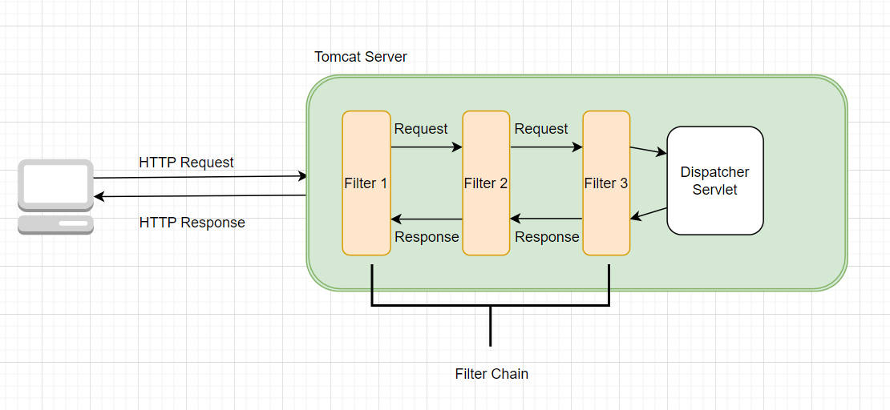
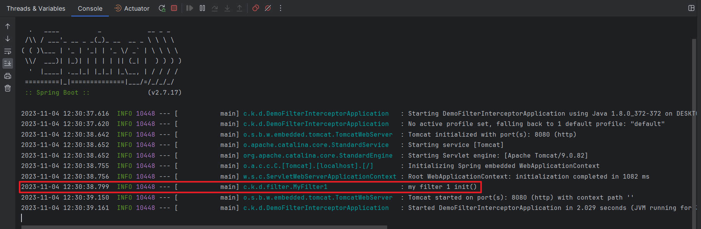
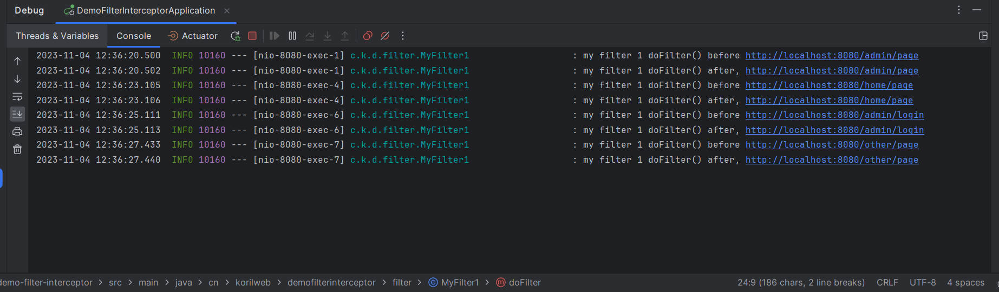
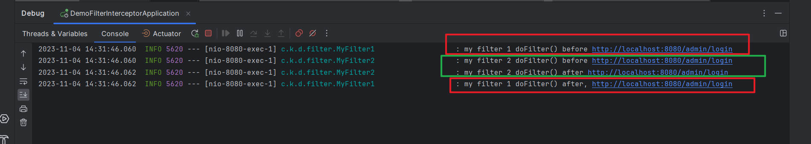
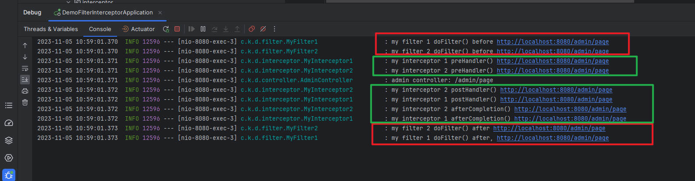
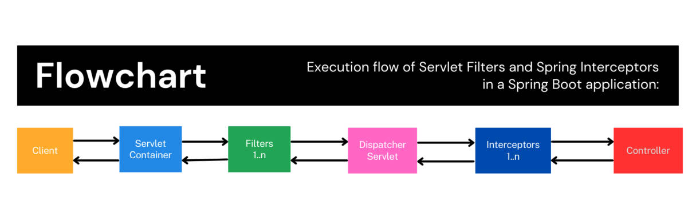

## 前言

过滤器（Filter）和拦截器（Interceptor）是 Web 开发中最常用也是最重要的两个组件，本文将先从各自的使用方式和示例程序入手，然后再比较二者的特点和使用场景。

---

## 过滤器

过滤器（Filter）是 Java EE 的 Servlet 规范中的一个组件，位于`javax.servlet`包下，它的作用就是，一个 HTTP 请求到达 Servlet 组件前，提供一些处理机制，并且多个过滤器可以组成一条过滤器链，分别不执行不同的过滤逻辑。

换句话说，过滤器比 Servlet 更早的拿到 Request 的内容，能够对其中的内容进行校验或者修改，然后把处理好的 Request 传递给下一个（如果还有的话）过滤器，最终在所有过滤器都处理结束后，将最终的 Request 交付到 Servlet 手上。

等 Servlet 工作完成后，Servlet 交付的 Response 又会按照过滤器链的顺序，依次返回给每个过滤器处理，最终交付到客户端。

它工作的流程如下：



### Filter 接口

想要实现一个 Filter 类，我们需要先了解`javax.servlet.Filter`这个接口，它的源码如下：

```java
/*
 * Licensed to the Apache Software Foundation (ASF) under one or more
 * contributor license agreements.  See the NOTICE file distributed with
 * this work for additional information regarding copyright ownership.
 * The ASF licenses this file to You under the Apache License, Version 2.0
 * (the "License"); you may not use this file except in compliance with
 * the License.  You may obtain a copy of the License at
 *
 *     http://www.apache.org/licenses/LICENSE-2.0
 *
 * Unless required by applicable law or agreed to in writing, software
 * distributed under the License is distributed on an "AS IS" BASIS,
 * WITHOUT WARRANTIES OR CONDITIONS OF ANY KIND, either express or implied.
 * See the License for the specific language governing permissions and
 * limitations under the License.
 */
package javax.servlet;

import java.io.IOException;

/**
 * A filter is an object that performs filtering tasks on either the request to a resource (a servlet or static
 * content), or on the response from a resource, or both. <br>
 * <br>
 * Filters perform filtering in the <code>doFilter</code> method. Every Filter has access to a FilterConfig object from
 * which it can obtain its initialization parameters, a reference to the ServletContext which it can use, for example,
 * to load resources needed for filtering tasks.
 * <p>
 * Filters are configured in the deployment descriptor of a web application
 * <p>
 * Examples that have been identified for this design are<br>
 * 1) Authentication Filters <br>
 * 2) Logging and Auditing Filters <br>
 * 3) Image conversion Filters <br>
 * 4) Data compression Filters <br>
 * 5) Encryption Filters <br>
 * 6) Tokenizing Filters <br>
 * 7) Filters that trigger resource access events <br>
 * 8) XSL/T filters <br>
 * 9) Mime-type chain Filter <br>
 *
 * @since Servlet 2.3
 */
public interface Filter {

    /**
     * Called by the web container to indicate to a filter that it is being placed into service. The servlet container
     * calls the init method exactly once after instantiating the filter. The init method must complete successfully
     * before the filter is asked to do any filtering work.
     * <p>
     * The web container cannot place the filter into service if the init method either:
     * <ul>
     * <li>Throws a ServletException</li>
     * <li>Does not return within a time period defined by the web container</li>
     * </ul>
     * The default implementation is a NO-OP.
     *
     * @param filterConfig The configuration information associated with the filter instance being initialised
     *
     * @throws ServletException if the initialisation fails
     */
    default void init(FilterConfig filterConfig) throws ServletException {
    }

    /**
     * The <code>doFilter</code> method of the Filter is called by the container each time a request/response pair is
     * passed through the chain due to a client request for a resource at the end of the chain. The FilterChain passed
     * in to this method allows the Filter to pass on the request and response to the next entity in the chain.
     * <p>
     * A typical implementation of this method would follow the following pattern:- <br>
     * 1. Examine the request<br>
     * 2. Optionally wrap the request object with a custom implementation to filter content or headers for input
     * filtering <br>
     * 3. Optionally wrap the response object with a custom implementation to filter content or headers for output
     * filtering <br>
     * 4. a) <strong>Either</strong> invoke the next entity in the chain using the FilterChain object
     * (<code>chain.doFilter()</code>), <br>
     * 4. b) <strong>or</strong> not pass on the request/response pair to the next entity in the filter chain to block
     * the request processing<br>
     * 5. Directly set headers on the response after invocation of the next entity in the filter chain.
     *
     * @param request  The request to process
     * @param response The response associated with the request
     * @param chain    Provides access to the next filter in the chain for this filter to pass the request and response
     *                     to for further processing
     *
     * @throws IOException      if an I/O error occurs during this filter's processing of the request
     * @throws ServletException if the processing fails for any other reason
     */
    void doFilter(ServletRequest request, ServletResponse response, FilterChain chain)
            throws IOException, ServletException;

    /**
     * Called by the web container to indicate to a filter that it is being taken out of service. This method is only
     * called once all threads within the filter's doFilter method have exited or after a timeout period has passed.
     * After the web container calls this method, it will not call the doFilter method again on this instance of the
     * filter. <br>
     * <br>
     * This method gives the filter an opportunity to clean up any resources that are being held (for example, memory,
     * file handles, threads) and make sure that any persistent state is synchronized with the filter's current state in
     * memory. The default implementation is a NO-OP.
     */
    default void destroy() {
    }
}

```

先说说这个接口的文档中的一些要点：

1. Filter 是一个普通的对象，用来执行过滤任务。
2. 过滤的对象包括了请求（Request）以及响应（Response）。
3. 请求的目标和响应的来源，叫资源（Resource），资源可以是 Servlet，也可以是静态内容（Static Content）。
4. 一个 Filter 可以仅仅对请求做过滤处理，也可以仅仅对响应做过滤处理，也可以对请求和响应都做处理。
5. 包含三个方法：init，doFilter，destroy。
6. init 方法必须在 Filter 执行过滤任务前被 Web 容器成功执行。
7. doFilter 方法是真正执行过滤任务代码的地方，方法参数包含一个 FilterChain，可以选择传递给下一个过滤器，也可以不传递，在当前的过滤器中终止请求。
8. destroy 方法类似于 init 方法，由 Web 容器调用，表示从服务中移除该过滤器。

接下来，实现我们的第一个过滤器，MyFilter1：

```java
package cn.korilweb.demofilterinterceptor.filter;

import lombok.extern.slf4j.Slf4j;
import org.springframework.stereotype.Component;

import javax.servlet.*;
import java.io.IOException;

@Slf4j
@Component
public class MyFilter1 implements Filter {

    @Override
    public void init(FilterConfig filterConfig) {
        log.info("my filter 1 init()");
    }

    @Override
    public void doFilter(ServletRequest servletRequest, ServletResponse servletResponse, FilterChain filterChain) throws IOException, ServletException {
        log.info("my filter 1 doFilter() before {}", requestURL);
        filterChain.doFilter(servletRequest, servletResponse);
        log.info("my filter 1 doFilter() after, {}", requestURL);
    }

    @Override
    public void destroy() {
        log.info("my filter 1 destroy()");
    }
}

```

为了查看过滤器的三个方法在 Web 应用中调用的顺序，每个方法都加了日志。

编写两个简单的 Controller，用于测试接口使用。

AdminController

```java
@RestController
@RequestMapping("/admin")
public class AdminController {

    @GetMapping("/page")
    public String page() {
        return "admin page!";
    }

    @GetMapping("/login")
    public String login() {
        return "admin login";
    }
}
```

HomeController

```java
@RestController
@RequestMapping("/home")
public class HomeController {

    @GetMapping("/page")
    public String page() {
        return "home page!";
    }
}
```

启动 SpringBoot 程序，可以在日志中看到，MyFilter1 的 init 方法首先被 Web 容器调用了



依次使用 curl 访问一下接口：

1. curl.exe localhost:8080/admin/page
2. curl.exe localhost:8080/home/page
3. curl.exe localhost:8080/admin/login
4. curl.exe localhost:8080/other/page

可以看到日志中，出现 8 条记录：



可以看到尽管我们没有编写 /other/page 这个路径对应的的 controller，Filter 依然执行了，它并不关心藏在过滤器链末尾的资源是 servlet 还是静态资源，也不关心它们是否存在，都会执行过滤任务。

在 doFilter 方法中，执行了 filterChain.doFilter 方法，并且传递了 request 和 response 对象，表示交给过滤器链的下一个过滤器处理，如果我们想在某个过滤器中终止请求，不调用 filterChain.doFilter 方法即可，比如：如果请求头不包含 access 或者 access 的值不为 true，就禁止访问，可以这么写：

```java
@Override
public void doFilter(ServletRequest servletRequest, ServletResponse servletResponse, FilterChain filterChain) throws IOException, ServletException {
    HttpServletRequest request = (HttpServletRequest) servletRequest;
    StringBuffer requestURL = request.getRequestURL();
    log.info("my filter 1 doFilter() before {}", requestURL);

    // 获取请求头中的 access 参数
    String access = request.getHeader("access");
    // 如果 access 不存在，或者存在但不等于 true，则禁止访问
    if (Objects.isNull(access) || !Objects.equals(access, "true")) {
        log.info("forbidden access: {}", requestURL);
        return;
    }
    filterChain.doFilter(servletRequest, servletResponse);

    log.info("my filter 1 doFilter() after, {}", requestURL);
}
```

访问以下接口：

1. curl.exe localhost:8080/admin/login
2. curl.exe -H "access: false" localhost:8080/admin/login
3. curl.exe -H "access: true" localhost:8080/admin/login

可以看到，只有最后一次请求，成功返回了响应内容，第一个和第二个请求都被禁止了，换句话说，Filter 就像门卫，过滤掉那些不符合条件的请求，如果都满足要求，那么可以执行 filterChain.doFilter 进行放行处理（移交到下一个过滤器）。

### 多个过滤器

我们再编写第二个过滤器，MyFilter2：

```java
package cn.korilweb.demofilterinterceptor.filter;

import lombok.extern.slf4j.Slf4j;
import org.springframework.stereotype.Component;

import javax.servlet.*;
import javax.servlet.http.HttpServletRequest;
import java.io.IOException;

@Slf4j
@Component
public class MyFilter2 implements Filter {

    @Override
    public void init(FilterConfig filterConfig) {
        log.info("my filter 2 init()");
    }

    @Override
    public void doFilter(ServletRequest servletRequest, ServletResponse servletResponse, FilterChain filterChain) throws IOException, ServletException {
        HttpServletRequest request = (HttpServletRequest) servletRequest;
        StringBuffer requestURL = request.getRequestURL();
        log.info("my filter 2 doFilter() before {}", requestURL);
        filterChain.doFilter(servletRequest, servletResponse);
        log.info("my filter 2 doFilter() after {}", requestURL);
    }

    @Override
    public void destroy() {
        log.info("my filter 2 destroy()");
    }
}

```

代码和 MyFilter1 基本一致，这里多个过滤器就存在一个顺序问题，谁先谁后？

如果要定义它们的顺序，需要使用 @Order 注解，数字越小，优先级越高，比如我希望 MyFilter1 先于 MyFilter2 执行：

```java
@Component
@Order(1)
public class MyFilter1 implements Filter {
	// some code
}

@Component
@Order(2)
public class MyFilter2 implements Filter {
	// some code
}
```

执行接口调用，日志打印如下：



### @WebFilter + @ServletComponentScan

@Component 虽然使用简单，但是有很大的局限性，那就是它会注册成一个 url pattern 为 "/*" 的过滤器，也就是说，每一个路径接口都会执行你自定义的过滤器。

但很多时候，我们希望控制的粒度更细些，比如：/home/page 不走过滤器，而 /admin/* 的所有接口都要经过过滤器校验。

这时候可以使用 @WebFilter 注解，里面的 urlPatterns 参数，可以定义那些访问路径需要走这个过滤器。

除了 @WebFilter，还需要在 SpringBoot 启动类上增加 @ServletComponentScan 注解，才能生效。

比如，现在希望所有请求都经过 MyFilter2，但 /admin/* 的请求在经过 MyFilter2 前还需要额外经过 MyFilter1，可以这么写：

```java
@WebFilter(urlPatterns = "/admin/*")
public class MyFilter1 implements Filter {
	// some code
}

@WebFilter
public class MyFilter2 implements Filter {
    // some code
}

// 启动类需要加 @ServletComponentScan 注解
@ServletComponentScan
@SpringBootApplication
public class DemoFilterInterceptorApplication {

    public static void main(String[] args) {
        SpringApplication.run(DemoFilterInterceptorApplication.class, args);
    }

}
```

执行以下接口：

1. curl.exe localhost:8080/admin/login
2. curl.exe localhost:8080/admin/page
3. curl.exe localhost:8080/home/page

结果显示，前两个会先调用 MyFilter1，然后调用 MyFilter2，最后一个接口，仅仅调用 MyFilter2。

@Component + @Order 可以定义顺序，但是无法使用 url pattern，而 @WebFilter + @ServletComponentScan 虽然可以使用 url pattern 定义那些接口走特定的过滤器，但是又无法准确定义顺序了。

### FilterRegistrationBean

以上的两种方式各有优缺点，如果希望控制顺序，定义命名，设置 url pattern，最好使用 FilterRegistrationBean 的方式，首先删除 MyFilter1 和 MyFilter2 以及启动类上之前加过的 @Component、@WebFilter、@Order、@ServletComponentScan 等注解。

然后，定义一个配置类：

```java
package cn.korilweb.demofilterinterceptor.config;

import cn.korilweb.demofilterinterceptor.filter.MyFilter1;
import cn.korilweb.demofilterinterceptor.filter.MyFilter2;
import org.springframework.boot.web.servlet.FilterRegistrationBean;
import org.springframework.context.annotation.Bean;
import org.springframework.context.annotation.Configuration;

@Configuration
public class FilterConfig {

    @Bean
    public FilterRegistrationBean<MyFilter1> myFilter1RegistrationBean() {
        FilterRegistrationBean<MyFilter1> bean = new FilterRegistrationBean<>();
        bean.setFilter(new MyFilter1());
        bean.setName("myFilter1");
        bean.setOrder(1);
        bean.addUrlPatterns("/admin/*");
        return bean;
    }

    @Bean
    public FilterRegistrationBean<MyFilter2> myFilter2RegistrationBean() {
        FilterRegistrationBean<MyFilter2> bean = new FilterRegistrationBean<>();
        bean.setFilter(new MyFilter2());
        bean.setName("myFilter2");
        bean.setOrder(2);
        bean.addUrlPatterns("/*");
        return bean;
    }

}
```

在配置类中可以精确定义路径和顺序。

总结一下过滤器的三种使用方式的特点：

1. @Component + @Order：可以定义过滤器顺序，但无法定义 url pattern。
2. @WebFilter + @ServletComponentScan：可以定义 url pattern，但无法定义顺序。
3. FilterRegistrationBean：过滤器顺序和 url pattern 都可以定义。

---

## 拦截器

拦截器的作用跟过滤器很相似，但是也有很多不同的地方，比如：过滤器是 Servlet API 的组件，而拦截器是 SpringMVC 的组件，过滤器的执行要先于拦截器。

### HandlerInterceptor

和过滤器一样，拦截器也有一个接口需要实现——HandlerInterceptor：

```java
/*
 * Copyright 2002-2021 the original author or authors.
 *
 * Licensed under the Apache License, Version 2.0 (the "License");
 * you may not use this file except in compliance with the License.
 * You may obtain a copy of the License at
 *
 *      https://www.apache.org/licenses/LICENSE-2.0
 *
 * Unless required by applicable law or agreed to in writing, software
 * distributed under the License is distributed on an "AS IS" BASIS,
 * WITHOUT WARRANTIES OR CONDITIONS OF ANY KIND, either express or implied.
 * See the License for the specific language governing permissions and
 * limitations under the License.
 */

package org.springframework.web.servlet;

import javax.servlet.http.HttpServletRequest;
import javax.servlet.http.HttpServletResponse;

import org.springframework.lang.Nullable;
import org.springframework.web.method.HandlerMethod;

/**
 * Workflow interface that allows for customized handler execution chains.
 * Applications can register any number of existing or custom interceptors
 * for certain groups of handlers, to add common preprocessing behavior
 * without needing to modify each handler implementation.
 *
 * <p>A HandlerInterceptor gets called before the appropriate HandlerAdapter
 * triggers the execution of the handler itself. This mechanism can be used
 * for a large field of preprocessing aspects, e.g. for authorization checks,
 * or common handler behavior like locale or theme changes. Its main purpose
 * is to allow for factoring out repetitive handler code.
 *
 * <p>In an asynchronous processing scenario, the handler may be executed in a
 * separate thread while the main thread exits without rendering or invoking the
 * {@code postHandle} and {@code afterCompletion} callbacks. When concurrent
 * handler execution completes, the request is dispatched back in order to
 * proceed with rendering the model and all methods of this contract are invoked
 * again. For further options and details see
 * {@code org.springframework.web.servlet.AsyncHandlerInterceptor}
 *
 * <p>Typically an interceptor chain is defined per HandlerMapping bean,
 * sharing its granularity. To be able to apply a certain interceptor chain
 * to a group of handlers, one needs to map the desired handlers via one
 * HandlerMapping bean. The interceptors themselves are defined as beans
 * in the application context, referenced by the mapping bean definition
 * via its "interceptors" property (in XML: a &lt;list&gt; of &lt;ref&gt;).
 *
 * <p>HandlerInterceptor is basically similar to a Servlet Filter, but in
 * contrast to the latter it just allows custom pre-processing with the option
 * of prohibiting the execution of the handler itself, and custom post-processing.
 * Filters are more powerful, for example they allow for exchanging the request
 * and response objects that are handed down the chain. Note that a filter
 * gets configured in web.xml, a HandlerInterceptor in the application context.
 *
 * <p>As a basic guideline, fine-grained handler-related preprocessing tasks are
 * candidates for HandlerInterceptor implementations, especially factored-out
 * common handler code and authorization checks. On the other hand, a Filter
 * is well-suited for request content and view content handling, like multipart
 * forms and GZIP compression. This typically shows when one needs to map the
 * filter to certain content types (e.g. images), or to all requests.
 *
 * @author Juergen Hoeller
 * @since 20.06.2003
 * @see HandlerExecutionChain#getInterceptors
 * @see org.springframework.web.servlet.handler.AbstractHandlerMapping#setInterceptors
 * @see org.springframework.web.servlet.handler.UserRoleAuthorizationInterceptor
 * @see org.springframework.web.servlet.i18n.LocaleChangeInterceptor
 * @see org.springframework.web.servlet.theme.ThemeChangeInterceptor
 * @see javax.servlet.Filter
 */
public interface HandlerInterceptor {

	/**
	 * Interception point before the execution of a handler. Called after
	 * HandlerMapping determined an appropriate handler object, but before
	 * HandlerAdapter invokes the handler.
	 * <p>DispatcherServlet processes a handler in an execution chain, consisting
	 * of any number of interceptors, with the handler itself at the end.
	 * With this method, each interceptor can decide to abort the execution chain,
	 * typically sending an HTTP error or writing a custom response.
	 * <p><strong>Note:</strong> special considerations apply for asynchronous
	 * request processing. For more details see
	 * {@link org.springframework.web.servlet.AsyncHandlerInterceptor}.
	 * <p>The default implementation returns {@code true}.
	 * @param request current HTTP request
	 * @param response current HTTP response
	 * @param handler chosen handler to execute, for type and/or instance evaluation
	 * @return {@code true} if the execution chain should proceed with the
	 * next interceptor or the handler itself. Else, DispatcherServlet assumes
	 * that this interceptor has already dealt with the response itself.
	 * @throws Exception in case of errors
	 */
	default boolean preHandle(HttpServletRequest request, HttpServletResponse response, Object handler)
			throws Exception {

		return true;
	}

	/**
	 * Interception point after successful execution of a handler.
	 * Called after HandlerAdapter actually invoked the handler, but before the
	 * DispatcherServlet renders the view. Can expose additional model objects
	 * to the view via the given ModelAndView.
	 * <p>DispatcherServlet processes a handler in an execution chain, consisting
	 * of any number of interceptors, with the handler itself at the end.
	 * With this method, each interceptor can post-process an execution,
	 * getting applied in inverse order of the execution chain.
	 * <p><strong>Note:</strong> special considerations apply for asynchronous
	 * request processing. For more details see
	 * {@link org.springframework.web.servlet.AsyncHandlerInterceptor}.
	 * <p>The default implementation is empty.
	 * @param request current HTTP request
	 * @param response current HTTP response
	 * @param handler the handler (or {@link HandlerMethod}) that started asynchronous
	 * execution, for type and/or instance examination
	 * @param modelAndView the {@code ModelAndView} that the handler returned
	 * (can also be {@code null})
	 * @throws Exception in case of errors
	 */
	default void postHandle(HttpServletRequest request, HttpServletResponse response, Object handler,
			@Nullable ModelAndView modelAndView) throws Exception {
	}

	/**
	 * Callback after completion of request processing, that is, after rendering
	 * the view. Will be called on any outcome of handler execution, thus allows
	 * for proper resource cleanup.
	 * <p>Note: Will only be called if this interceptor's {@code preHandle}
	 * method has successfully completed and returned {@code true}!
	 * <p>As with the {@code postHandle} method, the method will be invoked on each
	 * interceptor in the chain in reverse order, so the first interceptor will be
	 * the last to be invoked.
	 * <p><strong>Note:</strong> special considerations apply for asynchronous
	 * request processing. For more details see
	 * {@link org.springframework.web.servlet.AsyncHandlerInterceptor}.
	 * <p>The default implementation is empty.
	 * @param request current HTTP request
	 * @param response current HTTP response
	 * @param handler the handler (or {@link HandlerMethod}) that started asynchronous
	 * execution, for type and/or instance examination
	 * @param ex any exception thrown on handler execution, if any; this does not
	 * include exceptions that have been handled through an exception resolver
	 * @throws Exception in case of errors
	 */
	default void afterCompletion(HttpServletRequest request, HttpServletResponse response, Object handler,
			@Nullable Exception ex) throws Exception {
	}

}

```

拦截器提供了三个方法，preHandler 是在进入具体的 Controller 代码前执行，postHandler 是在 Controller 代码结束后，返回 ModelAndView 的时候执行，而 afterCompletion 用于请求结束后的一些操作，比如资源的清理和日志的记录。

接下来，定义两个拦截器，MyInterceptor1：

```java
package cn.korilweb.demofilterinterceptor.interceptor;

import lombok.extern.slf4j.Slf4j;
import org.springframework.web.servlet.HandlerInterceptor;
import org.springframework.web.servlet.ModelAndView;

import javax.servlet.http.HttpServletRequest;
import javax.servlet.http.HttpServletResponse;

@Slf4j
public class MyInterceptor1 implements HandlerInterceptor {

    @Override
    public boolean preHandle(HttpServletRequest request, HttpServletResponse response, Object handler) throws Exception {
        log.info("my interceptor 1 preHandler() {}", request.getRequestURL());
        return true;
    }

    @Override
    public void postHandle(HttpServletRequest request, HttpServletResponse response, Object handler, ModelAndView modelAndView) throws Exception {
        log.info("my interceptor 1 postHandler() {}", request.getRequestURL());
    }

    @Override
    public void afterCompletion(HttpServletRequest request, HttpServletResponse response, Object handler, Exception ex) throws Exception {
        log.info("my interceptor 1 afterCompletion() {}", request.getRequestURL());
    }
}

```

MyInterceptor2：

```java
package cn.korilweb.demofilterinterceptor.interceptor;

import lombok.extern.slf4j.Slf4j;
import org.springframework.web.servlet.HandlerInterceptor;
import org.springframework.web.servlet.ModelAndView;

import javax.servlet.http.HttpServletRequest;
import javax.servlet.http.HttpServletResponse;

@Slf4j
public class MyInterceptor2 implements HandlerInterceptor {

    @Override
    public boolean preHandle(HttpServletRequest request, HttpServletResponse response, Object handler) throws Exception {
        log.info("my interceptor 2 preHandler() {}", request.getRequestURL());
        return true;
    }

    @Override
    public void postHandle(HttpServletRequest request, HttpServletResponse response, Object handler, ModelAndView modelAndView) throws Exception {
        log.info("my interceptor 2 postHandler() {}", request.getRequestURL());
    }

    @Override
    public void afterCompletion(HttpServletRequest request, HttpServletResponse response, Object handler, Exception ex) throws Exception {
        log.info("my interceptor 2 afterCompletion() {}", request.getRequestURL());
    }
}
```

定义好拦截器后，需要在配置类中进行配置：

```java
package cn.korilweb.demofilterinterceptor.config;

import cn.korilweb.demofilterinterceptor.interceptor.MyInterceptor1;
import cn.korilweb.demofilterinterceptor.interceptor.MyInterceptor2;
import org.springframework.context.annotation.Configuration;
import org.springframework.web.servlet.config.annotation.InterceptorRegistry;
import org.springframework.web.servlet.config.annotation.WebMvcConfigurer;

@Configuration
public class InterceptorConfig implements WebMvcConfigurer {
    @Override
    public void addInterceptors(InterceptorRegistry registry) {
        registry.addInterceptor(new MyInterceptor1());
        registry.addInterceptor(new MyInterceptor2());
    }
}
```

拦截器的顺序就取决于配置类中 addInterceptor 的顺序。

接下来访问接口：curl.exe localhost:8080/admin/page

日志如下：



可以看到，interceptor 包裹着 controller 的代码，而 filter 又包裹着 interceptor。

在配置文件中，可以指定路径匹配（path pattern），类似过滤器的 url pattern。

```java
@Configuration
public class InterceptorConfig implements WebMvcConfigurer {
    @Override
    public void addInterceptors(InterceptorRegistry registry) {
        // MyIntercaptor1 作用于 /admin/*
        registry.addInterceptor(new MyInterceptor1()).addPathPatterns("/admin/*");
        
        // MyIntercaptor2 作用于 /home/*
        registry.addInterceptor(new MyInterceptor2()).addPathPatterns("/home/*");
    }
}
```

---

## 过滤器和拦截器

### 差异

在执行代码的层面上，过滤器处于 Servlet 层，过滤器在请求到达 Servlet 之前执行，以及在 Servlet 处理结束后执行。而拦截器位于 Controller 层。

这意味着，过滤器能修改的仅仅是 Request 和 Response，而拦截器更靠近 Controller，还能够修改 ModelAndView。

在框架上，过滤器属于 Servlet API 组件，拦截器属于 Spring 框架的组件。

在接口上，过滤器需要实现 javax.servlet.Filter 接口，而拦截器需要实现 org.springframework.web.servlet.HandlerInterceptor。

### 执行顺序

1. Request 发送到 Spring Boot 程序
2. Request 进入 Filter Chain，过滤器链上的每个过滤器都能修改 Request 和 Response
3. 一旦 Request 通过了 Filter Chain，接下来将抵达 DispatcherServlet。
4. DespatcherServlet 通过 HandlerMapping 找到于请求路径匹配的 Controller。
5. 在执行 Controller 相应方法前，Request 将进入 Interceptor Chain。
6. 一旦 Request 通过了 Interceptor Chain，Controller 对应的方法将被执行。
7. Controller 生成 Response，并且沿着 Interceptor Chain 原路返回。
8. Response 通过了 Interceptor Chain 之后，继续沿着 Filter Chain 原路返回。

下面是流程图：



---

## 总结

Spring Interceptor 和 Servlet Filters 都用于拦截 Web 应用进程中的Request 和 Response。

拦截器在 Controller 级别运行，而过滤器在 Servlet 级别运行。

拦截器对请求和响应具有更精细的控制，而过滤器对请求和响应具有更一般的控制。

拦截器和过滤器都是用于自定义和增强 Web 应用的有用工具，在选择要在应用中使用的工具时，了解它们之间的差异非常重要。
