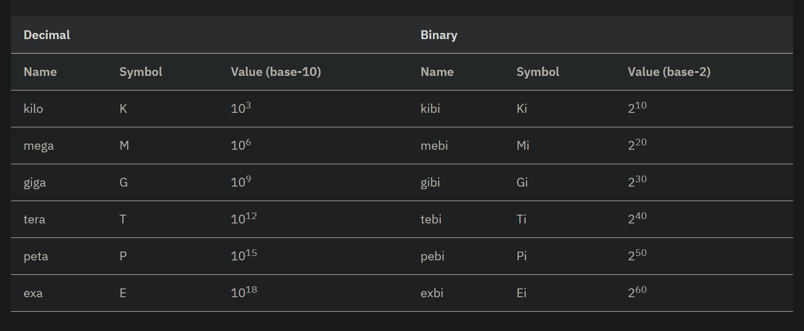
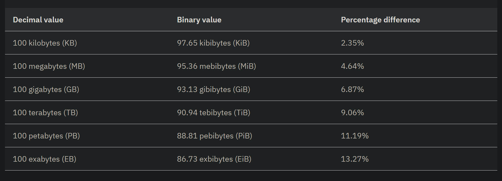

## 度量单位的差异

在数据存储中，有两种数据大小的度量方式，一种是以 10 为底，一种是以 2 为底。

设备厂商通常使用 10 进制单位（base 10）表示硬盘存储容量大小，而计算机操作系统则通常使用 2 进制单位（base 2）来表示磁盘容量。

这也就是为啥买来硬盘标注的容量和计算机显示的容量有较大差异的一个原因（其他原因还包括分区和格式化预留空间）。

以下是按照 K、M、G、T、P、E 的数量级来表示二者差异。

两种进制表示通常差的很小，但是随着数量级增加，而逐渐递增：

---

## 参考

1. [Data storage values - IBM Documentation](https://www.ibm.com/docs/en/spectrum-archive-ee/1.2.4.0?topic=overview-data-storage-values)
