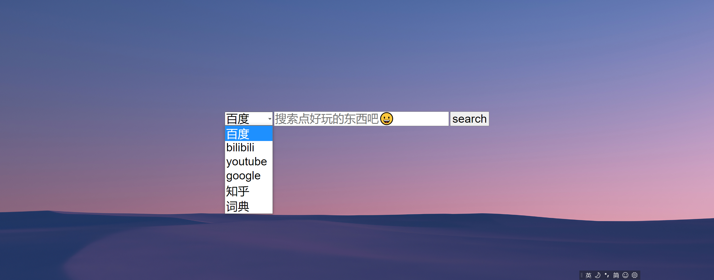
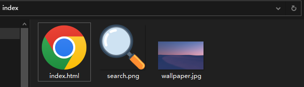
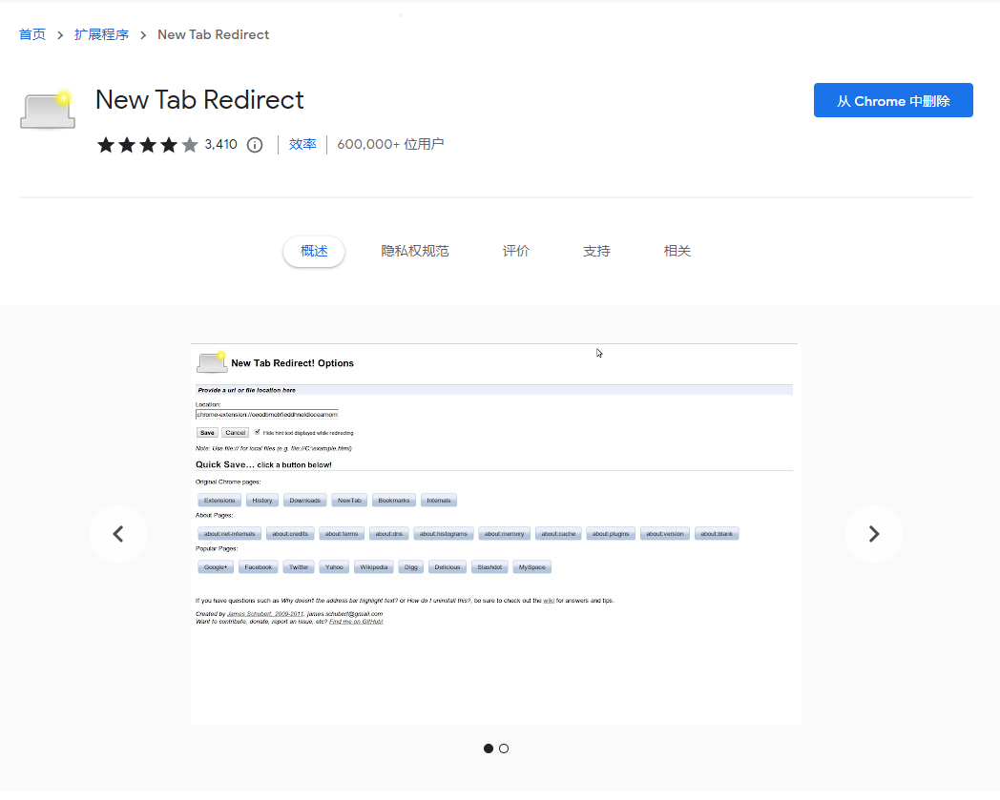

## 开始的想法

### 问题一：

在平时，搜索引擎是我使用次数最多的软件之一，Baidu，Google，知乎，Bilibili，Youtube，必应等等。每个引擎搜索出来的结果与其网站定位有关，不同的网站搜出来的内容往往不相同，可能我想查期末考试题目，我会去百度上搜，想要查代码的问题，会去国内的某些论坛搜索，如果没有想要的内容，再考虑去 Google、Stackoverflow。来来回回需要切换好几个页面去不同的搜索框里键入相同的文字，很麻烦。

### 问题二：

现在的算法和 AI 很厉害，总是能把一个功能本应该极简化的搜索页面搞成一个五颜六色，充斥着牛鬼蛇神的推荐页面（参考国内某些浏览器的主页），包括智能提示，历史搜索提示（对其他人可能很有用），我的注意力就会被吸引过去，然后恰好我的自制能力抵不住推荐算法的诱惑，就往往从搜索**Nginx 入门视频**不知不觉就变成了**你的背景被嘎子偷了**，**XXX明星塌房**，**高燃混剪|进来看不后悔**之类的。。。

### 解决方法

所以我就想，既然搜索引擎的URL，无非是调用网站的 API 和用户输入的关键字所拼接而成，为什么不能写个简单的页面来调用不同的搜索地址呢？

我最喜欢的搜索页面，应该只有四个元素：

1. 选项框：使用哪个搜索引擎的 API。

2. 输入框：输入想搜索的内容，没有 AI 推荐，也没有历（社）史（死）记录。

3. 提交按钮：提交输入框的内容，打开一个新的搜索结果页面。

4. 好看的背景图片。

知乎上，有和我一样想法的人提出了这个问题：

https://www.zhihu.com/question/20195445

里面的解决方案，我草草看了下，应该是安装一些浏览器插件，或者使用搜索引擎自带的“搜索规则”，最后我决定自己写一个。

---

## 页面版

### 页面的编写

所有搜索引擎的 API 都大同小异，类似于：

`https://www.XXXweb.com/search?key=用户输入的内容`

所以只要把每个搜索引擎的 URL 写死到代码里，拼接输入的内容，提交并打开新页面即可。

页面的元素很简单，我用最原始的 HTML + JS 的方式完成，没有花里胡哨的东西。

index.html

```html
<!DOCTYPE html>
<html>

<head>
    <style type="text/css">
        body {
            background-image: url("wallpaper.jpg");
            background-size: cover;
        }

        #main_div {
            text-align: center;
            position: absolute;
            left: 50%;
            top: 50%;
            width: 1000px;
            margin-left: -500px;
            margin-top: -100px;
        }

        #select_content {
            font-size: 40px;
        }

        #search_content {
            font-size: 40px;
            width: 600px;
        }

        #submit_btn {
            font-size: 40px;
        }
    </style>
    <link rel="icon" type="image/png" href="search.png"/>
</head>

<body>
    <div id="main_div">
        <form>
            <select id="select_content">
                <option id="baidu">百度</option>
                <option id="bilibili">bilibili</option>
                <option id="youtube">youtube</option>
                <option id="google">google</option>
                <option id="zhihu">知乎</option>
                <option id="vocabulary">词典</option>
            </select>
            <input id="search_content" 
                    autocomplete="off"
                    placeholder="搜索点好玩的东西吧😀"
                    onkeydown='if(event.keyCode==13){search();}'>
            <input id="submit_btn" type="button" value="search" onclick="search()">
        </form>

    </div>

    <script>
        document.getElementById("search_content").focus();
        function search() {
            var select_index = document.getElementById("select_content").selectedIndex;
            var select = document.getElementById("select_content").options[select_index].id;
            var content = document.getElementById("search_content").value;

            var dict = {
                "baidu": "https://www.baidu.com/s?wd=",
                "bilibili": "https://search.bilibili.com/all?keyword=",
                "youtube": "https://www.youtube.com/results?search_query=",
                "google": "https://www.google.com/search?q=",
                "zhihu": "https://www.zhihu.com/search?type=content&q=",
                "vocabulary": "https://www.vocabulary.com/dictionary/"
            };

            window.open(dict[select] + content);
        }
    </script>
</body>

</html>
```

效果图：



同级目录下，放一个 icon 和背景图，就完成了：



---

### 设置成打开新的页面

仅仅设置成主页很容易，在所有浏览器中都有设置主页的选项，不再赘述。

但是，我暂时没找到什么好的方法，将这个`index.html`设置成浏览器的“打开新页面”的页面，也就是设置成我最常使用的`Ctrl+t`快捷键跳出来新的页面，所以我找了一个 Chrome 插件来完成这个功能：



在这个插件的`Redirect URL`选项中，设置成`index.html`的绝对地址即可。

---

## 最后

这个页面从我写完，一直使用了一个多月，感觉很方便，实现了我自己的需要，后续要改进的点在于扩展性，比如我想把另外一个网站搜索 URL 的前缀添加进来，只能修改代码（不过好在是本地的，很快能完成），可以在页面里加一个“添加新URL”的按钮来实现。
