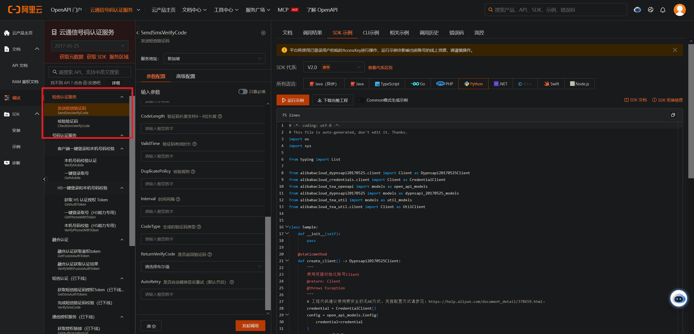

## 目录

[TOC]

---

## 前言

之前由于电信运营商的政策收紧，个人资质无法发送短信验证码，不过阿里云推出的“短信认证服务”，让个人开发者又可以重新开始使用短信验证码了。

> 短信认证服务是阿里云为个人和企业用户提供的验证服务，您可免申请资质、签名和模板，通过API直接使用。
> 短信认证服务由平台提供资源，对接成本低、成功率高，特别适合无法提供企业资质但有验证码场景需求的个人用户。

---

## 购买

购买链接：https://dypns.console.aliyun.com/smsServiceOverview

---

## AccessKey

调用阿里云 API 服务，需要使用 AccessKey 认证，首先需要创建 AccessKey，不建议使用主账号创建，可以使用 RAM 账号创建 AccessKey。

参考文档：https://help.aliyun.com/zh/ram/user-guide/create-an-accesskey-pair

成功获取到 AccessKey 和 AccessKey Secret 后，才能进行下面的 API 调用。

---

## Python API

官方提供了各个语言的 SDK，本文以 Python 为例。

### 访问凭据

阿里云提供了 Credentials 工具来配置 AccessKey 进行凭据管理，参考文档：

https://help.aliyun.com/zh/sdk/developer-reference/v2-manage-python-access-credentials

我使用的是方式一，在控制台中使用环境变量，配置以下两个环境变量，把上一节获取到的 AccessKey 和 AccessKey Secret 写到两个变量中：

```
ALIBABA_CLOUD_ACCESS_KEY_ID
ALIBABA_CLOUD_ACCESS_KEY_SECRET
```

### Python API

阿里云短信服务的 SDK 在 pypi 中可以找到：https://pypi.org/project/alibabacloud-dypnsapi20170525/2.0.0/

SDK 的示例代码可以使用阿里云的 OpenAPI 平台测试和生成：https://api.aliyun.com/api/Dypnsapi/2017-05-25/SendSmsVerifyCode



以下是稍作修改后的测试代码。

发送短信验证码：

```python
from alibabacloud_credentials.client import Client as CredentialClient
from alibabacloud_dypnsapi20170525 import models as dypnsapi_20170525_models
from alibabacloud_dypnsapi20170525.client import Client as Dypnsapi20170525Client
from alibabacloud_tea_openapi import models as open_api_models
from alibabacloud_tea_util import models as util_models
from alibabacloud_tea_util.client import Client as UtilClient


class Sample:
    def __init__(self):
        pass

    @staticmethod
    def create_client() -> Dypnsapi20170525Client:
        """
        使用凭据初始化账号Client
        @return: Client
        @throws Exception
        """
        # 工程代码建议使用更安全的无AK方式，凭据配置方式请参见：https://help.aliyun.com/document_detail/378659.html。
        credential = CredentialClient()
        config = open_api_models.Config(
            credential=credential
        )
        # Endpoint 请参考 https://api.aliyun.com/product/Dypnsapi
        config.endpoint = f'dypnsapi.aliyuncs.com'
        return Dypnsapi20170525Client(config)

    @staticmethod
    def main() -> None:
        client = Sample.create_client()
        send_sms_verify_code_request = dypnsapi_20170525_models.SendSmsVerifyCodeRequest(
            scheme_name='默认方案',
            phone_number='13511112222',
            sign_name='速通互联验证码',
            template_code='100001',
            template_param='{"code":"##code##","min":"5"}'
        )
        runtime = util_models.RuntimeOptions()
        try:
            # 复制代码运行请自行打印 API 的返回值
            response = client.send_sms_verify_code_with_options(send_sms_verify_code_request, runtime)
        except Exception as error:
            # 此处仅做打印展示，请谨慎对待异常处理，在工程项目中切勿直接忽略异常。
            # 错误 message
            print(error.message)
            # 诊断地址
            print(error.data.get("Recommend"))
            UtilClient.assert_as_string(error.message)
        else:
            print(response.headers)
            print(response.status_code)
            print(response.body)


if __name__ == '__main__':
    Sample.main()

```

验证码是阿里云平台随机生成的，我们并不知道，所以验证用户的验证码需要调用阿里云的核验验证码接口：

```python
from alibabacloud_dypnsapi20170525.client import Client as Dypnsapi20170525Client
from alibabacloud_credentials.client import Client as CredentialClient
from alibabacloud_tea_openapi import models as open_api_models
from alibabacloud_dypnsapi20170525 import models as dypnsapi_20170525_models
from alibabacloud_tea_util import models as util_models
from alibabacloud_tea_util.client import Client as UtilClient


class Sample:
    def __init__(self):
        pass

    @staticmethod
    def create_client() -> Dypnsapi20170525Client:
        """
        使用凭据初始化账号Client
        @return: Client
        @throws Exception
        """
        # 工程代码建议使用更安全的无AK方式，凭据配置方式请参见：https://help.aliyun.com/document_detail/378659.html。
        credential = CredentialClient()
        config = open_api_models.Config(
            credential=credential
        )
        # Endpoint 请参考 https://api.aliyun.com/product/Dypnsapi
        config.endpoint = f'dypnsapi.aliyuncs.com'
        return Dypnsapi20170525Client(config)

    @staticmethod
    def main() -> None:
        client = Sample.create_client()
        check_sms_verify_code_request = dypnsapi_20170525_models.CheckSmsVerifyCodeRequest(
            scheme_name='默认方案',
            phone_number='13511112222',
            verify_code='6266'
        )
        runtime = util_models.RuntimeOptions()
        try:
            # 复制代码运行请自行打印 API 的返回值
            response = client.check_sms_verify_code_with_options(check_sms_verify_code_request, runtime)
        except Exception as error:
            # 此处仅做打印展示，请谨慎对待异常处理，在工程项目中切勿直接忽略异常。
            # 错误 message
            print(error.message)
            # 诊断地址
            print(error.data.get("Recommend"))
            UtilClient.assert_as_string(error.message)
        else:
            print(response.headers)
            print(response.status_code)
            print(response.body)

if __name__ == '__main__':
    Sample.main()

```

阿里云默认生成的验证码是 4 位，且核验接口成功核验后，该该验证码会失效。

阿里云的该服务无法使用自定义签名的自定义的短信模板，不过个人开发和测试是够用了。

---

## 参考

1. https://help.aliyun.com/zh/pnvs/getting-started/sms-authentication-service-novice-guide
2. https://www.v2ex.com/t/1172035#reply32
3. https://common-buy.aliyun.com/?commodityCode=dypns\_smsverify\_public\_cn#buy
4. https://help.aliyun.com/zh/pnvs/developer-reference/api-dypnsapi-2017-05-25-sendsmsverifycode
5. https://api.aliyun.com/api-tools/sdk/Dypnsapi
