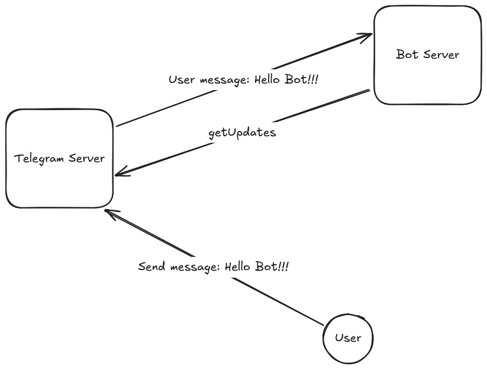
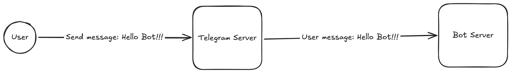
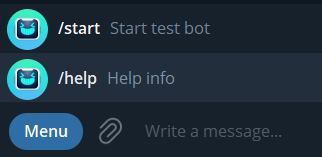
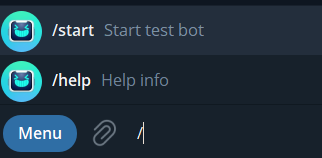
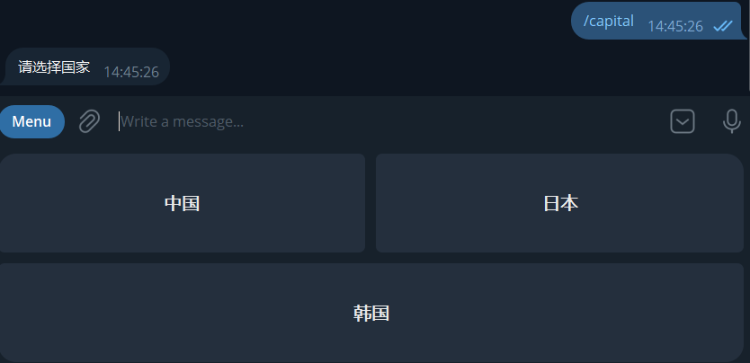
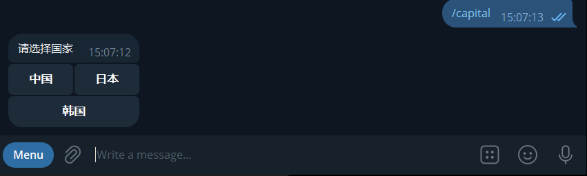

## 前言

本文简述 tg-bot 的基本用法，包含与 bot 进行简单的发送、处理和接收消息，button 和 keyboard 的设置。

---

## 通信模型

和 tg-bot 交互，既可以是我们主动给 bot 发消息，bot 收到消息后进行处理（实际上某个服务器上运行的程序处理），然后返回给用户消息，也可以是 bot 主动给我们推送消息。

双向的通信并不是我们直接与自己的服务器进行通信，中间隔了一个 telegram 服务器。

首先需要了解什么是 tg-bot？根据官网介绍：

> 机器人是完全在 Telegram 应用程序内运行的小型应用程序。用户通过灵活的界面与机器人交互,这些界面可支持任何类型的任务或服务。

而 tg-bot-api 则是：

> Bot API 是一个基于 HTTP 的接口,专为热衷于为 Telegram 构建机器人的开发者而创建。

所有的 HTTP 接口请求都基于一种 URL 形式：

```
https://api.telegram.org/bot<token>/METHOD_NAME
```

接口支持的 HTTP Method 包含 GET 和 POST，四种传参方式：

- URL query string
- application/x-www-form-urlencoded
- application/json (except for uploading files)
- multipart/form-data (use to upload files)

响应体是一个 JSON 对象。

每个方法是一次独立的 HTTP 请求/响应，没有长连接，Bot 只是"以 HTTPS 请求查询 API 并等待响应的脚本"。

Telegram Server 怎么把用户产生的 Update（发送给 bot 的消息） 交给 Bot Server？有两种方法（这两种只能选择其中一种）可以接收 bot 的更新。

第一种是 getUpdates，轮询模式（Pull），由你的 bot server 主动向 tg server 发起请求，tg server 保持连接（有 timeout，timeout 默认为 0，即默认是短轮询）直到有新的更新或者超时。

第二种是 setWebhook，推送模式（Push），由 tg server 在有更新的时候主动向你的 bot server 发 post。

所以要么 Bot 侧要么自己循环拉取（长轮询 ≈ 挂起一个 HTTP 请求等结果），要么暴露一个 HTTPS 回调端点让 Telegram 推过来。

getUpdates 适合 bot server 无法暴露公网端口的场景，setWebhook 适合 bot server 能被公网 HTTPS 访问的场景。

### 短轮询与长轮询

官方建议短轮询仅用于测试，是因为长轮询的效率更高。

短轮询就是 bot server 发起一次 HTTP 请求，tg server 不管有没有用户消息，接口立即返回，然后 bot server 等待一定时间（比如 1 秒），再发起下一次 HTTP 请求：

```
Client                    Server
  │                          │
  │── GET /messages ────────>│
  │<── [] ───────────────────│
  │                          │
  │       等 1 秒             │
  │                          │
  │── GET /messages ────────>│
  │<── [] ───────────────────│
  │                          │
  │       等 1 秒             │
  │                          │
  │── GET /messages ────────>│
  │<── ["hello"] ────────────│
  │                          │
```

假设每隔一秒访问 HTTP 接口：

```
10:00:00  有没有消息？ → 没有
10:00:01  有没有消息？ → 没有
10:00:02  有没有消息？ → 没有
10:00:03  有没有消息？ → 有！
```

短轮询最大的问题就是大部分 HTTP 请求是没有消息返回的，产生了大量无意义的 HTTP 连接。

长轮询在没有用户消息是，tg server 不会立即返回，而是保持这个 HTTP 连接一段时间：

```
Client                    Server
  │                          │
  │── GET /messages ────────>│
  │                          │
  │                          │ 没消息
  │                          │
  │                          │ 等待...
  │                          │
  │                          │ 等待...
  │                          │
  │                          │ 新消息来了！
  │                          │
  │<── ["hello"] ────────────│
  │                          │
  │── GET /messages ────────>│
  │                          │
```

等待的过程中，如果有用户的新消息，tg server 就会立即返回，然后 bot server 收到消息后，再继续创建新的 HTTP 连接。

### getUpdates



URL: https://api.telegram.org/bot{{bot-token}}/getUpdates

参数：

- offset，Integer，非必填，消费游标
- limit，Integer，非必填，单次最多返回条数，取值 1–100，默认 100
- timeout，Integer，非必填，长轮询秒数，默认 0（普通短轮询，官方建议短轮询应仅用于测试）
- allowed_updates，Array of String，非必填，只接收列出的更新类型

offset 的主要作用是 bot server 用来告诉 tg server，哪些用户信息已经被消费掉了，不必再传递。

假设用户发了一个消息，消息的 update_id = 176，那么用户发的下一个消息，update_id 就是 177，update_id 是用户发一条消息，数值就变大 1。

offset 传参规则：bot server 当前消费掉的信息的 update_id + 1。

比如用户有发送多条消息：

```

Telegram
│
├── 100
├── 101
└── 102

```

bot server 三条消息处理完毕后，下一次请求，offset 应该发送 102+1=103，tg server 收到 103 后，就知道 bot server 已经处理好了 103 之前的消息，就会把这些之前的消息从队列中删除。

bot server 应该及时消费，不要积压用户消息在 tg server 中，因为 tg server 最多保存用户信息 24 个小时。

offset 不传或者指定为 0 表示从最早的可用（未确认） Update 开始获取。

limit 是限制一次获取的信息数量，假设用户有发送多条消息：

```

Telegram
│
├── 100
├── 101
├── 102
├── 103
├── 104
└── 105

```

bot server 请求传参：offset=101&limit=3，那么 tg server 就会删除 update_id=100 （因为 offset = 101 > 100）这条消息，并且返回 101，102，103 这三条消息。

timeout 就是之前提到的长轮询的 HTTP 连接等待时间。

以下是一个长轮询的代码示例，循环接收用户发送给 bot server 的信息并处理：

```python

import time

import requests

DJHX_TEST_BOT_TOKEN = "your bot token"
URL = f"https://api.telegram.org/bot{DJHX_TEST_BOT_TOKEN}/getUpdates"

HTTP_TIMEOUT = 30
LONG_POLLING_TIMEOUT = 10


def get_updates(offset=0):
    params = {
        'timeout': LONG_POLLING_TIMEOUT,
        'offset': offset,
        'limit': 10
    }
    response = requests.get(URL, params=params, timeout=HTTP_TIMEOUT)
    response.raise_for_status()
    data = response.json()
    if not data["ok"]:
        raise RuntimeError(data.get("description"))
    return data["result"]


def process_updates(result_item):
    update_id = result_item["update_id"]
    try:
        message = result_item["message"]
        cal_res = 1 / int(message['text'])
        print(f'cal_res: {cal_res}')
    except Exception as e:
        print(e)
    return update_id + 1


def main():
    offset = 0
    while True:
        try:
            result = get_updates(offset=offset)
            for item in result:
                offset = process_updates(item)
        except requests.RequestException as e:
            print(f"Network error: {e}")
            time.sleep(3)

if __name__ == '__main__':
    main()

```

### setWebhook

setWebhook 和 getUpdates 模式相反，getUpdates 是 bot server 轮询 tg server，而 setWebhook 是 tg server 收到用户消息后主动往 bot server 推送消息。




setWebhook 要求 bot server 拥有一个支持 https 的公网域名，bot server 提供的 webhook api 可以被 tg server 访问到，比如：https://bot.example.com/telegram/webhook

由于这个接口是公网可访问的，也就意味着除了 tg server，别的人也可以访问接口（伪造用户信息），所以为了安全起见，webhook 模式提供了一个密钥选项：

> If you'd like to make sure that the webhook was set by you, you can specify secret data in the parameter secret_token. If specified, the request will contain a header “X-Telegram-Bot-Api-Secret-Token” with the secret token as content.

简而言之，与 tg server 约定一个密钥，后续 tg server 会在 headers 中带着这个密钥访问你的 bot server webhook 接口。

### sendMessage

与获取用户消息相比，bot server 发送给用户消息就简单的多，调用的接口是：https://api.telegram.org/bot{{bot-token}}/sendMessage

bot server 需要知道目标用户的 chat_id（在用户发送 /start 后 bot server 可以通过返回的消息获取）才可以发送消息。

下面是一个简单的示例：

```python

import requests

USER_CHAT_ID = "your user chat id"
DJHX_TEST_BOT_TOKEN = "your bot token"
URL = f"https://api.telegram.org/bot{DJHX_TEST_BOT_TOKEN}/sendMessage"

def main():
    msg = "Hello from bot!"
    payload = {
      "chat_id": USER_CHAT_ID,
      "text": msg,
    }
    response = requests.post(URL, data=payload, timeout=30)
    print(response.json())

if __name__ == '__main__':
    main()

```

---

## 命令

命令（BotCommand）是一种特殊的 message，必须始终以 / 符号开头,最多包含32个字符（只能包含小写英文字母、数字和下划线），比如：/start, /list, /newrule。

命令包含两部分：

- command：命令的名字，不包含斜杠
- description：命令的描述性内容，1-256个字符。

### 设置命令

官网提供了设置 bot 命令的接口，设置好后，tg 就会给用户显示 bot command 菜单。

参考：https://core.telegram.org/bots/api#setmycommands

POST https://api.telegram.org/bot{{bot-token}}/setMyCommands

JSON payload 示例：

```json
{
  "commands": [
    {
      "command": "start",
      "description": "Start test bot"
    },
    {
      "command": "help",
      "description": "Help info"
    }
  ]
}
```

请求成功后，tg 接口响应：

```json
{
  "ok": true,
  "result": true
}
```

聊天框会显示 command menu：



输入框输入 / 也会自动开启匹配：



### 执行命令

需要注意的是，仅仅调用 setMyCommands 只是告诉 tg 这个 Bot 支持这些命令，把它们展示给用户，但是没有真正的执行任何逻辑。

命令只是特殊的带有斜杠开头的 message，所以 bot server 执行命令，最原始的方式就是通过长轮询或者webhook收到 update 后，进行文本匹配：

```python
text = update["message"]["text"]

if text == "/start":
    ...
elif text == "/help":
    ...
elif text == "/settings":
    ...
```

---

## keyboard

command 是特殊的 message，需要用户手动输入，keyboard 则是另外一种交互方式，提供了交互式的 UI。

bot 给用户发消息：今天想吃菜单中的什么菜？用户只能输入菜单中已有的菜名，一般的前端 UI 都会提供一个下拉列表，防止用户输入错误的文本，keyboard 就实现了类似的功能。

keyboard 有两种：

- Reply Keyboard：替换/扩展用户输入框附近的键盘
- Inline Keyboard：挂在某条消息下面的按钮

### reply keyboard

reply keyboard 会更改用户输入框，最简单的用法，就是类似下拉列表，提供给用户系统允许范围的可选值，避免用户输入错误。

比如做一个获取国家首都的功能，国家是有限的集合，不能让用户随意输入，所以可以做成 reply keyboard：

```python
import json
import time

import requests

USER_CHAT_ID = "your user chat id"
DJHX_TEST_BOT_TOKEN = "bot token"
GET_UPDATES_URL = f"https://api.telegram.org/bot{DJHX_TEST_BOT_TOKEN}/getUpdates"
SEND_MSG_URL = f"https://api.telegram.org/bot{DJHX_TEST_BOT_TOKEN}/sendMessage"
HTTP_TIMEOUT = 30
LONG_POLLING_TIMEOUT = 10


country_capital_map = {
    '中国': '北京',
    '日本': '东京',
    '韩国': '首尔'
}


def get_updates(offset=0):
    params = {
        'timeout': LONG_POLLING_TIMEOUT,
        'offset': offset,
        'limit': 10
    }
    response = requests.get(GET_UPDATES_URL, params=params, timeout=HTTP_TIMEOUT)
    response.raise_for_status()
    data = response.json()
    if not data["ok"]:
        raise RuntimeError(data.get("description"))
    return data["result"]


def process_updates(result_item):
    update_id = result_item["update_id"]
    try:
        message = result_item["message"]
        text = message["text"]
        if text == '/capital':
            send_countries()
        elif text in country_capital_map.keys():
            send_msg(country_capital_map.get(text))
        else:
            print(f'message text: {text}')

    except Exception as e:
        print(e)
    return update_id + 1


def send_countries():
    payload = {
        "chat_id": USER_CHAT_ID,
        "text": '请选择国家',
        "reply_markup": {
            "keyboard": [
                [
                    {
                        "text": "中国"
                    },
                    {
                        "text": "日本"
                    }
                ],
                [
                    {
                        "text": "韩国"
                    }
                ]
            ]
        }
    }
    response = requests.post(SEND_MSG_URL, json=payload, timeout=30)
    print(response.json())


def send_msg(msg):
    payload = {
        "chat_id": USER_CHAT_ID,
        "text": msg
    }
    response = requests.post(SEND_MSG_URL, json=payload, timeout=30)
    print(response.json())

def main():
    offset = 0
    while True:
        try:
            result = get_updates(offset=offset)
            for item in result:
                offset = process_updates(item)
        except requests.RequestException as e:
            print(f"Network error: {e}")
            time.sleep(3)

if __name__ == '__main__':
    main()
```

用户输入 /capital 后，会发送一个带有 reply_markup 字段的 payload，里面写好了预设的 keyboard，这里是一个二维数组，keyboard 是行列排布的，所以上面第一行是中国和日本，第二行只有一个韩国。



最后 bot server 收到的用户 keyboard 信息，就是预设的值。

### inline keyboard

有时候可能不想通过发送消息来触发某些功能，这种情况下可以使用 inline keyboard，它会在相关信息的下方显示内嵌键盘。

与 reply keyboard 不同的是，按下 inline keyboard 上的按钮不会向聊天窗口发送消息。

相反，inline keyboard 支持可在后台运行或打开不同界面的按钮：回拨按钮、URL 按钮、切换到内嵌键盘按钮、游戏按钮和支付按钮。

把上面的国家-首都例子改成 inline keyboard：

```python
import time

import requests

USER_CHAT_ID = "your chat id"
DJHX_TEST_BOT_TOKEN = "bot token"
GET_UPDATES_URL = f"https://api.telegram.org/bot{DJHX_TEST_BOT_TOKEN}/getUpdates"
SEND_MSG_URL = f"https://api.telegram.org/bot{DJHX_TEST_BOT_TOKEN}/sendMessage"
ANSWER_CALLBACK_QUERY_URL = f"https://api.telegram.org/bot{DJHX_TEST_BOT_TOKEN}/answerCallbackQuery"

HTTP_TIMEOUT = 30
LONG_POLLING_TIMEOUT = 10


country_capital_map = {
    '中国': '北京',
    '日本': '东京',
    '韩国': '首尔'
}


def get_updates(offset=0):
    params = {
        'timeout': LONG_POLLING_TIMEOUT,
        'offset': offset,
        'limit': 10
    }
    response = requests.get(GET_UPDATES_URL, params=params, timeout=HTTP_TIMEOUT)
    response.raise_for_status()
    data = response.json()
    if not data["ok"]:
        raise RuntimeError(data.get("description"))
    return data["result"]


def process_updates(result_item):
    update_id = result_item["update_id"]

    try:
        message = result_item.get("message")
        callback = result_item.get("callback_query")

        if message:
            text = message.get("text")

            if text == "/capital":
                send_countries()
            else:
                print(f"message text: {text}")

        elif callback:
            print(f"callback: {callback}")
            callback_data = callback["data"]
            data_country = callback_data.split(':')[1]
            if data_country in country_capital_map.keys():
                send_msg(country_capital_map[data_country])
                answer_callback_query(callback["id"])

    except Exception as e:
        print(e)

    return update_id + 1

def answer_callback_query(callback_query_id):
    payload = {
        "callback_query_id": callback_query_id
    }

    response = requests.post(
        ANSWER_CALLBACK_QUERY_URL,
        json=payload,
        timeout=30
    )

    print(response.json())

def send_countries():
    payload = {
        "chat_id": USER_CHAT_ID,
        "text": '请选择国家',
        "reply_markup": {
            "inline_keyboard": [
                [
                    {
                        "text": "中国",
                        "callback_data": "country:中国"
                    },
                    {
                        "text": "日本",
                        "callback_data": "country:日本"
                    }
                ],
                [
                    {
                        "text": "韩国",
                        "callback_data": "country:韩国"
                    }
                ]
            ]
        }
    }
    response = requests.post(SEND_MSG_URL, json=payload, timeout=30)
    print(response.json())


def send_msg(msg):
    payload = {
        "chat_id": USER_CHAT_ID,
        "text": msg
    }
    response = requests.post(SEND_MSG_URL, json=payload, timeout=30)
    print(response.json())

def main():
    offset = 0
    while True:
        try:
            result = get_updates(offset=offset)
            for item in result:
                offset = process_updates(item)
        except requests.RequestException as e:
            print(f"Network error: {e}")
            time.sleep(3)

if __name__ == '__main__':
    main()

```



inline keyboard 类似一种事件回调机制，用户点击按钮后，按钮会显示 loading 的样式（半透明加载），所以处理完以后还需要调用 tg 的 answerCallbackQuery 接口，告知 tg 该回调已经处理完成，按钮 loading 动画可以结束了。

---

## 参考

1. https://core.telegram.org/bots/tutorial
2. https://core.telegram.org/bots
3. https://core.telegram.org/bots/api